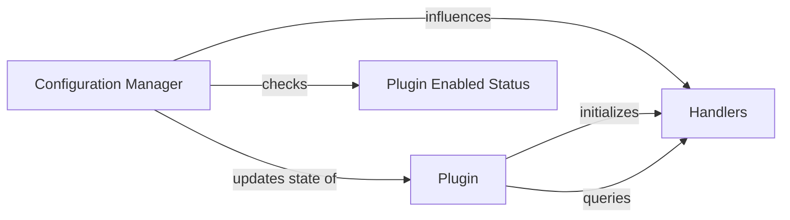

## Details

The `mkdocstrings` plugin for MkDocs operates around a central `Plugin` component, `MkdocstringsPlugin`, which orchestrates the documentation generation process. This plugin leverages a `Configuration Manager` (`PluginConfig` and `on_config` method) to parse and apply user-defined settings, determining the plugin's behavior and activation status via the `Plugin Enabled Status`. The `Plugin` component then initializes and interacts with `Handlers`, which are responsible for processing and rendering documentation for various programming languages. The `Configuration Manager` directly influences the `Handlers` by providing their operational parameters.

### Configuration Manager [[Expand]](./Configuration_Manager.md)
Responsible for parsing, validating, and applying user-defined settings from `mkdocs.yml` and other configuration sources. It acts as the control plane, influencing the behavior and activation of other plugin components based on these settings. This component is fundamental as it translates external user intent into internal operational parameters.

**Related Classes/Methods**:

- <a href="https://github.com/mkdocstrings/mkdocstrings/blob/main/src/mkdocstrings/_internal/plugin.py#L43-L79" target="_blank" rel="noopener noreferrer">`mkdocstrings._internal.plugin.PluginConfig`:43-79</a>
- <a href="https://github.com/mkdocstrings/mkdocstrings/blob/main/src/mkdocstrings/_internal/plugin.py#L117-L181" target="_blank" rel="noopener noreferrer">`mkdocstrings._internal.plugin.MkdocstringsPlugin.on_config`:117-181</a>

### Plugin
Represents the main plugin instance, providing context and state for lifecycle hooks and managing overall plugin operations. It serves as the container for the plugin's state, including the applied configuration and instances of `Handlers` and `AutorefsPlugin`. Its architectural importance lies in being the central orchestrator for the plugin's lifecycle within the MkDocs framework.

**Related Classes/Methods**:

- <a href="https://github.com/mkdocstrings/mkdocstrings/blob/main/src/mkdocstrings/_internal/plugin.py#L82-L303" target="_blank" rel="noopener noreferrer">`mkdocstrings._internal.plugin.MkdocstringsPlugin`:82-303</a>
- <a href="https://github.com/mkdocstrings/mkdocstrings/blob/main/src/mkdocstrings/_internal/plugin.py#L103-L115" target="_blank" rel="noopener noreferrer">`mkdocstrings._internal.plugin.MkdocstringsPlugin.handlers`:103-115</a>
- <a href="https://github.com/mkdocstrings/mkdocstrings/blob/main/src/mkdocstrings/_internal/plugin.py#L294-L300" target="_blank" rel="noopener noreferrer">`mkdocstrings._internal.plugin.MkdocstringsPlugin.get_handler`:294-300</a>

### Plugin Enabled Status
Manages the overall activation status of the plugin, typically a boolean flag. This status is a direct outcome of the configuration process, determining whether the plugin's functionalities are active. It's crucial for controlling the plugin's runtime presence.

**Related Classes/Methods**:

- <a href="https://github.com/mkdocstrings/mkdocstrings/blob/main/src/mkdocstrings/_internal/plugin.py#L195-L202" target="_blank" rel="noopener noreferrer">`mkdocstrings._internal.plugin.MkdocstringsPlugin.plugin_enabled`:195-202</a>

### Handlers [[Expand]](./Handlers.md)
Manages the activation and behavior of various language handlers within the plugin. While not directly involved in configuration *parsing*, their operational parameters (e.g., which handlers are active, their specific settings) are directly influenced and set by the `Configuration Manager`. This component represents the configurable aspects of the core documentation generation.

**Related Classes/Methods**:

- <a href="https://github.com/mkdocstrings/mkdocstrings/blob/main/src/mkdocstrings/_internal/handlers/base.py#L576-L796" target="_blank" rel="noopener noreferrer">`mkdocstrings._internal.handlers.base.Handlers`:576-796</a>
- <a href="https://github.com/mkdocstrings/mkdocstrings/blob/main/src/mkdocstrings/_internal/handlers/base.py#L92-L573" target="_blank" rel="noopener noreferrer">`mkdocstrings._internal.handlers.base.BaseHandler`:92-573</a>

### [FAQ](https://github.com/CodeBoarding/GeneratedOnBoardings/tree/main?tab=readme-ov-file#faq)