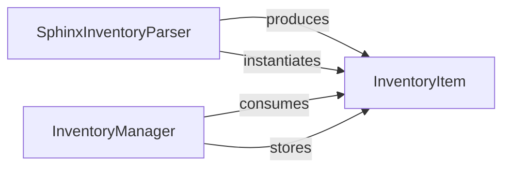

## Details

The Inventory & Cross-referencing subsystem is primarily defined and managed within the mkdocstrings._internal.inventory module. This module encapsulates the logic for creating, loading, parsing, and managing documentation object inventories, enabling internal and external cross-referencing.

### InventoryItem
This class serves as the canonical data model for a single documentation object within the inventory. It encapsulates all necessary attributes (e.g., name, type, URL, domain, project, version) required for accurate cross-referencing. It is the fundamental unit stored and retrieved, ensuring consistency across various documentation sources. This component is crucial as it defines the standardized structure for all documentation objects processed by the subsystem, aligning with the "Core Documentation Engine" needing a consistent internal representation.

**Related Classes/Methods**:

- <a href="https://github.com/mkdocstrings/mkdocstrings/blob/main/src/mkdocstrings/_internal/inventory.py#L17-L90" target="_blank" rel="noopener noreferrer">`mkdocstrings._internal.inventory.InventoryItem`:17-90</a>

### SphinxInventoryParser
This component (represented by the `parse_sphinx` function) acts as an input adapter specifically for Sphinx inventory files (`objects.inv`). It parses these external files, extracts documentation object metadata, and transforms them into `InventoryItem` instances. This enables `mkdocstrings` to integrate and reference objects defined in Sphinx-generated documentation. Its recursive nature allows handling complex inventory structures. This component fits the "Input/Output Adapters" pattern, demonstrating the system's ability to consume external data formats.

**Related Classes/Methods**:

- <a href="https://github.com/mkdocstrings/mkdocstrings/blob/main/src/mkdocstrings/_internal/inventory.py#L166-L185" target="_blank" rel="noopener noreferrer">`mkdocstrings._internal.inventory.parse_sphinx`:166-185</a>

### InventoryManager
This component (represented by the `register` function) is the central inventory manager, responsible for adding individual `InventoryItem` instances into the internal inventory data structure. It ensures that documentation objects are correctly indexed and stored for efficient lookup and cross-referencing within the `mkdocstrings` project. It serves as the primary interface for populating the internal cross-reference map. This component is vital for the "Cross-referencing/Linking Module" as it maintains the core data structure required for resolving references.

**Related Classes/Methods**:

- <a href="https://github.com/mkdocstrings/mkdocstrings/blob/main/src/mkdocstrings/_internal/inventory.py#L113-L139" target="_blank" rel="noopener noreferrer">`mkdocstrings._internal.inventory.register`:113-139</a>

### [FAQ](https://github.com/CodeBoarding/GeneratedOnBoardings/tree/main?tab=readme-ov-file#faq)