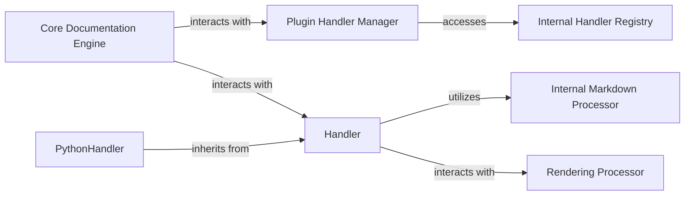

## Details

The mkdocstrings documentation generation subsystem is orchestrated by the Core Documentation Engine. This engine initiates the process by interacting with the Plugin Handler Manager to resolve and retrieve the appropriate language-specific Handler. The Plugin Handler Manager, in turn, utilizes the Internal Handler Registry to efficiently locate and provide the correct handler instance. Once a Handler (such as the PythonHandler for Python code) is obtained, it is responsible for parsing source code and extracting documentation. During this process, the Handler utilizes the Internal Markdown Processor to format extracted content and interacts with the Rendering Processor to prepare the content for final display, ensuring proper linking and transformations. This modular design allows for extensible language support while maintaining a consistent core documentation workflow.

### Core Documentation Engine
The central orchestrator of the documentation generation process. It initiates the handler resolution, retrieves documentation content, and coordinates the overall flow from source parsing to final rendering.

**Related Classes/Methods**: _None_

### Handler
The foundational abstract class that defines the contract and implements common functionalities for all language-specific documentation handlers. It serves as the core interface for extending mkdocstrings to support new programming languages, ensuring a consistent API for the core engine.

**Related Classes/Methods**:

- <a href="https://github.com/mkdocstrings/mkdocstrings/blob/main/src/mkdocstrings/_internal/handlers/base.py" target="_blank" rel="noopener noreferrer">`mkdocstrings._internal.handlers.base`</a>

### PythonHandler
A concrete implementation of the Handler abstract base class, specifically designed for parsing Python source code. It extracts documentation (e.g., docstrings, signatures) and converts it into the standardized intermediate representation defined by the Handler interface, acting as a specialized handler within the mkdocstrings ecosystem.

**Related Classes/Methods**:

### Plugin Handler Manager
Responsible for resolving and retrieving the appropriate language handlers based on configuration or detected language. It acts as the primary interface for the Core Documentation Engine to obtain handler instances, abstracting the handler discovery process.

**Related Classes/Methods**:

- <a href="https://github.com/mkdocstrings/mkdocstrings/blob/main/src/mkdocstrings/_internal/plugin.py#L294-L303" target="_blank" rel="noopener noreferrer">`mkdocstrings._internal.plugin.get_handler`:294-303</a>

### Internal Handler Registry
An internal mechanism or data structure that stores and provides access to registered language handlers. It serves as a lookup table for the Plugin Handler Manager, enabling efficient retrieval of handler instances by language identifier.

**Related Classes/Methods**:

- <a href="https://github.com/mkdocstrings/mkdocstrings/blob/main/src/mkdocstrings/_internal/plugin.py" target="_blank" rel="noopener noreferrer">`mkdocstrings._internal.plugin.handlers`</a>

### Internal Markdown Processor
A utility component providing Markdown conversion capabilities. It is primarily utilized by Handler implementations to process and format extracted documentation content, ensuring consistency in Markdown rendering before further processing.

**Related Classes/Methods**:

- <a href="https://github.com/mkdocstrings/mkdocstrings/blob/main/src/mkdocstrings/_internal/handlers/base.py" target="_blank" rel="noopener noreferrer">`mkdocstrings._internal.handlers.base.md`</a>

### Rendering Processor
A component responsible for preparing the documentation content extracted by handlers for final rendering. This includes applying transformations such as ID prefixing to ensure proper linking and display within the generated documentation.

**Related Classes/Methods**:

- <a href="https://github.com/mkdocstrings/mkdocstrings/blob/main/src/mkdocstrings/_internal/handlers/rendering.py" target="_blank" rel="noopener noreferrer">`mkdocstrings._internal.handlers.rendering`</a>

### [FAQ](https://github.com/CodeBoarding/GeneratedOnBoardings/tree/main?tab=readme-ov-file#faq)