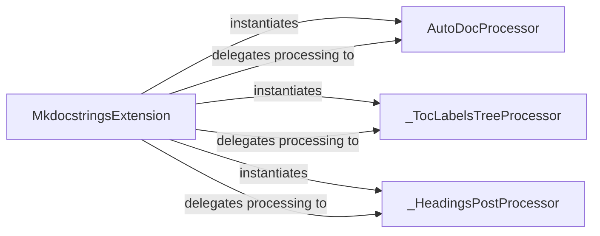

## Details

The `mkdocstrings` subsystem, centered around the `MkdocstringsExtension`, integrates with MkDocs to process and render documentation. The `MkdocstringsExtension` acts as the primary orchestrator, responsible for initializing and registering various specialized Markdown processors. It instantiates `AutoDocProcessor` to handle `:::identifier` blocks, and `_TocLabelsTreeProcessor` and `_HeadingsPostProcessor` for refining Table of Contents labels and post-processing headings, respectively. The extension then delegates the actual Markdown content processing to these specialized processors, ensuring accurate and well-structured documentation output.

### MkdocstringsExtension
This is the central orchestrator and primary entry point for the `mkdocstrings` Markdown extension within the MkDocs ecosystem. It is responsible for initializing and registering specialized Markdown processors (`AutoDocProcessor`, `_TocLabelsTreeProcessor`, `_HeadingsPostProcessor`) with the MkDocs Markdown rendering pipeline. It orchestrates the overall processing flow, acting as the bridge between MkDocs' core Markdown handling and `mkdocstrings`' specific requirements.

**Related Classes/Methods**:

- <a href="https://github.com/mkdocstrings/mkdocstrings/blob/main/src/mkdocstrings/_internal/extension.py#L342-L382" target="_blank" rel="noopener noreferrer">`MkdocstringsExtension`:342-382</a>

### AutoDocProcessor
A specialized Markdown processor dedicated to parsing and transforming `:::identifier` syntax blocks found within the Markdown content. Its core responsibility is to resolve these identifiers to actual documentation objects (e.g., functions, classes, modules) and prepare them for rendering into the final documentation output.

**Related Classes/Methods**:

- <a href="https://github.com/mkdocstrings/mkdocstrings/blob/main/src/mkdocstrings/_internal/extension.py#L52-L307" target="_blank" rel="noopener noreferrer">`AutoDocProcessor`:52-307</a>

### _TocLabelsTreeProcessor
This processor focuses on modifying and refining Table of Contents (ToC) labels. It likely processes `[[cross-reference]]` syntax or other internal logic to ensure that navigation links within the generated documentation are accurate, consistent, and user-friendly. It performs recursive tree traversal to achieve its modifications.

**Related Classes/Methods**:

- <a href="https://github.com/mkdocstrings/mkdocstrings/blob/main/src/mkdocstrings/_internal/extension.py#L331-L339" target="_blank" rel="noopener noreferrer">`_TocLabelsTreeProcessor`:331-339</a>

### _HeadingsPostProcessor
Responsible for performing post-rendering adjustments to headings within the generated HTML output. Its tasks include removing duplicated headings and potentially normalizing heading levels to maintain document consistency, quality, and proper structure. It also performs recursive tree traversal for its operations.

**Related Classes/Methods**:

- <a href="https://github.com/mkdocstrings/mkdocstrings/blob/main/src/mkdocstrings/_internal/extension.py#L310-L328" target="_blank" rel="noopener noreferrer">`_HeadingsPostProcessor`:310-328</a>

### [FAQ](https://github.com/CodeBoarding/GeneratedOnBoardings/tree/main?tab=readme-ov-file#faq)