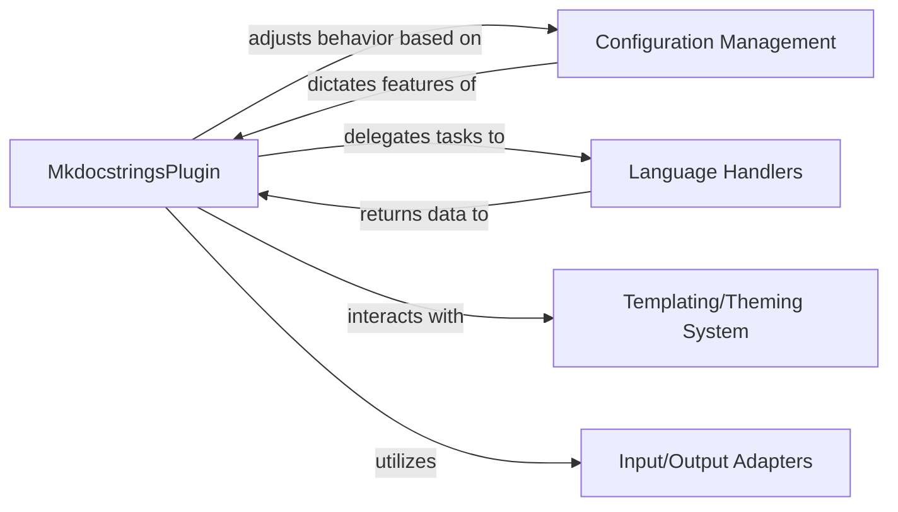

## Details

The `MkDocs Plugin Core` subsystem, centered around the `MkdocstringsPlugin`, orchestrates the documentation generation process. The `MkdocstringsPlugin` initializes and manages the plugin's lifecycle, interacting with `Configuration Management` to load and apply settings from `mkdocs.yml`. It delegates language-specific documentation extraction to `Language Handlers` and integrates presentation assets via the `Templating/Theming System`. Finally, `Input/Output Adapters` handle the persistence of generated data, such as inventories, to the output directory. This modular design ensures a clear separation of concerns, allowing for flexible configuration, extensible language support, and consistent output formatting.

### MkdocstringsPlugin
The core component of the `MkDocs Plugin Core` subsystem. It acts as the central orchestrator for the plugin's lifecycle, managing configuration loading, registering extensions, coordinating the overall documentation generation flow, and handling various MkDocs events (e.g., `on_config`, `on_post_build`). It embodies the `Core Documentation Engine` role for this subsystem.

**Related Classes/Methods**:

- <a href="https://github.com/mkdocstrings/mkdocstrings/blob/main/src/mkdocstrings/_internal/plugin.py#L82-L303" target="_blank" rel="noopener noreferrer">`mkdocstrings._internal.plugin.MkdocstringsPlugin`:82-303</a>
- <a href="https://github.com/mkdocstrings/mkdocstrings/blob/main/src/mkdocstrings/_internal/plugin.py#L100-L159" target="_blank" rel="noopener noreferrer">`mkdocstrings._internal.plugin:on_config`:100-159</a>
- <a href="https://github.com/mkdocstrings/mkdocstrings/blob/main/src/mkdocstrings/_internal/plugin.py#L162-L169" target="_blank" rel="noopener noreferrer">`mkdocstrings._internal.plugin:get_handler`:162-169</a>
- <a href="https://github.com/mkdocstrings/mkdocstrings/blob/main/src/mkdocstrings/_internal/plugin.py#L172-L176" target="_blank" rel="noopener noreferrer">`mkdocstrings._internal.plugin:_on_env_add_css`:172-176</a>
- <a href="https://github.com/mkdocstrings/mkdocstrings/blob/main/src/mkdocstrings/_internal/plugin.py#L179-L183" target="_blank" rel="noopener noreferrer">`mkdocstrings._internal.plugin:_on_env_write_inventory`:179-183</a>
- <a href="https://github.com/mkdocstrings/mkdocstrings/blob/main/src/mkdocstrings/_internal/plugin.py#L186-L209" target="_blank" rel="noopener noreferrer">`mkdocstrings._internal.plugin:on_post_build`:186-209</a>

### Configuration Management
Responsible for loading, parsing, and applying the plugin's configuration from `mkdocs.yml`. This includes determining if the plugin is enabled, setting up inventory management, and influencing how documentation is generated. It drives the behavior of the `MkdocstringsPlugin`.

**Related Classes/Methods**:

- <a href="https://github.com/mkdocstrings/mkdocstrings/blob/main/src/mkdocstrings/_internal/plugin.py#L100-L159" target="_blank" rel="noopener noreferrer">`mkdocstrings._internal.plugin:on_config`:100-159</a>

### Language Handlers [[Expand]](./Language_Handlers.md)
A collection of specialized modules designed to extract and process documentation from source code written in various programming languages. The `MkdocstringsPlugin` delegates language-specific parsing and data extraction tasks to these handlers.

**Related Classes/Methods**:

- <a href="https://github.com/mkdocstrings/mkdocstrings/blob/main/src/mkdocstrings/_internal/plugin.py#L162-L169" target="_blank" rel="noopener noreferrer">`mkdocstrings._internal.plugin:get_handler`:162-169</a>

### Templating/Theming System
Manages the integration of presentation-related assets, such as custom CSS, into the final generated documentation. It ensures that the output adheres to the desired visual style and theme.

**Related Classes/Methods**:

- <a href="https://github.com/mkdocstrings/mkdocstrings/blob/main/src/mkdocstrings/_internal/plugin.py#L172-L176" target="_blank" rel="noopener noreferrer">`mkdocstrings._internal.plugin:_on_env_add_css`:172-176</a>

### Input/Output Adapters
Components responsible for handling the persistence of generated data, such as inter-project inventories, to the output directory. They manage the final writing steps in the documentation generation pipeline.

**Related Classes/Methods**:

- <a href="https://github.com/mkdocstrings/mkdocstrings/blob/main/src/mkdocstrings/_internal/plugin.py#L179-L183" target="_blank" rel="noopener noreferrer">`mkdocstrings._internal.plugin:_on_env_write_inventory`:179-183</a>
- <a href="https://github.com/mkdocstrings/mkdocstrings/blob/main/src/mkdocstrings/_internal/plugin.py#L186-L209" target="_blank" rel="noopener noreferrer">`mkdocstrings._internal.plugin:on_post_build`:186-209</a>

### [FAQ](https://github.com/CodeBoarding/GeneratedOnBoardings/tree/main?tab=readme-ov-file#faq)