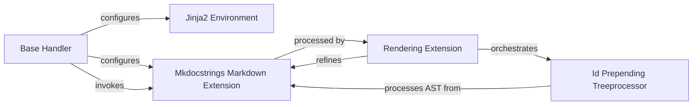

## Details

The mkdocstrings rendering subsystem is orchestrated by the Base Handler, which establishes the core environment for documentation processing. It configures the Jinja2 Environment for template rendering and initializes the Mkdocstrings Markdown Extension for Markdown-to-HTML conversion. The Rendering Extension then refines the output from the Markdown conversion, specifically leveraging the Id Prepending Treeprocessor to ensure unique and consistent HTML element IDs, thereby preparing the content for final presentation.

### Base Handler
Establishes the foundational rendering environment. This includes managing template directories, initializing the Markdown converter, and providing utilities for basic Markdown-to-HTML conversion and heading generation. It acts as the initial processing layer for documentation content within the rendering pipeline.

**Related Classes/Methods**:

- <a href="https://github.com/mkdocstrings/mkdocstrings/blob/main/src/mkdocstrings/_internal/handlers/base.py#L92-L573" target="_blank" rel="noopener noreferrer">`mkdocstrings._internal.handlers.base.BaseHandler`:92-573</a>

### Jinja2 Environment
Manages the loading and rendering of Jinja2 templates. It allows for the application of themes, custom layouts, and global variables during the HTML generation process, serving as the primary templating engine for the final output.

**Related Classes/Methods**:

- <a href="https://github.com/mkdocstrings/mkdocstrings/blob/main/src/mkdocstrings/_internal/handlers/base.py" target="_blank" rel="noopener noreferrer">`jinja2.Environment`</a>

### Mkdocstrings Markdown Extension
Converts Markdown text into HTML, specifically configured with extensions relevant to mkdocstrings. It is the core utility for rendering docstrings and other textual content within the documentation, often configured with various extensions to support specific Markdown features.

**Related Classes/Methods**:

- <a href="https://github.com/mkdocstrings/mkdocstrings/blob/main/src/mkdocstrings/_internal/extension.py#L360-L382" target="_blank" rel="noopener noreferrer">`markdown.Markdown`:360-382</a>

### Rendering Extension
Extends the Markdown processing pipeline with specialized transformations for the final HTML output. This includes applying ID prefixes for unique element identification and integrating custom Markdown tree processors to ensure consistent and valid HTML structure, focusing on refining the output for presentation.

**Related Classes/Methods**:

- <a href="https://github.com/mkdocstrings/mkdocstrings/blob/main/src/mkdocstrings/_internal/handlers/rendering.py" target="_blank" rel="noopener noreferrer">`mkdocstrings._internal.handlers.rendering.RenderingExtension`</a>

### Id Prepending Treeprocessor
Applies specific, fine-grained transformations to the Markdown Abstract Syntax Tree (AST) before it's converted to HTML. This processor handles tasks like adjusting heading levels, stripping unwanted elements, and ensuring unique IDs for navigation, crucial for correct document structure and linking.

**Related Classes/Methods**:

- <a href="https://github.com/mkdocstrings/mkdocstrings/blob/main/src/mkdocstrings/_internal/handlers/rendering.py#L133-L188" target="_blank" rel="noopener noreferrer">`mkdocstrings._internal.handlers.rendering.IdPrependingTreeprocessor`:133-188</a>

### [FAQ](https://github.com/CodeBoarding/GeneratedOnBoardings/tree/main?tab=readme-ov-file#faq)