```mermaid
graph LR
    MkDocs_Plugin_Core["MkDocs Plugin Core"]
    Configuration_Manager["Configuration Manager"]
    Language_Handlers["Language Handlers"]
    Markdown_Extension_Processor["Markdown Extension Processor"]
    Inventory_Cross_referencing["Inventory & Cross-referencing"]
    Resource_Downloader["Resource Downloader"]
    Rendering_Output["Rendering & Output"]
    MkDocs_Plugin_Core -- "Initializes & Loads Configuration" --> Configuration_Manager
    Configuration_Manager -- "Applies Settings" --> Language_Handlers
    Configuration_Manager -- "Applies Settings" --> Rendering_Output
    MkDocs_Plugin_Core -- "Orchestrates Markdown Processing" --> Markdown_Extension_Processor
    Markdown_Extension_Processor -- "Requests Documentation Data" --> Language_Handlers
    Language_Handlers -- "Provides Extracted Data" --> Markdown_Extension_Processor
    Language_Handlers -- "Registers Documentation Objects" --> Inventory_Cross_referencing
    Inventory_Cross_referencing -- "Requests External Inventories" --> Resource_Downloader
    Resource_Downloader -- "Provides Downloaded Inventories" --> Inventory_Cross_referencing
    Markdown_Extension_Processor -- "Passes Processed Content" --> Rendering_Output
    Inventory_Cross_referencing -- "Supplies Cross-reference Data" --> Rendering_Output
    click MkDocs_Plugin_Core href "https://github.com/CodeBoarding/GeneratedOnBoardings/blob/main/mkdocstrings/MkDocs_Plugin_Core.md" "Details"
    click Configuration_Manager href "https://github.com/CodeBoarding/GeneratedOnBoardings/blob/main/mkdocstrings/Configuration_Manager.md" "Details"
    click Language_Handlers href "https://github.com/CodeBoarding/GeneratedOnBoardings/blob/main/mkdocstrings/Language_Handlers.md" "Details"
    click Markdown_Extension_Processor href "https://github.com/CodeBoarding/GeneratedOnBoardings/blob/main/mkdocstrings/Markdown_Extension_Processor.md" "Details"
    click Inventory_Cross_referencing href "https://github.com/CodeBoarding/GeneratedOnBoardings/blob/main/mkdocstrings/Inventory_Cross_referencing.md" "Details"
    click Rendering_Output href "https://github.com/CodeBoarding/GeneratedOnBoardings/blob/main/mkdocstrings/Rendering_Output.md" "Details"
```

## Details

The `mkdocstrings` project operates as an integrated MkDocs plugin, designed to automate the generation of API documentation from source code. At its core, the `MkDocs Plugin Core` orchestrates the entire documentation build process, from loading configurations to coordinating with specialized components. The `Configuration Manager` ensures that user-defined settings are applied consistently across all operations. `Language Handlers` are pivotal, acting as pluggable interpreters that parse language-specific source code into a standardized format. This processed information is then consumed by the `Markdown Extension Processor`, which integrates it seamlessly into MkDocs' Markdown rendering pipeline. `Inventory & Cross-referencing` manages the crucial task of linking documentation objects, both internal and external, supported by the `Resource Downloader` for fetching remote inventories. Finally, the `Rendering & Output` component transforms the processed data into the final, themed HTML documentation. This modular design facilitates clear data flow, enabling efficient and extensible documentation generation.

### MkDocs Plugin Core [[Expand]](./MkDocs_Plugin_Core.md)
The central orchestrator of `mkdocstrings` within the MkDocs build process. It initializes the plugin, manages configuration loading, registers extensions, and coordinates the overall documentation generation flow.

**Related Classes/Methods**:

- <a href="https://github.com/mkdocstrings/mkdocstrings/blob/main/src/mkdocstrings/_internal/plugin.py" target="_blank" rel="noopener noreferrer">`mkdocstrings._internal.plugin`</a>

### Configuration Manager [[Expand]](./Configuration_Manager.md)
Handles the parsing and application of user-defined settings from `mkdocs.yml` and other sources, ensuring all components operate according to the specified parameters.

**Related Classes/Methods**:

- <a href="https://github.com/mkdocstrings/mkdocstrings/blob/main/src/mkdocstrings/_internal/plugin.py" target="_blank" rel="noopener noreferrer">`mkdocstrings._internal.plugin`</a>

### Language Handlers [[Expand]](./Language_Handlers.md)
A pluggable component responsible for parsing source code in a specific programming language, extracting documentation, and converting it into a standardized intermediate representation. This includes the common interface and concrete implementations (e.g., the Python handler within the `mkdocstrings_python` package).

**Related Classes/Methods**:

- <a href="https://github.com/mkdocstrings/mkdocstrings/blob/main/src/mkdocstrings/_internal/handlers/base.py" target="_blank" rel="noopener noreferrer">`mkdocstrings._internal.handlers.base`</a>

### Markdown Extension Processor [[Expand]](./Markdown_Extension_Processor.md)
Extends MkDocs' Markdown rendering capabilities to recognize and process `mkdocstrings`-specific syntax (e.g., `:::identifier`, `[[cross-reference]]`). It acts as a bridge between raw Markdown and the documentation objects.

**Related Classes/Methods**:

- <a href="https://github.com/mkdocstrings/mkdocstrings/blob/main/src/mkdocstrings/_internal/extension.py" target="_blank" rel="noopener noreferrer">`mkdocstrings._internal.extension`</a>

### Inventory & Cross-referencing [[Expand]](./Inventory_Cross_referencing.md)
Manages the creation, loading, and parsing of inventory files (e.g., Sphinx inventories, `objects.inv`) for enabling cross-referencing of documentation objects both within the current project and across external projects.

**Related Classes/Methods**:

- <a href="https://github.com/mkdocstrings/mkdocstrings/blob/main/src/mkdocstrings/_internal/inventory.py" target="_blank" rel="noopener noreferrer">`mkdocstrings._internal.inventory`</a>

### Resource Downloader
Securely handles the downloading of external resources, primarily inventory files from remote URLs, to support cross-project linking.

**Related Classes/Methods**:

- <a href="https://github.com/mkdocstrings/mkdocstrings/blob/main/src/mkdocstrings/_internal/download.py" target="_blank" rel="noopener noreferrer">`mkdocstrings._internal.download`</a>

### Rendering & Output [[Expand]](./Rendering_Output.md)
Utilizes Jinja2 to render the extracted and processed documentation objects into the final HTML output, applying themes and custom templates, and performing final transformations for consistent and valid output.

**Related Classes/Methods**:

- <a href="https://github.com/mkdocstrings/mkdocstrings/blob/main/src/mkdocstrings/_internal/handlers/base.py" target="_blank" rel="noopener noreferrer">`mkdocstrings._internal.handlers.base`</a>
- <a href="https://github.com/mkdocstrings/mkdocstrings/blob/main/src/mkdocstrings/_internal/handlers/rendering.py" target="_blank" rel="noopener noreferrer">`mkdocstrings._internal.handlers.rendering`</a>

### [FAQ](https://github.com/CodeBoarding/GeneratedOnBoardings/tree/main?tab=readme-ov-file#faq)