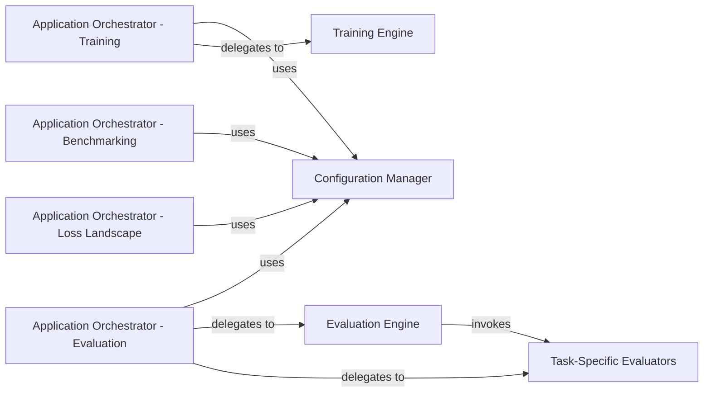

## Details

The Application Orchestration subsystem serves as the primary control layer, managing the application's lifecycle across various operational modes. It is responsible for initializing the environment, parsing top-level arguments, and orchestrating the overall process by invoking core engine components.

### Application Orchestrator - Training
The primary entry point for initiating the model training process. It initializes the training environment, parses training-specific arguments, and delegates control to the Training Engine to manage the training lifecycle.

**Related Classes/Methods**:

- <a href="https://github.com/apple/ml-cvnets/blob/main/main_train.py" target="_blank" rel="noopener noreferrer">`main_train.py`</a>

### Application Orchestrator - Evaluation
The primary entry point for initiating the model evaluation process. It initializes the evaluation environment, parses evaluation-specific arguments, and dispatches to the appropriate Evaluation Engine or Task-Specific Evaluators based on the task.

**Related Classes/Methods**:

- <a href="https://github.com/apple/ml-cvnets/blob/main/main_eval.py" target="_blank" rel="noopener noreferrer">`main_eval.py`</a>

### Application Orchestrator - Benchmarking
The primary entry point for initiating model benchmarking. It sets up and initiates the model benchmarking process, likely involving configuration parsing and delegation to a benchmarking engine (implied).

**Related Classes/Methods**:

- <a href="https://github.com/apple/ml-cvnets/blob/main/main_benchmark.py" target="_blank" rel="noopener noreferrer">`main_benchmark.py`</a>

### Application Orchestrator - Loss Landscape
The primary entry point for visualizing the loss landscape. It prepares the environment and initiates the process for visualizing the loss landscape, including configuration and delegation to relevant visualization utilities.

**Related Classes/Methods**:

- <a href="https://github.com/apple/ml-cvnets/blob/main/main_loss_landscape.py" target="_blank" rel="noopener noreferrer">`main_loss_landscape.py`</a>

### Configuration Manager
Acts as the central configuration manager, parsing command-line arguments and YAML files to provide structured settings for all operational modes. It ensures consistent configuration across different entry points.

**Related Classes/Methods**:

- <a href="https://github.com/apple/ml-cvnets/blob/main/options/opts.py" target="_blank" rel="noopener noreferrer">`options.opts`</a>

### Training Engine [[Expand]](./Training_Engine.md)
Manages the core training lifecycle, including data loading, model forward/backward passes, optimization, and metric tracking. It receives configuration and control from the Application Orchestrator - Training.

**Related Classes/Methods**:

- <a href="https://github.com/apple/ml-cvnets/blob/main/engine/training_engine.py" target="_blank" rel="noopener noreferrer">`engine.training_engine`</a>

### Evaluation Engine
Provides a general framework for model evaluation, handling common evaluation steps and delegating to task-specific evaluators for specialized metrics. It is invoked by the Application Orchestrator - Evaluation.

**Related Classes/Methods**:

- <a href="https://github.com/apple/ml-cvnets/blob/main/engine/evaluation_engine.py" target="_blank" rel="noopener noreferrer">`engine.evaluation_engine`</a>

### Task-Specific Evaluators
Implements specialized evaluation logic and metric calculation for specific computer vision tasks like object detection and semantic segmentation. These are invoked by the Evaluation Engine or directly by the Application Orchestrator - Evaluation.

**Related Classes/Methods**:

- <a href="https://github.com/apple/ml-cvnets/blob/main/engine/eval_detection.py" target="_blank" rel="noopener noreferrer">`engine.eval_detection`</a>
- <a href="https://github.com/apple/ml-cvnets/blob/main/engine/eval_segmentation.py" target="_blank" rel="noopener noreferrer">`engine.eval_segmentation`</a>

### [FAQ](https://github.com/CodeBoarding/GeneratedOnBoardings/tree/main?tab=readme-ov-file#faq)