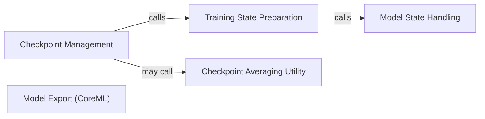

## Details

The Checkpoint & Export subsystem is responsible for managing the persistence of training progress and enabling the deployment of trained models. Its boundaries are defined by the utils/checkpoint_utils.py and utils/pytorch_to_coreml.py modules, which encapsulate functionalities related to saving, loading, and converting models.

### Checkpoint Management
This component provides the core functionalities for saving and loading the complete training state, including the model's weights, optimizer state, and current epoch. It acts as the primary interface for persisting and restoring training progress.

**Related Classes/Methods**:

- <a href="https://github.com/apple/ml-cvnets/blob/main/utils/checkpoint_utils.py#L230-L329" target="_blank" rel="noopener noreferrer">`save_checkpoint`:230-329</a>
- <a href="https://github.com/apple/ml-cvnets/blob/main/utils/checkpoint_utils.py#L332-L407" target="_blank" rel="noopener noreferrer">`load_checkpoint`:332-407</a>

### Model State Handling
Focuses specifically on the extraction, loading, and manipulation of only the model's weights (state dictionary). It provides granular control over model parameters, separate from the full training state.

**Related Classes/Methods**:

- <a href="https://github.com/apple/ml-cvnets/blob/main/utils/checkpoint_utils.py#L410-L446" target="_blank" rel="noopener noreferrer">`load_model_state`:410-446</a>
- <a href="https://github.com/apple/ml-cvnets/blob/main/utils/checkpoint_utils.py#L24-L38" target="_blank" rel="noopener noreferrer">`get_model_state_dict`:24-38</a>
- <a href="https://github.com/apple/ml-cvnets/blob/main/utils/checkpoint_utils.py#L449-L463" target="_blank" rel="noopener noreferrer">`copy_weights`:449-463</a>

### Training State Preparation
This component is responsible for gathering and structuring all necessary information (model state, optimizer state, epoch, etc.) into a unified object that can be efficiently saved as a checkpoint. It acts as an internal helper for the Checkpoint Management component.

**Related Classes/Methods**:

- <a href="https://github.com/apple/ml-cvnets/blob/main/utils/checkpoint_utils.py#L191-L227" target="_blank" rel="noopener noreferrer">`get_training_state`:191-227</a>

### Checkpoint Averaging Utility
Implements advanced checkpointing strategies, specifically the averaging of weights from multiple checkpoints. This technique is often used to improve model generalization and robustness, particularly in scenarios like Stochastic Weight Averaging (SWA).

**Related Classes/Methods**:

- <a href="https://github.com/apple/ml-cvnets/blob/main/utils/checkpoint_utils.py#L94-L154" target="_blank" rel="noopener noreferrer">`avg_and_save_k_checkpoints`:94-154</a>

### Model Export (CoreML)
Handles the conversion of trained PyTorch models into deployment-ready formats, specifically targeting CoreML for integration into Apple's ecosystem (iOS, macOS, watchOS, tvOS).

**Related Classes/Methods**:

- <a href="https://github.com/apple/ml-cvnets/blob/main/utils/pytorch_to_coreml.py#L20-L94" target="_blank" rel="noopener noreferrer">`convert_pytorch_to_coreml`:20-94</a>

### [FAQ](https://github.com/CodeBoarding/GeneratedOnBoardings/tree/main?tab=readme-ov-file#faq)