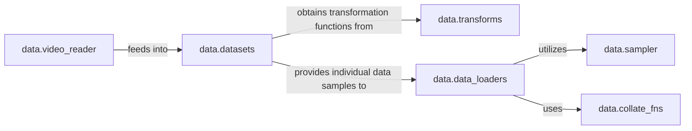

## Details

The `ml_cvnets.data` subsystem is designed for efficient and flexible data handling in machine learning workflows. At its core, `data.datasets` abstracts raw data into usable samples, acting as the primary data source. These samples are then processed by `data.transforms` for augmentation and preprocessing, ensuring data is in the correct format for model consumption. For video-specific data, `data.video_reader` provides the initial raw video input to `data.datasets`. The `data.data_loaders` component orchestrates the iteration over these processed samples, forming batches. It leverages `data.sampler` to determine the order and grouping of samples within batches, enabling various sampling strategies. Finally, `data.collate_fns` provides the necessary functions to combine individual samples into a coherent batch, preparing them for input to the neural network. This modular design ensures a clear separation of concerns, allowing for easy extension and modification of data pipelines.

### data.datasets
This is the core component for data abstraction. It defines how raw data is loaded and presented as individual samples. It acts as the primary interface for accessing data.

**Related Classes/Methods**:

### data.transforms
This component encapsulates all data augmentation and preprocessing logic. It provides a modular way to apply various transformations to raw data samples, preparing them for model input and enhancing generalization.

**Related Classes/Methods**:

### data.data_loaders
This component acts as the orchestrator for data iteration. It is responsible for creating and managing data loaders (e.g., PyTorch `DataLoader` instances), which handle batching and provide an iterable interface for training and evaluation loops.

**Related Classes/Methods**:

### data.collate_fns
This specialized component provides functions to combine individual data samples into a batch. This is crucial for handling varying sample sizes and ensuring proper formatting for model input.

**Related Classes/Methods**:

### data.sampler
This component determines the order and grouping of data samples during iteration, allowing for different batching strategies (e.g., sequential, random, distributed). It influences how `data.data_loaders` forms batches.

**Related Classes/Methods**:

### data.video_reader
A specialized component for handling video data, responsible for reading video files and extracting relevant clips. It provides raw video data to the dataset component.

**Related Classes/Methods**:

### [FAQ](https://github.com/CodeBoarding/GeneratedOnBoardings/tree/main?tab=readme-ov-file#faq)