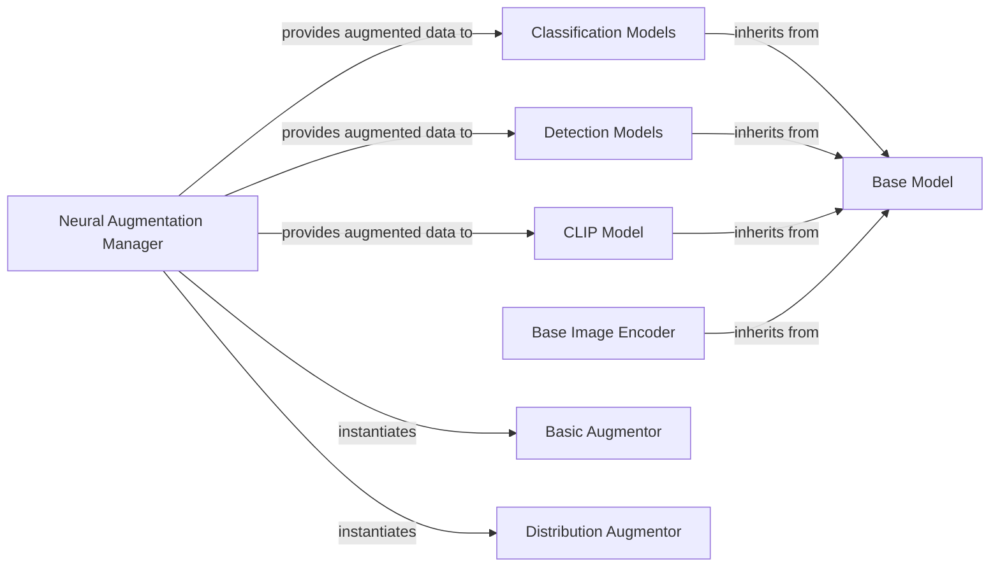

## Details

The `cvnets` model subsystem provides a structured framework for developing and deploying computer vision models. At its core, the `Base Model` establishes a common contract for all models, promoting reusability and maintainability. Specialized model categories like `Classification Models` and `Detection Models`, along with specific implementations such as the `CLIP Model` and `Base Image Encoder`, extend this base functionality to address diverse vision tasks. A dedicated `Neural Augmentation Manager` orchestrates data pre-processing, applying various augmentation strategies (e.g., `Basic Augmentor`, `Distribution Augmentor`) to enhance the training data. This modular design allows for easy integration of new models and augmentation techniques, forming a robust pipeline for computer vision applications.

### Base Model
Serves as the abstract base class for all computer vision models. It defines common interfaces, properties (e.g., model information), and functionalities (e.g., dummy input/label generation), establishing the architectural contract for all derived models.

**Related Classes/Methods**:

- <a href="https://github.com/apple/ml-cvnets/blob/main/cvnets/models/base_model.py" target="_blank" rel="noopener noreferrer">`cvnets.models.base_model.BaseModel`</a>

### Neural Augmentation Manager
Manages and applies neural augmentation techniques to input data. It acts as a factory for creating different types of augmentors and orchestrates their application to data before it enters the model.

**Related Classes/Methods**:

- <a href="https://github.com/apple/ml-cvnets/blob/main/cvnets/neural_augmentor/neural_aug.py" target="_blank" rel="noopener noreferrer">`cvnets.neural_augmentor.neural_aug.NeuralAugmentor`</a>

### Classification Models
Represents a category of specific computer vision models designed for classification tasks, inheriting from the `Base Model`. This category includes various concrete implementations found within its directory.

**Related Classes/Methods**:

- <a href="https://github.com/apple/ml-cvnets/blob/main/cvnets/models/classification" target="_blank" rel="noopener noreferrer">`cvnets.models.classification`</a>

### Detection Models
Represents a category of specific computer vision models designed for object detection tasks, inheriting from the `Base Model`. This category includes various concrete implementations found within its directory.

**Related Classes/Methods**:

- <a href="https://github.com/apple/ml-cvnets/blob/main/cvnets/models/detection" target="_blank" rel="noopener noreferrer">`cvnets.models.detection`</a>

### CLIP Model
Represents the concrete CLIP model implementation, inheriting from the `Base Model`.

**Related Classes/Methods**:

- <a href="https://github.com/apple/ml-cvnets/blob/main/cvnets/models/multi_modal_img_text/clip.py#L26-L245" target="_blank" rel="noopener noreferrer">`cvnets.models.multi_modal_img_text.clip.CLIP`:26-245</a>

### Base Image Encoder
Represents a foundational and concrete component for image encoding, likely used as a sub-component within more complex models, inheriting from the `Base Model`.

**Related Classes/Methods**:

- <a href="https://github.com/apple/ml-cvnets/blob/main/cvnets/models/classification/base_image_encoder.py#L20-L383" target="_blank" rel="noopener noreferrer">`cvnets.models.classification.base_image_encoder.BaseImageEncoder`:20-383</a>

### Basic Augmentor
A concrete implementation of a neural augmentor, providing a basic augmentation strategy.

**Related Classes/Methods**:

- <a href="https://github.com/apple/ml-cvnets/blob/main/cvnets/neural_augmentor/neural_aug.py" target="_blank" rel="noopener noreferrer">`cvnets.neural_augmentor.neural_aug.BasicAugmentor`</a>

### Distribution Augmentor
A concrete implementation of a neural augmentor, providing a distribution-based augmentation strategy.

**Related Classes/Methods**:

- <a href="https://github.com/apple/ml-cvnets/blob/main/cvnets/neural_augmentor/neural_aug.py" target="_blank" rel="noopener noreferrer">`cvnets.neural_augmentor.neural_aug.DistributionAugmentor`</a>

### [FAQ](https://github.com/CodeBoarding/GeneratedOnBoardings/tree/main?tab=readme-ov-file#faq)