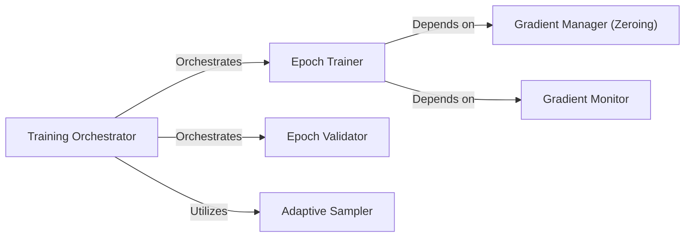

## Details

The Training Engine subsystem is primarily encapsulated within the ml-cvnets.engine.training_engine module, located at /mnt/e/StartUp/ml-cvnets/engine/training_engine.py. This module serves as the central orchestrator for the entire model training and validation lifecycle.

### Training Orchestrator
The highest-level component within the Training Engine, responsible for orchestrating the entire training and validation process across multiple epochs. It defines the overarching pipeline, managing the flow between training and validation phases.

**Related Classes/Methods**:

- <a href="https://github.com/apple/ml-cvnets/blob/main/engine/training_engine.py" target="_blank" rel="noopener noreferrer">`ml-cvnets.engine.training_engine:run`</a>

### Epoch Trainer
Executes the core training steps for a single epoch. This includes performing forward and backward passes, calculating loss, and managing gradient updates. It is the workhorse for iterative learning.

**Related Classes/Methods**:

- <a href="https://github.com/apple/ml-cvnets/blob/main/engine/training_engine.py" target="_blank" rel="noopener noreferrer">`ml-cvnets.engine.training_engine:train_epoch`</a>

### Epoch Validator
Performs model evaluation on a validation dataset for a single epoch. Its primary role is to assess model performance and generalization capabilities without performing gradient updates.

**Related Classes/Methods**:

- <a href="https://github.com/apple/ml-cvnets/blob/main/engine/training_engine.py" target="_blank" rel="noopener noreferrer">`ml-cvnets.engine.training_engine:val_epoch`</a>

### Gradient Manager (Zeroing)
Resets the gradients of model parameters to zero before a new optimization step. This prevents unintended accumulation of gradients from previous iterations, ensuring clean updates.

**Related Classes/Methods**:

- <a href="https://github.com/apple/ml-cvnets/blob/main/engine/training_engine.py" target="_blank" rel="noopener noreferrer">`ml-cvnets.engine.training_engine:_zero_grad`</a>

### Gradient Monitor
Calculates the norm of gradients, a metric often used for monitoring training stability, detecting exploding/vanishing gradients, or for gradient clipping techniques.

**Related Classes/Methods**:

- <a href="https://github.com/apple/ml-cvnets/blob/main/engine/training_engine.py" target="_blank" rel="noopener noreferrer">`ml-cvnets.engine.training_engine:compute_grad_norm`</a>

### Adaptive Sampler
Identifies and potentially prioritizes specific samples (e.g., "easy" or "hard" samples) within a dataset. This component supports adaptive training strategies like curriculum learning or hard-negative mining.

**Related Classes/Methods**:

- <a href="https://github.com/apple/ml-cvnets/blob/main/engine/training_engine.py" target="_blank" rel="noopener noreferrer">`ml-cvnets.engine.training_engine:find_easy_samples`</a>

### [FAQ](https://github.com/CodeBoarding/GeneratedOnBoardings/tree/main?tab=readme-ov-file#faq)