```mermaid
graph LR
    Application_Orchestration["Application Orchestration"]
    Configuration_Management["Configuration Management"]
    Data_Management["Data Management"]
    Model_Core["Model Core"]
    Training_Engine["Training Engine"]
    Evaluation_Metrics["Evaluation & Metrics"]
    Optimization_Loss["Optimization & Loss"]
    Checkpoint_Export["Checkpoint & Export"]
    Application_Orchestration -- "configures and initializes" --> Configuration_Management
    Application_Orchestration -- "initializes" --> Data_Management
    Application_Orchestration -- "initializes" --> Model_Core
    Application_Orchestration -- "initializes" --> Training_Engine
    Application_Orchestration -- "initializes" --> Evaluation_Metrics
    Application_Orchestration -- "initializes" --> Checkpoint_Export
    Application_Orchestration -- "manages model persistence via" --> Checkpoint_Export
    Configuration_Management -- "provides configuration to" --> Application_Orchestration
    Configuration_Management -- "provides configuration to" --> Data_Management
    Configuration_Management -- "provides configuration to" --> Model_Core
    Configuration_Management -- "provides configuration to" --> Training_Engine
    Configuration_Management -- "provides configuration to" --> Evaluation_Metrics
    Configuration_Management -- "provides configuration to" --> Optimization_Loss
    Configuration_Management -- "provides configuration to" --> Checkpoint_Export
    Data_Management -- "provides data to" --> Training_Engine
    Data_Management -- "provides data to" --> Evaluation_Metrics
    Model_Core -- "processes data from" --> Data_Management
    Model_Core -- "provides outputs to" --> Training_Engine
    Model_Core -- "provides outputs to" --> Evaluation_Metrics
    Model_Core -- "provides/receives weights from" --> Checkpoint_Export
    Training_Engine -- "requests data from" --> Data_Management
    Training_Engine -- "interacts with" --> Model_Core
    Training_Engine -- "calculates loss with" --> Optimization_Loss
    Training_Engine -- "informs learning rate to" --> Optimization_Loss
    Training_Engine -- "saves/loads state via" --> Checkpoint_Export
    Training_Engine -- "invokes" --> Evaluation_Metrics
    Evaluation_Metrics -- "requests data from" --> Data_Management
    Evaluation_Metrics -- "performs inference with" --> Model_Core
    Evaluation_Metrics -- "reports metrics to" --> Training_Engine
    Optimization_Loss -- "receives parameters/outputs from" --> Model_Core
    Optimization_Loss -- "updates parameters in" --> Model_Core
    Checkpoint_Export -- "provides/receives models to/from" --> Model_Core
    click Application_Orchestration href "https://github.com/CodeBoarding/GeneratedOnBoardings/blob/main/ml-cvnets/Application_Orchestration.md" "Details"
    click Configuration_Management href "https://github.com/CodeBoarding/GeneratedOnBoardings/blob/main/ml-cvnets/Configuration_Management.md" "Details"
    click Data_Management href "https://github.com/CodeBoarding/GeneratedOnBoardings/blob/main/ml-cvnets/Data_Management.md" "Details"
    click Model_Core href "https://github.com/CodeBoarding/GeneratedOnBoardings/blob/main/ml-cvnets/Model_Core.md" "Details"
    click Training_Engine href "https://github.com/CodeBoarding/GeneratedOnBoardings/blob/main/ml-cvnets/Training_Engine.md" "Details"
    click Optimization_Loss href "https://github.com/CodeBoarding/GeneratedOnBoardings/blob/main/ml-cvnets/Optimization_Loss.md" "Details"
    click Checkpoint_Export href "https://github.com/CodeBoarding/GeneratedOnBoardings/blob/main/ml-cvnets/Checkpoint_Export.md" "Details"
```

## Details

The `ml-cvnets` project is structured around a modular design, facilitating efficient development and deployment of computer vision models. At its core, `Application Orchestration` serves as the central control, managing the lifecycle of training, evaluation, and benchmarking processes. It initializes and coordinates interactions among key components, including `Configuration Management` for parameter handling, `Data Management` for data preparation, `Model Core` for model definitions, `Training Engine` for model optimization, `Evaluation & Metrics` for performance assessment, and `Checkpoint & Export` for model persistence and deployment. This clear separation of concerns ensures a robust and scalable architecture, where data flows logically from preparation through training and evaluation, culminating in deployable models.

### Application Orchestration [[Expand]](./Application_Orchestration.md)
The primary entry point for different operational modes (training, evaluation, benchmarking). It initializes the application, parses top-level arguments, and orchestrates the overall process by invoking core engine components.

**Related Classes/Methods**:

- <a href="https://github.com/apple/ml-cvnets/blob/main/main_train.py" target="_blank" rel="noopener noreferrer">`main_train.py`</a>
- <a href="https://github.com/apple/ml-cvnets/blob/main/main_eval.py" target="_blank" rel="noopener noreferrer">`main_eval.py`</a>

### Configuration Management [[Expand]](./Configuration_Management.md)
Centralized system for managing project configurations and command-line arguments. It loads YAML configuration files, validates input parameters, and provides structured options to other components.

**Related Classes/Methods**:

- <a href="https://github.com/apple/ml-cvnets/blob/main/options/opts.py" target="_blank" rel="noopener noreferrer">`options/opts.py`</a>

### Data Management [[Expand]](./Data_Management.md)
Handles all aspects of data loading, preprocessing, augmentation, and batching for various data types. It creates datasets, applies transformations, and manages data loaders for training and evaluation.

**Related Classes/Methods**:

- <a href="https://github.com/apple/ml-cvnets/blob/main/data/data_loaders.py" target="_blank" rel="noopener noreferrer">`data/data_loaders.py`</a>
- <a href="https://github.com/apple/ml-cvnets/blob/main/data/collate_fns/collate_functions.py#L16-L20" target="_blank" rel="noopener noreferrer">`data.collate_fns.collate_functions.py`:16-20</a>
- <a href="https://github.com/apple/ml-cvnets/blob/main/data/datasets/dataset_base.py" target="_blank" rel="noopener noreferrer">`data/datasets/dataset_base.py`</a>

### Model Core [[Expand]](./Model_Core.md)
Contains the architectural definitions and building blocks for a wide range of computer vision models. This includes implementing forward passes and integrating neural augmentation techniques.

**Related Classes/Methods**:

- <a href="https://github.com/apple/ml-cvnets/blob/main/cvnets/models/base_model.py" target="_blank" rel="noopener noreferrer">`cvnets/models/base_model.py`</a>
- <a href="https://github.com/apple/ml-cvnets/blob/main/cvnets/neural_augmentor/neural_aug.py" target="_blank" rel="noopener noreferrer">`cvnets/neural_augmentor/neural_aug.py`</a>

### Training Engine [[Expand]](./Training_Engine.md)
Manages the core training loop, including forward and backward passes, gradient accumulation, and logging of training progress. It orchestrates interactions between data, model, loss, and optimization components.

**Related Classes/Methods**:

- <a href="https://github.com/apple/ml-cvnets/blob/main/engine/training_engine.py" target="_blank" rel="noopener noreferrer">`engine/training_engine.py`</a>

### Evaluation & Metrics
Oversees the evaluation process for different tasks, including inference, prediction saving, and task-specific result analysis. It also implements various performance metrics for evaluating model outputs.

**Related Classes/Methods**:

- <a href="https://github.com/apple/ml-cvnets/blob/main/engine/evaluation_engine.py" target="_blank" rel="noopener noreferrer">`engine/evaluation_engine.py`</a>
- <a href="https://github.com/apple/ml-cvnets/blob/main/metrics/metric_base.py" target="_blank" rel="noopener noreferrer">`metrics/metric_base.py`</a>
- <a href="https://github.com/apple/ml-cvnets/blob/main/metrics/topk_accuracy.py" target="_blank" rel="noopener noreferrer">`metrics/topk_accuracy.py`</a>

### Optimization & Loss [[Expand]](./Optimization_Loss.md)
Manages the optimizers and learning rate schedulers used during model training, and provides a collection of loss functions, including composite loss mechanisms.

**Related Classes/Methods**:

- <a href="https://github.com/apple/ml-cvnets/blob/main/optim/__init__.py" target="_blank" rel="noopener noreferrer">`optim/__init__.py`</a>
- <a href="https://github.com/apple/ml-cvnets/blob/main/optim/scheduler/base_scheduler.py" target="_blank" rel="noopener noreferrer">`optim/scheduler/base_scheduler.py`</a>
- <a href="https://github.com/apple/ml-cvnets/blob/main/loss_fn/composite_loss.py" target="_blank" rel="noopener noreferrer">`loss_fn/composite_loss.py`</a>
- <a href="https://github.com/apple/ml-cvnets/blob/main/loss_fn/classification/cross_entropy.py" target="_blank" rel="noopener noreferrer">`loss_fn/classification/cross_entropy.py`</a>

### Checkpoint & Export [[Expand]](./Checkpoint_Export.md)
Handles the saving and loading of model weights, optimizer states, and other training progress information. It also manages the export of trained models to various deployment formats.

**Related Classes/Methods**:

- <a href="https://github.com/apple/ml-cvnets/blob/main/utils/checkpoint_utils.py" target="_blank" rel="noopener noreferrer">`utils/checkpoint_utils.py`</a>
- <a href="https://github.com/apple/ml-cvnets/blob/main/utils/pytorch_to_coreml.py" target="_blank" rel="noopener noreferrer">`utils/pytorch_to_coreml.py`</a>

### [FAQ](https://github.com/CodeBoarding/GeneratedOnBoardings/tree/main?tab=readme-ov-file#faq)