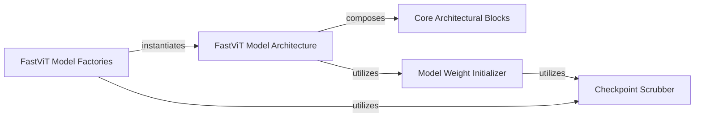

## Details

The `FastViT Model Core` subsystem centralizes the definition and implementation of the FastViT model architectures, including their forward pass and weight initialization. This component represents the core intellectual property of the library, focusing on the model's structure and foundational elements.

### FastViT Model Architecture
This is the core component, defining the complete neural network architecture of the FastViT model. It orchestrates the data flow through its layers during the forward pass. It represents the primary model structure.

**Related Classes/Methods**:

- <a href="https://github.com/apple/ml-fastvit/blob/main/models/fastvit.py#L742-L953" target="_blank" rel="noopener noreferrer">`FastViT`:742-953</a>

### Core Architectural Blocks
These are the fundamental, reusable building blocks (layers or sub-modules) that constitute the FastViT architecture. They are composed by the `FastViT Model Architecture` to form the complete network.

**Related Classes/Methods**:

- <a href="https://github.com/apple/ml-fastvit/blob/main/models/fastvit.py#L228-L345" target="_blank" rel="noopener noreferrer">`RepMixer`:228-345</a>
- <a href="https://github.com/apple/ml-fastvit/blob/main/models/fastvit.py#L113-L172" target="_blank" rel="noopener noreferrer">`MHSA`:113-172</a>
- <a href="https://github.com/apple/ml-fastvit/blob/main/models/fastvit.py#L175-L225" target="_blank" rel="noopener noreferrer">`PatchEmbed`:175-225</a>
- <a href="https://github.com/apple/ml-fastvit/blob/main/models/fastvit.py" target="_blank" rel="noopener noreferrer">`ConvFFN`</a>
- <a href="https://github.com/apple/ml-fastvit/blob/main/models/fastvit.py#L520-L591" target="_blank" rel="noopener noreferrer">`RepMixerBlock`:520-591</a>
- <a href="https://github.com/apple/ml-fastvit/blob/main/models/fastvit.py#L594-L661" target="_blank" rel="noopener noreferrer">`AttentionBlock`:594-661</a>
- <a href="https://github.com/apple/ml-fastvit/blob/main/models/fastvit.py#L63-L110" target="_blank" rel="noopener noreferrer">`convolutional_stem`:63-110</a>
- <a href="https://github.com/apple/ml-fastvit/blob/main/models/fastvit.py#L926-L938" target="_blank" rel="noopener noreferrer">`forward_tokens`:926-938</a>
- <a href="https://github.com/apple/ml-fastvit/blob/main/models/fastvit.py#L922-L924" target="_blank" rel="noopener noreferrer">`forward_embeddings`:922-924</a>

### Model Weight Initializer
Manages the initialization of the model's parameters, ensuring proper starting conditions for training or loading pre-trained weights.

**Related Classes/Methods**:

- <a href="https://github.com/apple/ml-fastvit/blob/main/models/fastvit.py#L390-L394" target="_blank" rel="noopener noreferrer">`init_weights`:390-394</a>
- <a href="https://github.com/apple/ml-fastvit/blob/main/models/fastvit.py#L886-L920" target="_blank" rel="noopener noreferrer">`FastViT.init_weights`:886-920</a>
- <a href="https://github.com/apple/ml-fastvit/blob/main/models/fastvit.py#L390-L394" target="_blank" rel="noopener noreferrer">`_init_weights`:390-394</a>
- <a href="https://github.com/apple/ml-fastvit/blob/main/models/fastvit.py#L869-L874" target="_blank" rel="noopener noreferrer">`cls_init_weights`:869-874</a>

### FastViT Model Factories
Provide convenient entry points to create pre-configured instances of the FastViT model with specific architectural parameters (e.g., different sizes like `fastvit_t8`, `fastvit_tx`). They abstract the complexity of model instantiation.

**Related Classes/Methods**:

- <a href="https://github.com/apple/ml-fastvit/blob/main/models/fastvit.py#L956-L975" target="_blank" rel="noopener noreferrer">`fastvit_t8`:956-975</a>
- <a href="https://github.com/apple/ml-fastvit/blob/main/models/fastvit.py#L956-L975" target="_blank" rel="noopener noreferrer">`fastvit_tx`:956-975</a>

### Checkpoint Scrubber
Handles potential modifications or cleaning of pre-trained model checkpoints to ensure compatibility and correct loading into the FastViT model architecture.

**Related Classes/Methods**:

- <a href="https://github.com/apple/ml-fastvit/blob/main/models/fastvit.py#L876-L884" target="_blank" rel="noopener noreferrer">`_scrub_checkpoint`:876-884</a>

### [FAQ](https://github.com/CodeBoarding/GeneratedOnBoardings/tree/main?tab=readme-ov-file#faq)