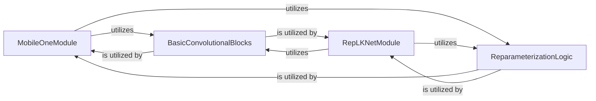

## Details

The `models/modules` subsystem primarily focuses on defining and implementing specialized neural network architectures and their core building blocks. `MobileOneModule` and `RepLKNetModule` represent distinct, self-contained network models, each encapsulating its specific layers and reparameterization logic. Both of these modules extensively `utilize` `BasicConvolutionalBlocks` as fundamental primitives for constructing their convolutional and batch normalization layers. Furthermore, both `MobileOneModule` and `RepLKNetModule` `utilize` `ReparameterizationLogic` to apply generic algorithms for fusing batch normalization parameters, which is a critical step for optimizing models for efficient inference. This structure highlights a clear separation of concerns, with network definitions leveraging shared, low-level convolutional operations and a common reparameterization mechanism.

### MobileOneModule
Defines and implements the MobileOne neural network architecture, including its specific layers and the `reparameterize` method tailored for MobileOne. This component encapsulates the full MobileOne model definition, making it a reusable and self-contained module.

**Related Classes/Methods**:

- <a href="https://github.com/apple/ml-fastvit/blob/main/models/modules/mobileone.py#L181-L211" target="_blank" rel="noopener noreferrer">`reparameterize`:181-211</a>

### RepLKNetModule
Defines and implements the RepLKNet neural network architecture, including its specific layers and the `reparameterize` method tailored for RepLKNet. Similar to MobileOne, this component provides a complete, reusable RepLKNet model.

**Related Classes/Methods**:

- <a href="https://github.com/apple/ml-fastvit/blob/main/models/modules/replknet.py" target="_blank" rel="noopener noreferrer">`replknet`</a>

### ReparameterizationLogic
Provides generic algorithms (e.g., `_get_kernel_bias`, `_fuse_bn_tensor`) for fusing batch normalization parameters into convolutional layers. This is crucial for converting models for efficient inference by reducing computational overhead.

**Related Classes/Methods**:

- <a href="https://github.com/apple/ml-fastvit/blob/main/models/modules/mobileone.py#L213-L246" target="_blank" rel="noopener noreferrer">`_get_kernel_bias`:213-246</a>
- <a href="https://github.com/apple/ml-fastvit/blob/main/models/modules/mobileone.py#L248-L289" target="_blank" rel="noopener noreferrer">`_fuse_bn_tensor`:248-289</a>

### BasicConvolutionalBlocks
Offers fundamental, reusable convolutional and batch normalization operations (`_conv_bn`) that serve as basic building blocks for various neural network architectures within the `models/modules` subsystem. These are low-level primitives used to construct more complex layers.

**Related Classes/Methods**:

- <a href="https://github.com/apple/ml-fastvit/blob/main/models/modules/mobileone.py#L291-L315" target="_blank" rel="noopener noreferrer">`_conv_bn`:291-315</a>

### [FAQ](https://github.com/CodeBoarding/GeneratedOnBoardings/tree/main?tab=readme-ov-file#faq)