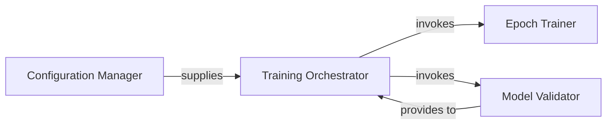

## Details

The Training Pipeline subsystem orchestrates the entire model training lifecycle, embodying the "Experimentation & Training" architectural pattern. It drives the learning process from raw data to a trained model.

### Configuration Manager
Responsible for parsing command-line arguments, loading configuration settings, and preparing the training environment. It ensures that all necessary hyperparameters and operational flags are correctly set before training commences.

**Related Classes/Methods**:

- <a href="https://github.com/apple/ml-fastvit/blob/main/train.py#L841-L855" target="_blank" rel="noopener noreferrer">`train._parse_args`:841-855</a>

### Training Orchestrator
The main entry point for the training process. It initializes the model, data loaders, optimizers, and schedulers, then manages the overall training loop across multiple epochs, coordinating calls to the epoch training and validation routines.

**Related Classes/Methods**:

- <a href="https://github.com/apple/ml-fastvit/blob/main/train.py#L858-L1344" target="_blank" rel="noopener noreferrer">`train.main`:858-1344</a>

### Epoch Trainer
Encapsulates the core logic for a single training epoch. This includes iterating through the training dataset, performing forward and backward passes, calculating loss, and updating model weights using the optimizer.

**Related Classes/Methods**:

- <a href="https://github.com/apple/ml-fastvit/blob/main/train.py#L1347-L1484" target="_blank" rel="noopener noreferrer">`train.train_one_epoch`:1347-1484</a>

### Model Validator
Handles the evaluation of the model's performance on a separate validation dataset. It computes metrics (e.g., accuracy, loss) to assess the model's generalization ability and inform decisions about early stopping or learning rate adjustments.

**Related Classes/Methods**:

- <a href="https://github.com/apple/ml-fastvit/blob/main/train.py#L1487-L1559" target="_blank" rel="noopener noreferrer">`train.validate`:1487-1559</a>

### [FAQ](https://github.com/CodeBoarding/GeneratedOnBoardings/tree/main?tab=readme-ov-file#faq)