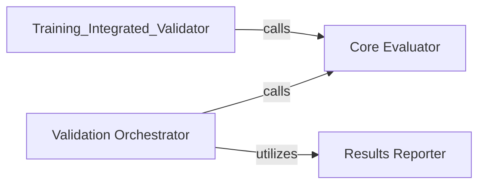

## Details

The validation subsystem of ml-fastvit is structured around a clear separation of concerns, facilitating both standalone model evaluation and integrated validation within the training pipeline. The Validation Orchestrator acts as the central control for independent validation runs, directing the flow from data loading to result reporting. The Core Evaluator encapsulates the fundamental logic for calculating model performance metrics, serving as a reusable component for any validation need. Validation outcomes are systematically handled by the Results Reporter, ensuring that all experimental results are captured and made accessible. Furthermore, the Training-Integrated Validator seamlessly integrates the core evaluation capabilities into the training process, promoting consistent and efficient model assessment throughout the development lifecycle. This modular design enhances maintainability and allows for flexible deployment of validation functionalities.

### Validation Orchestrator
Serves as the primary entry point for standalone model validation. It orchestrates the entire validation workflow, from initiating the evaluation to reporting the results. This component embodies the "Pipeline/Workflow" pattern, managing the sequence of operations for a complete validation run.

**Related Classes/Methods**:

- <a href="https://github.com/apple/ml-fastvit/blob/main/validate.py#L478-L547" target="_blank" rel="noopener noreferrer">`validate.main`:478-547</a>

### Core Evaluator
Executes the actual model evaluation logic. It takes a trained model and a dataset, computes various performance metrics (e.g., accuracy, loss), and returns the results. This is the core functional component responsible for "evaluating model performance and generating metrics."

**Related Classes/Methods**:

- <a href="https://github.com/apple/ml-fastvit/blob/main/validate.py#L281-L475" target="_blank" rel="noopener noreferrer">`validate.validate`:281-475</a>

### Results Reporter
Handles the persistence and reporting of validation outcomes. This includes saving metrics to files, generating reports, or logging results. This component is crucial for the "reproducible ML experimentation pipeline" by ensuring validation results are captured and accessible.

**Related Classes/Methods**:

- <a href="https://github.com/apple/ml-fastvit/blob/main/validate.py#L550-L556" target="_blank" rel="noopener noreferrer">`validate.write_results`:550-556</a>

### [FAQ](https://github.com/CodeBoarding/GeneratedOnBoardings/tree/main?tab=readme-ov-file#faq)