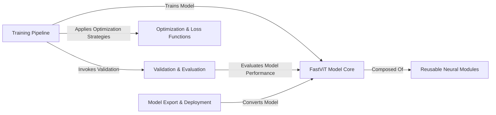

## Details

The `ml-fastvit` project is structured around a core `FastViT Model Core` that defines the various FastViT architectures, leveraging `Reusable Neural Modules` as foundational building blocks. The `Training Pipeline` orchestrates the model learning process, utilizing `Optimization & Loss Functions` to guide model convergence and regularly invoking the `Validation & Evaluation` component to assess performance. Once trained, models can be prepared for production deployment through the `Model Export & Deployment` component, which converts the `FastViT Model Core` into deployable formats. This modular design facilitates clear separation of concerns, enabling efficient development, training, and deployment of FastViT models.

### FastViT Model Core [[Expand]](./FastViT_Model_Core.md)
Centralizes the definition and implementation of the FastViT model architectures, including their forward pass and weight initialization. This component represents the core intellectual property of the library.

**Related Classes/Methods**:

- <a href="https://github.com/apple/ml-fastvit/blob/main/models/fastvit.py#L742-L953" target="_blank" rel="noopener noreferrer">`FastViT`:742-953</a>
- <a href="https://github.com/apple/ml-fastvit/blob/main/models/fastvit.py#L390-L394" target="_blank" rel="noopener noreferrer">`init_weights`:390-394</a>
- <a href="https://github.com/apple/ml-fastvit/blob/main/models/fastvit.py#L956-L975" target="_blank" rel="noopener noreferrer">`fastvit_t8`:956-975</a>
- <a href="https://github.com/apple/ml-fastvit/blob/main/models/fastvit.py" target="_blank" rel="noopener noreferrer">`fastvit_tx`</a>

### Reusable Neural Modules [[Expand]](./Reusable_Neural_Modules.md)
Provides a library of specialized, reusable neural network modules and reparameterization techniques (e.g., MobileOne, RepLKNet components) that serve as building blocks for FastViT models or other custom architectures, promoting modularity and reusability.

**Related Classes/Methods**:

- <a href="https://github.com/apple/ml-fastvit/blob/main/models/modules/mobileone.py#L181-L211" target="_blank" rel="noopener noreferrer">`reparameterize`:181-211</a>
- <a href="https://github.com/apple/ml-fastvit/blob/main/export_model.py#L15-L31" target="_blank" rel="noopener noreferrer">``:15-31</a>

### Training Pipeline [[Expand]](./Training_Pipeline.md)
Orchestrates the entire model training lifecycle, including argument parsing, managing training epochs, handling data loading, and invoking validation routines. It drives the learning process from raw data to a trained model.

**Related Classes/Methods**:

- <a href="https://github.com/apple/ml-fastvit/blob/main/train.py#L1347-L1484" target="_blank" rel="noopener noreferrer">`train_one_epoch`:1347-1484</a>
- <a href="https://github.com/apple/ml-fastvit/blob/main/export_model.py#L15-L31" target="_blank" rel="noopener noreferrer">``:15-31</a>

### Validation & Evaluation [[Expand]](./Validation_Evaluation.md)
Manages the evaluation of trained models. This component is responsible for calculating performance metrics, generating reports, and persisting validation results, providing critical feedback on model performance and enabling benchmarking.

**Related Classes/Methods**:

- <a href="https://github.com/apple/ml-fastvit/blob/main/validate.py#L478-L547" target="_blank" rel="noopener noreferrer">`main`:478-547</a>
- <a href="https://github.com/apple/ml-fastvit/blob/main/validate.py#L281-L475" target="_blank" rel="noopener noreferrer">`validate`:281-475</a>

### Optimization & Loss Functions
Contains utility functions and classes for specific optimization strategies (e.g., learning rate scheduling, weight decay adjustments) and various loss functions used during the training process. This component supports the training pipeline by providing the mathematical backbone for learning.

**Related Classes/Methods**:

- <a href="https://github.com/apple/ml-fastvit/blob/main/misc/cosine_annealing.py#L33-L40" target="_blank" rel="noopener noreferrer">`update_weight_decay`:33-40</a>
- <a href="https://github.com/apple/ml-fastvit/blob/main/misc/distillation_loss.py#L10-L71" target="_blank" rel="noopener noreferrer">`DistillationLoss`:10-71</a>

### Model Export & Deployment
Provides tools and scripts for converting trained models into production-ready formats (e.g., CoreML) suitable for deployment on target platforms. This component bridges the gap between experimentation and practical application.

**Related Classes/Methods**:

- <a href="https://github.com/apple/ml-fastvit/blob/main/export_model.py#L15-L31" target="_blank" rel="noopener noreferrer">``:15-31</a>

### [FAQ](https://github.com/CodeBoarding/GeneratedOnBoardings/tree/main?tab=readme-ov-file#faq)