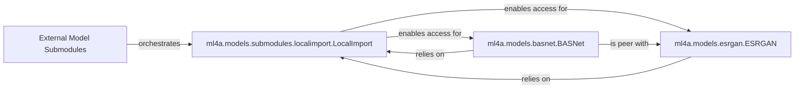

## Details

This subsystem is critical for `ml4a`'s ability to dynamically integrate and manage external machine learning model implementations, which are typically incorporated as Git submodules. It provides the foundational mechanism for `ml4a` to access and utilize these external deep learning codebases as if they were native Python packages, and offers standardized wrappers for specific models.

### External Model Submodules [[Expand]](./External_Model_Submodules.md)
The overarching subsystem responsible for the dynamic loading and integration of external ML model implementations, which are often included as git submodules, providing the actual deep learning code. It ensures that `ml4a` can seamlessly interact with these external codebases.

**Related Classes/Methods**:

- <a href="https://github.com/ml4a/ml4a/blob/master/ml4a/models/submodules/localimport.py" target="_blank" rel="noopener noreferrer">`ml4a.models.submodules.localimport`</a>
- <a href="https://github.com/ml4a/ml4a/blob/master/ml4a/models/submodules/BASNet" target="_blank" rel="noopener noreferrer">`ml4a.models.submodules.BASNet`</a>
- <a href="https://github.com/ml4a/ml4a/blob/master/ml4a/models/submodules/ESRGAN" target="_blank" rel="noopener noreferrer">`ml4a.models.submodules.ESRGAN`</a>

### ml4a.models.submodules.localimport.LocalImport
This is the core utility for dynamic path manipulation within the subsystem. It manages `sys.path` to allow `ml4a` to import modules directly from the submodule directories. It dynamically adds submodule directories to the Python import path, enabling `ml4a` to import code from these external repositories. It also handles `.pth` files and namespace declarations within submodules. This component is fundamental for the "Submodules" architectural pattern.

**Related Classes/Methods**:

- <a href="https://github.com/ml4a/ml4a/blob/master/ml4a/models/submodules/localimport.py#L165-L374" target="_blank" rel="noopener noreferrer">`ml4a.models.submodules.localimport.LocalImport`:165-374</a>

### ml4a.models.basnet.BASNet
A specific model wrapper that provides an `ml4a`-consistent interface for the external BASNet implementation. It acts as a facade/wrapper for the BASNet model, abstracting away its complexities and providing a simplified API for `ml4a` users (e.g., `load_model`, `run`, `get_foreground`). It handles model-specific pre-processing, inference execution, and post-processing. This component exemplifies the "Model Wrappers" pattern.

**Related Classes/Methods**:

- <a href="https://github.com/ml4a/ml4a/blob/master/ml4a/models/basnet.py" target="_blank" rel="noopener noreferrer">`ml4a.models.basnet.BASNet`</a>

### ml4a.models.esrgan.ESRGAN
A specific model wrapper that provides an `ml4a`-consistent interface for the external ESRGAN implementation. Similar to `BASNet`, it acts as a facade/wrapper for the ESRGAN model, managing the setup and execution of the super-resolution process. It provides a simplified API and handles model-specific pre-processing, inference, and post-processing. This also exemplifies the "Model Wrappers" pattern.

**Related Classes/Methods**:

- <a href="https://github.com/ml4a/ml4a/blob/master/ml4a/models/esrgan.py" target="_blank" rel="noopener noreferrer">`ml4a.models.esrgan.ESRGAN`</a>

### [FAQ](https://github.com/CodeBoarding/GeneratedOnBoardings/tree/main?tab=readme-ov-file#faq)