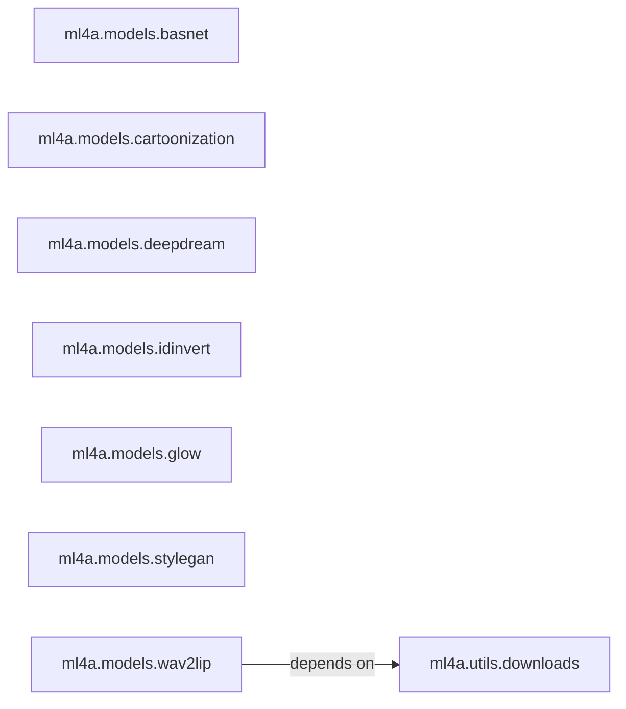

## Details

The ML4A Model Abstraction Layer subsystem, primarily defined by the `ml4a.models` Python package, provides wrappers for various deep learning models. It includes utility components like `ml4a.utils.downloads` for external resource acquisition. The subsystem follows a Wrapper/Facade Pattern, with model wrappers largely independent but adhering to a consistent API. A key dependency exists where model wrappers, such as `ml4a.models.wav2lip`, rely on `ml4a.utils.downloads` for pre-trained models.

### ml4a.models.basnet
Encapsulates the BASNet model for foreground segmentation from images, providing a simplified interface for loading the model and performing segmentation.

**Related Classes/Methods**:

- <a href="https://github.com/ml4a/ml4a/blob/master/ml4a/models/basnet.py#L1-L100" target="_blank" rel="noopener noreferrer">`ml4a.models.basnet`:1-100</a>

### ml4a.models.cartoonization
Provides an interface for applying cartoonization effects to images, abstracting the underlying model setup and inference logic.

**Related Classes/Methods**:

- <a href="https://github.com/ml4a/ml4a/blob/master/ml4a/models/cartoonization.py#L1-L100" target="_blank" rel="noopener noreferrer">`ml4a.models.cartoonization`:1-100</a>

### ml4a.models.deepdream
Manages the generation of Deep Dream visualizations, offering methods to set up the model and run the dream generation process.

**Related Classes/Methods**:

- <a href="https://github.com/ml4a/ml4a/blob/master/ml4a/models/deepdream.py#L1-L100" target="_blank" rel="noopener noreferrer">`ml4a.models.deepdream`:1-100</a>

### ml4a.models.idinvert
Encapsulates the logic for image inversion and generation using ID-Inversion techniques, typically for Generative Adversarial Networks (GANs), including model setup and querying available models.

**Related Classes/Methods**:

- <a href="https://github.com/ml4a/ml4a/blob/master/ml4a/models/idinvert.py#L1-L100" target="_blank" rel="noopener noreferrer">`ml4a.models.idinvert`:1-100</a>

### ml4a.models.glow
Offers functionalities for encoding, decoding, and manipulating images within the latent space of a Glow generative model, providing methods for creative image transformations.

**Related Classes/Methods**:

- <a href="https://github.com/ml4a/ml4a/blob/master/ml4a/models/glow.py#L1-L100" target="_blank" rel="noopener noreferrer">`ml4a.models.glow`:1-100</a>

### ml4a.models.stylegan
Provides methods for generating images and videos using StyleGAN, including random sampling, interpolations, and video generation from latent space manipulations.

**Related Classes/Methods**:

- <a href="https://github.com/ml4a/ml4a/blob/master/ml4a/models/stylegan.py#L1-L100" target="_blank" rel="noopener noreferrer">`ml4a.models.stylegan`:1-100</a>

### ml4a.models.wav2lip
Encapsulates the capability to perform lip-syncing of audio to video, handling model setup and the core lip-syncing process.

**Related Classes/Methods**:

- <a href="https://github.com/ml4a/ml4a/blob/master/ml4a/models/wav2lip.py#L1-L100" target="_blank" rel="noopener noreferrer">`ml4a.models.wav2lip`:1-100</a>

### ml4a.utils.downloads
A utility component responsible for downloading pre-trained models and other necessary files required by various ML models within the `ml4a.models` package.

**Related Classes/Methods**:

- <a href="https://github.com/ml4a/ml4a/blob/master/ml4a/utils/downloads.py#L1-L100" target="_blank" rel="noopener noreferrer">`ml4a.utils.downloads`:1-100</a>

### [FAQ](https://github.com/CodeBoarding/GeneratedOnBoardings/tree/main?tab=readme-ov-file#faq)