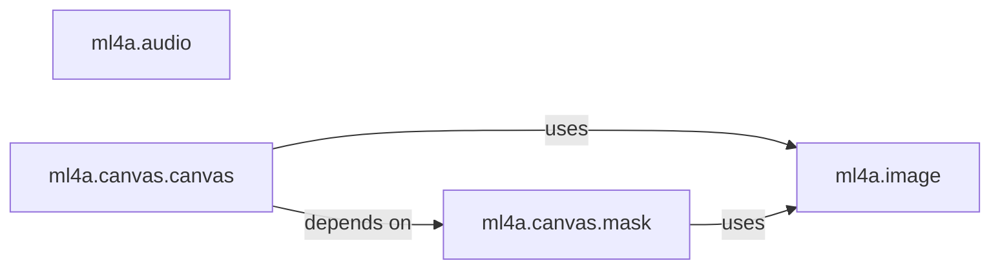

## Details

This subsystem is responsible for the fundamental handling, manipulation, and visualization of media assets (images and audio) and the creation of dynamic creative elements like canvases and masks. It forms the core layer for interactive and generative art applications within the `ml4a` toolkit.

### ml4a.image
This module serves as the foundational utility for core image operations. It provides functionalities for loading images from various sources (local files, URLs, NumPy arrays), saving images, displaying images and sequences of images (including conversion to movies), and performing fundamental manipulations such as resizing, cropping to aspect ratio, and retrieving image dimensions. It also simplifies access to common visual assets through sample image loading.

**Related Classes/Methods**:

- <a href="https://github.com/ml4a/ml4a/blob/master/ml4a/image.py" target="_blank" rel="noopener noreferrer">`ml4a.image`</a>

### ml4a.audio
This module manages basic audio operations. Its responsibilities include loading audio data, saving audio files, plotting audio waveforms, displaying audio in interactive environments, and retrieving audio duration. It ensures consistent audio data preparation through an internal preprocessing mechanism.

**Related Classes/Methods**:

- <a href="https://github.com/ml4a/ml4a/blob/master/ml4a/audio.py" target="_blank" rel="noopener noreferrer">`ml4a.audio`</a>

### ml4a.canvas.canvas
This component orchestrates the creation, modification, and visualization of dynamic canvases, which often involve sequences of images or frames. It provides methods for generating initial canvas content (e.g., image grids), applying complex transformations (shift, stretch, zoom, rotation, spiral, noise) to the canvas, and outputting the canvas content as videos or for interactive display.

**Related Classes/Methods**:

- <a href="https://github.com/ml4a/ml4a/blob/master/ml4a/canvas/canvas.py" target="_blank" rel="noopener noreferrer">`ml4a.canvas.canvas`</a>

### ml4a.canvas.mask
This component specializes in generating and visualizing various types of masks. These masks can be derived from image processing techniques (e.g., thresholding, KMeans clustering, BASNet for foreground/background segmentation), geometric shapes (arcs, rectangles), manual input, or interpolation. It provides tools for defining regions of interest or effects that can be applied to canvases or images.

**Related Classes/Methods**:

- <a href="https://github.com/ml4a/ml4a/blob/master/ml4a/canvas/mask.py" target="_blank" rel="noopener noreferrer">`ml4a.canvas.mask`</a>

### [FAQ](https://github.com/CodeBoarding/GeneratedOnBoardings/tree/main?tab=readme-ov-file#faq)