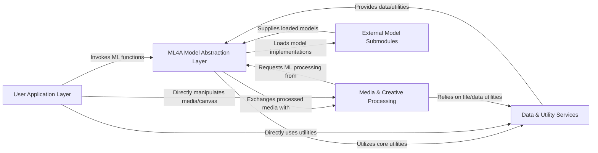

## Details

The `ml4a` project is structured around a core `ML4A Model Abstraction Layer` that provides simplified access to various deep learning models. The `User Application Layer` serves as the primary entry point for users, enabling them to invoke ML functionalities and directly interact with `Media & Creative Processing` components for handling audio and image data. The `Media & Creative Processing` layer not only manages media but also requests ML processing from the `ML4A Model Abstraction Layer` for creative effects. Both the `ML4A Model Abstraction Layer` and `Media & Creative Processing` rely on `Data & Utility Services` for foundational operations like file handling and data manipulation. The `ML4A Model Abstraction Layer` dynamically integrates `External Model Submodules` to load and utilize actual deep learning model implementations, forming a cohesive system for creative ML applications.

### User Application Layer
The primary interface for users, typically Jupyter Notebooks or custom Python scripts, to interact with the `ml4a` library. This layer represents the user's own code that imports and utilizes the functionalities exposed by the `ml4a` library.

**Related Classes/Methods**:

- <a href="https://github.com/ml4a/ml4a/blob/master/ml4a/__init__.py" target="_blank" rel="noopener noreferrer">`ml4a.__init__`</a>

### ML4A Model Abstraction Layer [[Expand]](./ML4A_Model_Abstraction_Layer.md)
Encapsulates various deep learning models, providing a simplified and consistent API for setup, inference, and specific model operations. This is the core ML functionality exposed to users.

**Related Classes/Methods**:

- <a href="https://github.com/ml4a/ml4a/blob/master/ml4a/models/basnet.py" target="_blank" rel="noopener noreferrer">`ml4a/models/basnet.py`</a>
- <a href="https://github.com/ml4a/ml4a/blob/master/ml4a/models/cartoonization.py" target="_blank" rel="noopener noreferrer">`ml4a/models/cartoonization.py`</a>
- <a href="https://github.com/ml4a/ml4a/blob/master/ml4a/models/deepdream.py" target="_blank" rel="noopener noreferrer">`ml4a/models/deepdream.py`</a>
- <a href="https://github.com/ml4a/ml4a/blob/master/ml4a/models/stylegan.py" target="_blank" rel="noopener noreferrer">`ml4a/models/stylegan.py`</a>
- <a href="https://github.com/ml4a/ml4a/blob/master/ml4a/models/idinvert.py" target="_blank" rel="noopener noreferrer">`ml4a/models/idinvert.py`</a>
- <a href="https://github.com/ml4a/ml4a/blob/master/ml4a/models/glow.py" target="_blank" rel="noopener noreferrer">`ml4a/models/glow.py`</a>
- <a href="https://github.com/ml4a/ml4a/blob/master/ml4a/models/wav2lip.py" target="_blank" rel="noopener noreferrer">`ml4a/models/wav2lip.py`</a>

### Media & Creative Processing [[Expand]](./Media_Creative_Processing.md)
Handles loading, saving, displaying, and basic manipulation of audio and image data, along with functionalities for creating, modifying, and visualizing dynamic canvases and masks for interactive creative applications.

**Related Classes/Methods**:

- <a href="https://github.com/ml4a/ml4a/blob/master/ml4a/image.py" target="_blank" rel="noopener noreferrer">`ml4a/image.py`</a>
- <a href="https://github.com/ml4a/ml4a/blob/master/ml4a/audio.py" target="_blank" rel="noopener noreferrer">`ml4a/audio.py`</a>
- <a href="https://github.com/ml4a/ml4a/blob/master/ml4a/canvas/canvas.py" target="_blank" rel="noopener noreferrer">`ml4a/canvas/canvas.py`</a>
- <a href="https://github.com/ml4a/ml4a/blob/master/ml4a/canvas/mask.py" target="_blank" rel="noopener noreferrer">`ml4a/canvas/mask.py`</a>

### Data & Utility Services
Provides foundational helper functions for file operations, downloads, console output, and general data manipulation, alongside tools for generating, processing, and augmenting datasets.

**Related Classes/Methods**:

- <a href="https://github.com/ml4a/ml4a/blob/master/ml4a/utils/downloads.py" target="_blank" rel="noopener noreferrer">`ml4a/utils/downloads.py`</a>
- <a href="https://github.com/ml4a/ml4a/blob/master/ml4a/utils/face.py" target="_blank" rel="noopener noreferrer">`ml4a/utils/face.py`</a>
- <a href="https://github.com/ml4a/ml4a/blob/master/ml4a/utils/video.py" target="_blank" rel="noopener noreferrer">`ml4a/utils/video.py`</a>
- <a href="https://github.com/ml4a/ml4a/blob/master/ml4a/dataset/dataset_utils.py" target="_blank" rel="noopener noreferrer">`ml4a/dataset/dataset_utils.py`</a>
- <a href="https://github.com/ml4a/ml4a/blob/master/ml4a/dataset/processing.py" target="_blank" rel="noopener noreferrer">`ml4a/dataset/processing.py`</a>

### External Model Submodules [[Expand]](./External_Model_Submodules.md)
Manages the dynamic loading and integration of external ML model implementations, which are often included as git submodules, providing the actual deep learning code.

**Related Classes/Methods**:

- <a href="https://github.com/ml4a/ml4a/blob/master/ml4a/models/submodules/localimport.py" target="_blank" rel="noopener noreferrer">`ml4a/models/submodules/localimport.py`</a>
- <a href="https://github.com/ml4a/ml4a/blob/master/ml4a/models/submodules/BASNet" target="_blank" rel="noopener noreferrer">`ml4a/models/submodules/BASNet`</a>
- <a href="https://github.com/ml4a/ml4a/blob/master/ml4a/models/submodules/ESRGAN" target="_blank" rel="noopener noreferrer">`ml4a/models/submodules/ESRGAN`</a>

### [FAQ](https://github.com/CodeBoarding/GeneratedOnBoardings/tree/main?tab=readme-ov-file#faq)