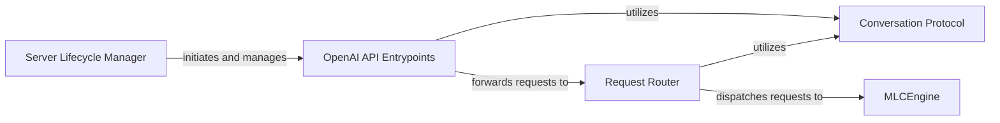

## Details

The MLC LLM serving subsystem is orchestrated by the Server Lifecycle Manager, which initiates and oversees the OpenAI API Entrypoints. These entrypoints serve as the primary interface for external clients, receiving and validating requests according to the Conversation Protocol. Validated requests are then forwarded to the Request Router, which translates and dispatches them to the MLCEngine. The MLCEngine is the core component responsible for executing the LLM inference, processing the requests, and generating responses. The Conversation Protocol ensures consistent data exchange across the API and internal components. This architecture provides a clear separation of concerns, from API exposure and request routing to the core inference execution.

### Server Lifecycle Manager
This component is the orchestrator for the entire MLC LLM serving process. It is responsible for initiating and managing the lifecycle of the API server, including starting the OpenAI API Entrypoints and ensuring a graceful shutdown of all server-related processes. It acts as the main entry and exit point for the server application.

**Related Classes/Methods**:

- <a href="https://github.com/mlc-ai/mlc-llm/blob/main/python/mlc_llm/serve/server/popen_server.py" target="_blank" rel="noopener noreferrer">`mlc_llm.serve.server.popen_server`</a>

### OpenAI API Entrypoints
Serving as the public-facing API endpoint, this component receives and processes incoming HTTP requests that conform to the OpenAI API specification (e.g., for chat completions, text completions). It performs initial parsing, validation, and translation of these external requests into a standardized internal format, acting as the primary interface for external clients. This component embodies the "API/SDK Layer" pattern.

**Related Classes/Methods**:

- <a href="https://github.com/mlc-ai/mlc-llm/blob/main/python/mlc_llm/serve/entrypoints/openai_entrypoints.py" target="_blank" rel="noopener noreferrer">`mlc_llm.serve.entrypoints.openai_entrypoints`</a>

### Request Router
This component intercepts and processes the standardized internal requests received from the OpenAI API Entrypoints. Its core responsibility is to translate these requests into the specific format required by the underlying MLCEngine (represented by serve.engine). It also handles the logical routing of these requests, potentially incorporating strategies for request distribution or load balancing.

**Related Classes/Methods**:

- <a href="https://github.com/mlc-ai/mlc-llm/blob/main/python/mlc_llm/router/router.py" target="_blank" rel="noopener noreferrer">`mlc_llm.router.router`</a>

### MLCEngine
This is the core inference engine of the MLC LLM system. It receives processed requests from the Request Router and manages the execution of the language model. Its responsibilities include request batching, scheduling, token generation, and managing the underlying model state. It is the central component for performing the actual LLM inference.

**Related Classes/Methods**:

- <a href="https://github.com/mlc-ai/mlc-llm/blob/main/python/mlc_llm/serve/engine.py#L1406-L1963" target="_blank" rel="noopener noreferrer">`mlc_llm.serve.engine.MLCEngine`:1406-1963</a>

### Conversation Protocol
This component defines the canonical data structures and schemas (e.g., Pydantic models for ChatCompletionRequest, CompletionRequest, Message, ToolCall) that represent conversational prompts, messages, and responses within the MLC LLM system. It provides essential utility functions for serialization, deserialization, and validation of these data models, ensuring consistency and interoperability across the API and internal components. This component embodies the "Protocol" aspect of the subsystem.

**Related Classes/Methods**:

- <a href="https://github.com/mlc-ai/mlc-llm/blob/main/python/mlc_llm/protocol/conversation_protocol.py" target="_blank" rel="noopener noreferrer">`mlc_llm.protocol.conversation_protocol`</a>

### [FAQ](https://github.com/CodeBoarding/GeneratedOnBoardings/tree/main?tab=readme-ov-file#faq)