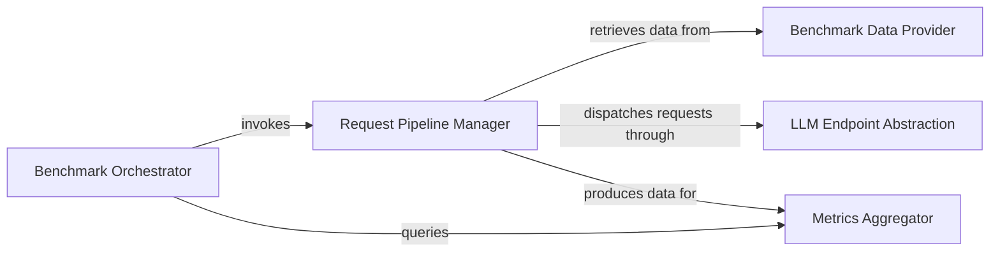

## Details

The `Benchmarking & Evaluation` subsystem is responsible for systematically evaluating the performance, correctness, and efficiency of the MLCEngine and compiled models.

### Benchmark Orchestrator
Acts as the primary entry point and control center for initiating and managing benchmark runs. It orchestrates the overall benchmarking workflow, including setting up the environment, triggering the request pipeline, and querying for final metrics. This component embodies the "Tooling/CLI" pattern, providing the user interface for benchmarking.

**Related Classes/Methods**:

- <a href="https://github.com/mlc-ai/mlc-llm/blob/main/python/mlc_llm/bench/__main__.py" target="_blank" rel="noopener noreferrer">`python/mlc_llm/bench/__main__.py`</a>

### Request Pipeline Manager
Manages the end-to-end lifecycle of individual benchmark requests. It constructs and executes a processing pipeline that involves generating requests, dispatching them to the LLM endpoint, and collecting raw performance data. This component is a clear example of the "Pipeline" pattern.

**Related Classes/Methods**:

- <a href="https://github.com/mlc-ai/mlc-llm/blob/main/python/mlc_llm/bench/request_processor.py" target="_blank" rel="noopener noreferrer">`python/mlc_llm/bench/request_processor.py`</a>

### Benchmark Data Provider
Responsible for creating, loading, and managing diverse datasets used as input for generating benchmark requests. It ensures that the benchmarking process can be fed with varied and representative data.

**Related Classes/Methods**:

- <a href="https://github.com/mlc-ai/mlc-llm/blob/main/python/mlc_llm/bench/dataset.py" target="_blank" rel="noopener noreferrer">`python/mlc_llm/bench/dataset.py`</a>

### Metrics Aggregator
Collects, processes, and aggregates raw performance data generated during benchmark runs. It is responsible for calculating and presenting key performance indicators and summaries, providing insights into the model's behavior.

**Related Classes/Methods**:

- <a href="https://github.com/mlc-ai/mlc-llm/blob/main/python/mlc_llm/bench/request_record.py" target="_blank" rel="noopener noreferrer">`python/mlc_llm/bench/request_record.py`</a>

### LLM Endpoint Abstraction
Provides a standardized and abstract interface for interacting with various LLM serving endpoints (e.g., OpenAI-compatible APIs, TensorRT-LLM). This abstraction allows the benchmarking system to be agnostic to the underlying LLM serving technology, facilitating flexible evaluation across different deployment targets. This component supports the "Client-Server" interaction pattern by abstracting the client-side communication with various LLM servers.

**Related Classes/Methods**:

- <a href="https://github.com/mlc-ai/mlc-llm/blob/main/python/mlc_llm/bench/api_endpoint.py" target="_blank" rel="noopener noreferrer">`python/mlc_llm/bench/api_endpoint.py`</a>

### [FAQ](https://github.com/CodeBoarding/GeneratedOnBoardings/tree/main?tab=readme-ov-file#faq)