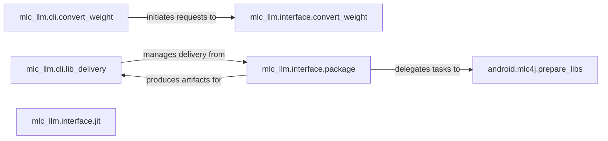

## Details

The Deployment & Tooling subsystem encompasses command-line interfaces and core utilities for model preparation, compilation, packaging, and delivery across various target platforms. Its boundaries are defined by the mlc_llm.cli, mlc_llm.interface, and platform-specific preparation modules like android.mlc4j.

### mlc_llm.cli.convert_weight
Serves as the command-line entry point for initiating the model weight conversion process. It parses user arguments and orchestrates the high-level conversion flow.

**Related Classes/Methods**:

- <a href="https://github.com/mlc-ai/mlc-llm/blob/main/python/mlc_llm/cli/convert_weight.py" target="_blank" rel="noopener noreferrer">`mlc_llm.cli.convert_weight`</a>

### mlc_llm.interface.convert_weight
Encapsulates the core logic for converting model weights. It manages conversion arguments, performs validation, and orchestrates the underlying conversion steps.

**Related Classes/Methods**:

- <a href="https://github.com/mlc-ai/mlc-llm/blob/main/python/mlc_llm/interface/convert_weight.py" target="_blank" rel="noopener noreferrer">`mlc_llm.interface.convert_weight`</a>

### mlc_llm.cli.lib_delivery
Provides command-line utilities for managing and delivering compiled libraries to target environments, facilitating the deployment of generated artifacts.

**Related Classes/Methods**:

- <a href="https://github.com/mlc-ai/mlc-llm/blob/main/python/mlc_llm/cli/lib_delivery.py" target="_blank" rel="noopener noreferrer">`mlc_llm.cli.lib_delivery`</a>

### mlc_llm.interface.package
Offers a high-level interface for packaging compiled models and their dependencies for deployment across different platforms (e.g., Android, iOS, Web). It acts as an orchestrator for platform-specific build and packaging processes.

**Related Classes/Methods**:

- <a href="https://github.com/mlc-ai/mlc-llm/blob/main/python/mlc_llm/interface/package.py" target="_blank" rel="noopener noreferrer">`mlc_llm.interface.package`</a>

### mlc_llm.interface.jit
Manages Just-In-Time (JIT) compilation processes, including configuration, execution, and logging of JIT policies and optimization flags. This component is key for dynamic compilation invocation within the toolkit.

**Related Classes/Methods**:

- <a href="https://github.com/mlc-ai/mlc-llm/blob/main/python/mlc_llm/interface/jit.py" target="_blank" rel="noopener noreferrer">`mlc_llm.interface.jit`</a>

### android.mlc4j.prepare_libs
Specifically handles the preparation and building of libraries for Android deployment. It leverages tools like CMake for compilation and installation of necessary components for the Android runtime.

**Related Classes/Methods**:

- <a href="https://github.com/mlc-ai/mlc-llm/blob/main/android/mlc4j/prepare_libs.py" target="_blank" rel="noopener noreferrer">`android.mlc4j.prepare_libs`</a>

### [FAQ](https://github.com/CodeBoarding/GeneratedOnBoardings/tree/main?tab=readme-ov-file#faq)