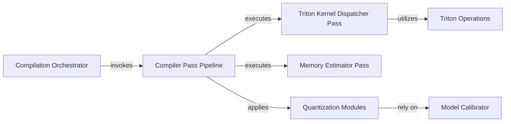

## Details

The ML Compilation Pipeline subsystem is the core compiler responsible for transforming raw or preprocessed LLM models into optimized, deployable artifacts. Its boundaries are defined by the initial user interface for compilation (python/mlc_llm/interface/compile.py), the orchestration of various compiler passes (python/mlc_llm/compiler_pass/pipeline.py), and the specific optimization techniques applied, such as quantization (python/mlc_llm/quantization/fp8_quantization.py, python/mlc_llm/quantization/awq_quantization.py), memory estimation (python/mlc_llm/compiler_pass/estimate_memory_usage.py), and kernel dispatching (python/mlc_llm/compiler_pass/dispatch_triton_kernel.py). It leverages low-level, optimized operations (python/mlc_llm/op/triton.py, python/mlc_llm/op/attention.py, python/mlc_llm/op/moe_matmul.py) and includes a calibration interface (python/mlc_llm/interface/calibrate.py) to support these transformations.

### Compilation Orchestrator
Serves as the primary entry point for users to initiate model compilation, managing the overall workflow from argument parsing to invoking the core compiler pipeline and presenting results.

**Related Classes/Methods**:

- <a href="https://github.com/mlc-ai/mlc-llm/blob/main/python/mlc_llm/interface/compile.py#L106-L208" target="_blank" rel="noopener noreferrer">`compile`:106-208</a>

### Compiler Pass Pipeline
Manages the sequential execution of various compiler passes, defining the order of transformations and optimizations applied to the model's computational graph. It also handles debugging and progress logging.

**Related Classes/Methods**:

- <a href="https://github.com/mlc-ai/mlc-llm/blob/main/python/mlc_llm/compiler_pass/pipeline.py#L81-L209" target="_blank" rel="noopener noreferrer">`pipeline`:81-209</a>

### Quantization Modules
Implements diverse quantization algorithms (e.g., FP8, AWQ) to reduce model size and improve inference speed by transforming model weights and activations into lower-precision formats.

**Related Classes/Methods**:

- <a href="https://github.com/mlc-ai/mlc-llm/blob/main/python/mlc_llm/quantization/fp8_quantization.py" target="_blank" rel="noopener noreferrer">`fp8_quantization`</a>
- <a href="https://github.com/mlc-ai/mlc-llm/blob/main/python/mlc_llm/quantization/awq_quantization.py" target="_blank" rel="noopener noreferrer">`awq_quantization`</a>

### Memory Estimator Pass
Analyzes the compiled model to estimate its memory footprint, providing crucial metadata for deployment planning and resource allocation.

**Related Classes/Methods**:

- <a href="https://github.com/mlc-ai/mlc-llm/blob/main/python/mlc_llm/compiler_pass/estimate_memory_usage.py" target="_blank" rel="noopener noreferrer">`estimate_memory_usage`</a>

### Triton Kernel Dispatcher Pass
Identifies suitable operations in the model's computational graph and replaces them with calls to highly optimized Triton kernels, leveraging specialized hardware capabilities for performance.

**Related Classes/Methods**:

- <a href="https://github.com/mlc-ai/mlc-llm/blob/main/python/mlc_llm/compiler_pass/dispatch_triton_kernel.py" target="_blank" rel="noopener noreferrer">`dispatch_triton_kernel`</a>

### Model Calibrator
Manages the process of model calibration, which is often required by quantization methods to determine optimal scaling factors for accurate low-precision representation.

**Related Classes/Methods**:

- <a href="https://github.com/mlc-ai/mlc-llm/blob/main/python/mlc_llm/interface/calibrate.py#L126-L166" target="_blank" rel="noopener noreferrer">`calibrate`:126-166</a>

### Triton Operations
Provides low-level, highly optimized tensor operations specifically implemented for the Triton framework, used by the compiler passes for hardware acceleration.

**Related Classes/Methods**:

- <a href="https://github.com/mlc-ai/mlc-llm/blob/main/python/mlc_llm/op/triton.py" target="_blank" rel="noopener noreferrer">`triton`</a>

### [FAQ](https://github.com/CodeBoarding/GeneratedOnBoardings/tree/main?tab=readme-ov-file#faq)