```mermaid
graph LR
    Model_Management_Definition["Model Management & Definition"]
    ML_Compilation_Pipeline["ML Compilation Pipeline"]
    MLCEngine_Inference_Runtime_["MLCEngine (Inference Runtime)"]
    API_Server_Protocol["API Server & Protocol"]
    Deployment_Tooling["Deployment & Tooling"]
    Benchmarking_Evaluation["Benchmarking & Evaluation"]
    Model_Management_Definition -- "Provides model weights and architectural definitions." --> ML_Compilation_Pipeline
    ML_Compilation_Pipeline -- "Outputs compiled model artifacts." --> MLCEngine_Inference_Runtime_
    MLCEngine_Inference_Runtime_ -- "Processes inference requests." --> API_Server_Protocol
    Deployment_Tooling -- "Initiates model preparation." --> Model_Management_Definition
    Deployment_Tooling -- "Invokes compilation." --> ML_Compilation_Pipeline
    Deployment_Tooling -- "Manages runtime deployment." --> MLCEngine_Inference_Runtime_
    Benchmarking_Evaluation -- "Submits inference benchmarks." --> API_Server_Protocol
    Benchmarking_Evaluation -- "Collects runtime performance data." --> MLCEngine_Inference_Runtime_
    API_Server_Protocol -- "References model schemas." --> Model_Management_Definition
    click Model_Management_Definition href "https://github.com/CodeBoarding/GeneratedOnBoardings/blob/main/mlc-llm/Model_Management_Definition.md" "Details"
    click ML_Compilation_Pipeline href "https://github.com/CodeBoarding/GeneratedOnBoardings/blob/main/mlc-llm/ML_Compilation_Pipeline.md" "Details"
    click API_Server_Protocol href "https://github.com/CodeBoarding/GeneratedOnBoardings/blob/main/mlc-llm/API_Server_Protocol.md" "Details"
    click Deployment_Tooling href "https://github.com/CodeBoarding/GeneratedOnBoardings/blob/main/mlc-llm/Deployment_Tooling.md" "Details"
    click Benchmarking_Evaluation href "https://github.com/CodeBoarding/GeneratedOnBoardings/blob/main/mlc-llm/Benchmarking_Evaluation.md" "Details"
```

## Details

The MLC LLM project is structured around a core set of components designed for efficient large language model (LLM) compilation, serving, and deployment. The `Model Management & Definition` component acts as the initial entry point, handling the acquisition and structural definition of LLM models and their associated tokenizers. These model definitions are then fed into the `ML Compilation Pipeline`, which optimizes and transforms them into deployable artifacts through processes like quantization and memory estimation. The resulting compiled models are consumed by the `MLCEngine (Inference Runtime)`, the central component responsible for loading models, managing the KV cache, and executing inference requests across various hardware targets.

For external interaction, the `API Server & Protocol` exposes the MLCEngine's capabilities via a standardized API, primarily an OpenAI-compatible interface, handling request parsing, response formatting, and routing of inference requests to the `MLCEngine`. The `Deployment & Tooling` component provides command-line interfaces and utilities for developers, enabling model conversion, library delivery, compilation invocation, and server management. Finally, the `Benchmarking & Evaluation` component offers tools and datasets for systematically assessing the performance and correctness of the MLCEngine and compiled models, submitting inference benchmarks to the `API Server & Protocol` and collecting performance data directly from the `MLCEngine`. This architecture ensures a streamlined workflow from model definition and compilation to efficient serving and rigorous evaluation.

### Model Management & Definition [[Expand]](./Model_Management_Definition.md)
Manages the acquisition, loading, and structural definition of LLM models, including tokenizer information and neural network architectures. It serves as the initial entry point for raw model assets and their blueprints.

**Related Classes/Methods**:

- <a href="https://github.com/mlc-ai/mlc-llm/blob/main/python/mlc_llm/loader/huggingface_loader.py" target="_blank" rel="noopener noreferrer">`python/mlc_llm/loader/huggingface_loader.py`</a>
- <a href="https://github.com/mlc-ai/mlc-llm/blob/main/python/mlc_llm/tokenizers/tokenizers.py" target="_blank" rel="noopener noreferrer">`python/mlc_llm/tokenizers/tokenizers.py`</a>
- <a href="https://github.com/mlc-ai/mlc-llm/blob/main/python/mlc_llm/support/download_cache.py" target="_blank" rel="noopener noreferrer">`python/mlc_llm/support/download_cache.py`</a>
- <a href="https://github.com/mlc-ai/mlc-llm/blob/main/python/mlc_llm/model/llama/llama_model.py" target="_blank" rel="noopener noreferrer">`python/mlc_llm/model/llama/llama_model.py`</a>
- <a href="https://github.com/mlc-ai/mlc-llm/blob/main/python/mlc_llm/model/mixtral/mixtral_model.py" target="_blank" rel="noopener noreferrer">`python/mlc_llm/model/mixtral/mixtral_model.py`</a>
- <a href="https://github.com/mlc-ai/mlc-llm/blob/main/python/mlc_llm/model/qwen/qwen_model.py" target="_blank" rel="noopener noreferrer">`python/mlc_llm/model/qwen/qwen_model.py`</a>
- <a href="https://github.com/mlc-ai/mlc-llm/blob/main/python/mlc_llm/model/phi3v/phi3v_model.py" target="_blank" rel="noopener noreferrer">`python/mlc_llm/model/phi3v/phi3v_model.py`</a>

### ML Compilation Pipeline [[Expand]](./ML_Compilation_Pipeline.md)
The core compiler that transforms raw or preprocessed LLM models into optimized, deployable artifacts. This includes quantization, memory estimation, and various compiler passes, leveraging highly optimized low-level operations.

**Related Classes/Methods**:

- <a href="https://github.com/mlc-ai/mlc-llm/blob/main/python/mlc_llm/compiler_pass/pipeline.py" target="_blank" rel="noopener noreferrer">`python/mlc_llm/compiler_pass/pipeline.py`</a>
- <a href="https://github.com/mlc-ai/mlc-llm/blob/main/python/mlc_llm/compiler_pass/estimate_memory_usage.py" target="_blank" rel="noopener noreferrer">`python/mlc_llm/compiler_pass/estimate_memory_usage.py`</a>
- <a href="https://github.com/mlc-ai/mlc-llm/blob/main/python/mlc_llm/compiler_pass/dispatch_triton_kernel.py" target="_blank" rel="noopener noreferrer">`python/mlc_llm/compiler_pass/dispatch_triton_kernel.py`</a>
- <a href="https://github.com/mlc-ai/mlc-llm/blob/main/python/mlc_llm/interface/compile.py" target="_blank" rel="noopener noreferrer">`python/mlc_llm/interface/compile.py`</a>
- <a href="https://github.com/mlc-ai/mlc-llm/blob/main/python/mlc_llm/quantization/fp8_quantization.py" target="_blank" rel="noopener noreferrer">`python/mlc_llm/quantization/fp8_quantization.py`</a>
- <a href="https://github.com/mlc-ai/mlc-llm/blob/main/python/mlc_llm/quantization/awq_quantization.py" target="_blank" rel="noopener noreferrer">`python/mlc_llm/quantization/awq_quantization.py`</a>
- <a href="https://github.com/mlc-ai/mlc-llm/blob/main/python/mlc_llm/interface/calibrate.py" target="_blank" rel="noopener noreferrer">`python/mlc_llm/interface/calibrate.py`</a>
- <a href="https://github.com/mlc-ai/mlc-llm/blob/main/python/mlc_llm/op/triton.py" target="_blank" rel="noopener noreferrer">`python/mlc_llm/op/triton.py`</a>
- <a href="https://github.com/mlc-ai/mlc-llm/blob/main/python/mlc_llm/op/attention.py" target="_blank" rel="noopener noreferrer">`python/mlc_llm/op/attention.py`</a>
- <a href="https://github.com/mlc-ai/mlc-llm/blob/main/python/mlc_llm/op/moe_matmul.py" target="_blank" rel="noopener noreferrer">`python/mlc_llm/op/moe_matmul.py`</a>

### MLCEngine (Inference Runtime)
The central runtime engine responsible for loading compiled models, managing KV cache, and executing inference requests efficiently across various hardware targets. It serves as the unified inference layer.

**Related Classes/Methods**:

- <a href="https://github.com/mlc-ai/mlc-llm/blob/main/python/mlc_llm/json_ffi/engine.py" target="_blank" rel="noopener noreferrer">`python/mlc_llm/json_ffi/engine.py`</a>
- <a href="https://github.com/mlc-ai/mlc-llm/blob/main/python/mlc_llm/serve/engine_base.py" target="_blank" rel="noopener noreferrer">`python/mlc_llm/serve/engine_base.py`</a>
- <a href="https://github.com/mlc-ai/mlc-llm/blob/main/python/mlc_llm/serve/sync_engine.py" target="_blank" rel="noopener noreferrer">`python/mlc_llm/serve/sync_engine.py`</a>
- <a href="https://github.com/mlc-ai/mlc-llm/blob/main/python/mlc_llm/nn/kv_cache.py" target="_blank" rel="noopener noreferrer">`python/mlc_llm/nn/kv_cache.py`</a>

### API Server & Protocol [[Expand]](./API_Server_Protocol.md)
Exposes the MLCEngine's capabilities through a standardized API, primarily an OpenAI-compatible interface. It handles request parsing, response formatting, and routing of inference requests.

**Related Classes/Methods**:

- <a href="https://github.com/mlc-ai/mlc-llm/blob/main/python/mlc_llm/serve/server/popen_server.py" target="_blank" rel="noopener noreferrer">`python/mlc_llm/serve/server/popen_server.py`</a>
- <a href="https://github.com/mlc-ai/mlc-llm/blob/main/python/mlc_llm/serve/entrypoints/openai_entrypoints.py" target="_blank" rel="noopener noreferrer">`python/mlc_llm/serve/entrypoints/openai_entrypoints.py`</a>
- <a href="https://github.com/mlc-ai/mlc-llm/blob/main/python/mlc_llm/protocol/conversation_protocol.py" target="_blank" rel="noopener noreferrer">`python/mlc_llm/protocol/conversation_protocol.py`</a>
- <a href="https://github.com/mlc-ai/mlc-llm/blob/main/python/mlc_llm/router/router.py" target="_blank" rel="noopener noreferrer">`python/mlc_llm/router/router.py`</a>

### Deployment & Tooling [[Expand]](./Deployment_Tooling.md)
Provides command-line interfaces and utilities for developers to interact with the ML Toolkit, including model conversion, library delivery, compilation invocation, server management, and packaging for deployment on various target platforms.

**Related Classes/Methods**:

- <a href="https://github.com/mlc-ai/mlc-llm/blob/main/python/mlc_llm/cli/convert_weight.py" target="_blank" rel="noopener noreferrer">`python/mlc_llm/cli/convert_weight.py`</a>
- <a href="https://github.com/mlc-ai/mlc-llm/blob/main/python/mlc_llm/cli/lib_delivery.py" target="_blank" rel="noopener noreferrer">`python/mlc_llm/cli/lib_delivery.py`</a>
- <a href="https://github.com/mlc-ai/mlc-llm/blob/main/python/mlc_llm/interface/package.py" target="_blank" rel="noopener noreferrer">`python/mlc_llm/interface/package.py`</a>
- <a href="https://github.com/mlc-ai/mlc-llm/blob/main/python/mlc_llm/interface/jit.py" target="_blank" rel="noopener noreferrer">`python/mlc_llm/interface/jit.py`</a>
- <a href="https://github.com/mlc-ai/mlc-llm/blob/main/android/mlc4j/prepare_libs.py" target="_blank" rel="noopener noreferrer">`android/mlc4j/prepare_libs.py`</a>

### Benchmarking & Evaluation [[Expand]](./Benchmarking_Evaluation.md)
Contains tools and datasets for systematically evaluating the performance, correctness, and efficiency of the MLCEngine and compiled models across different configurations and hardware.

**Related Classes/Methods**:

- <a href="https://github.com/mlc-ai/mlc-llm/blob/main/python/mlc_llm/bench/__main__.py" target="_blank" rel="noopener noreferrer">`python/mlc_llm/bench/__main__.py`</a>
- <a href="https://github.com/mlc-ai/mlc-llm/blob/main/python/mlc_llm/bench/request_processor.py" target="_blank" rel="noopener noreferrer">`python/mlc_llm/bench/request_processor.py`</a>
- <a href="https://github.com/mlc-ai/mlc-llm/blob/main/python/mlc_llm/bench/dataset.py" target="_blank" rel="noopener noreferrer">`python/mlc_llm/bench/dataset.py`</a>

### [FAQ](https://github.com/CodeBoarding/GeneratedOnBoardings/tree/main?tab=readme-ov-file#faq)