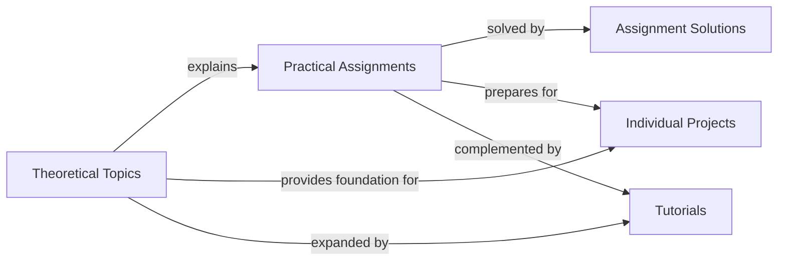

## Component Details

This component serves as the central repository for all primary educational content within the `mlcourse.ai` project. It encompasses theoretical explanations, practical assignments, and individual projects, organized by language and topic. These Jupyter notebooks form the main curriculum, guiding users through fundamental and advanced machine learning concepts, and serve as the primary interface for user learning and interaction.

### Theoretical Topics
These notebooks introduce and explain fundamental and advanced machine learning concepts. They form the theoretical backbone of the course.

**Related Classes/Methods**:

- `topic1_pandas_data_analysis.ipynb` (0:0)

### Practical Assignments
These notebooks contain practical exercises and problems designed to reinforce the theoretical concepts learned in the topic notebooks. They often include datasets and require users to apply various machine learning techniques.

**Related Classes/Methods**:

- `assignment01_pandas_uci_adult.ipynb` (0:0)

### Assignment Solutions
These notebooks provide the solutions to the practical assignments, allowing users to check their work and understand correct implementations.

**Related Classes/Methods**:

- `assignment01_pandas_uci_adult_solution.ipynb` (0:0)

### Individual Projects
These notebooks represent more extensive, open-ended projects where users can apply a broader range of machine learning skills to real-world problems. They demonstrate the culmination of learned knowledge.

**Related Classes/Methods**:

- `California_housing_value_prediction_Ilya_Larchenko.ipynb` (0:0)

### Tutorials
These notebooks offer supplementary material, covering specific tools, techniques, or advanced topics that complement the main curriculum.

**Related Classes/Methods**:

- `Keras_easy_way_to_construct_the_Neural_Networks_fixed.ipynb` (0:0)

### [FAQ](https://github.com/CodeBoarding/GeneratedOnBoardings/tree/main?tab=readme-ov-file#faq)