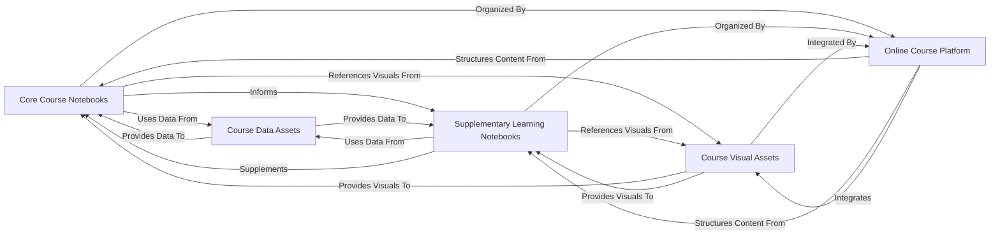

## Component Details

The mlcourse.ai project is fundamentally structured around delivering machine learning educational content through Jupyter notebooks, supported by various assets, and presented via an online platform. The analysis consolidates the initial CFG and Source Analysis into five core components, highlighting their responsibilities, key source files, and interrelationships.

### Core Course Notebooks
This component encompasses all primary educational content, including theoretical topics, practical assignments, and individual projects. These notebooks form the main curriculum and are the central interface for user learning and interaction. They are designed to guide users through fundamental and advanced machine learning concepts.

**Related Classes/Methods**:

- `jupyter_english/` (1:1)
- `jupyter_russian/` (1:1)
- `jupyter_chinese/` (1:1)
- `jupyter_french/` (1:1)

### Supplementary Learning Notebooks
This component specifically covers tutorial notebooks, offering deeper dives into specific tools, libraries, or advanced techniques. They serve to enhance understanding beyond the core curriculum, providing specialized knowledge and practical examples.

**Related Classes/Methods**:

- `jupyter_english/tutorials/` (1:1)
- `jupyter_russian/tutorials/` (1:1)
- `jupyter_chinese/tutorials/` (1:1)
- `jupyter_french/tutorials/` (1:1)

### Course Data Assets
This component is the central repository for all datasets required for the practical exercises and projects within the notebooks. It provides the raw input for all data analysis, model training, and evaluation tasks, making it a critical resource for hands-on learning.

**Related Classes/Methods**:

- `data/` (1:1)

### Course Visual Assets
This component stores all images, diagrams, and other visual aids used across the notebooks and the online course platform. These assets are crucial for enhancing explanations, illustrating concepts, and visualizing results, thereby improving comprehension.

**Related Classes/Methods**:

- `img/` (1:1)

### Online Course Platform
This component represents the Jupyter Book configuration, which defines the structure, navigation, and overall presentation of the entire course content online. It acts as the central orchestrator, binding all the educational content and visual resources into a cohesive, accessible, and structured learning experience.

**Related Classes/Methods**:

- `mlcourse_ai_jupyter_book/_config.yml` (1:1)
- `mlcourse_ai_jupyter_book/_toc.yml` (1:1)

### [FAQ](https://github.com/CodeBoarding/GeneratedOnBoardings/tree/main?tab=readme-ov-file#faq)