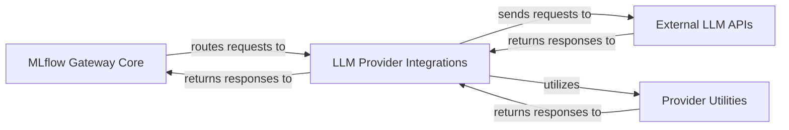

## Details

The MLflow LLM Gateway subsystem acts as a central intermediary for Large Language Model (LLM) interactions. The `MLflow Gateway Core` component serves as the primary API endpoint, responsible for receiving and routing LLM requests to the appropriate `LLM Provider Integrations`. Each integration within the `LLM Provider Integrations` component handles communication with a specific external LLM API, translating requests and responses to and from a standardized format. These integrations leverage the `Provider Utilities` component for common functionalities like network communication. Ultimately, the `LLM Provider Integrations` communicate with `External LLM APIs` to process requests and retrieve responses.

### MLflow Gateway Core
This is the central routing component of the MLflow LLM Gateway. It acts as the primary API endpoint for LLM requests, receiving incoming requests, parsing them, and dynamically dispatching them to the appropriate provider-specific handler based on configuration. It also receives processed responses from the providers and returns them to the client.

**Related Classes/Methods**:

- <a href="https://github.com/mlflow/mlflow/blob/master/mlflow/gateway/app.py" target="_blank" rel="noopener noreferrer">`mlflow.gateway.app`</a>

### LLM Provider Integrations
This component represents the collection of individual modules, each responsible for managing communication with a specific external LLM API (e.g., OpenAI, Anthropic, Google Palm, Mistral, TogetherAI, AWS Bedrock, Cohere, Google Gemini). These integrations translate standardized MLflow Gateway requests into the specific API format required by their respective external LLM provider, send the requests, handle synchronous and streaming responses, and translate the external API's response back into a standardized format for the MLflow Gateway. They also manage API keys and authentication. This component embodies the "Plugin/Extension" pattern, allowing easy addition of new LLM providers.

**Related Classes/Methods**:

- <a href="https://github.com/mlflow/mlflow/blob/master/mlflow/gateway/providers/openai.py" target="_blank" rel="noopener noreferrer">`mlflow.gateway.providers.openai`</a>
- <a href="https://github.com/mlflow/mlflow/blob/master/mlflow/gateway/providers/anthropic.py" target="_blank" rel="noopener noreferrer">`mlflow.gateway.providers.anthropic`</a>
- <a href="https://github.com/mlflow/mlflow/blob/master/mlflow/gateway/providers/palm.py" target="_blank" rel="noopener noreferrer">`mlflow.gateway.providers.palm`</a>
- <a href="https://github.com/mlflow/mlflow/blob/master/mlflow/gateway/providers/mistral.py" target="_blank" rel="noopener noreferrer">`mlflow.gateway.providers.mistral`</a>
- <a href="https://github.com/mlflow/mlflow/blob/master/mlflow/gateway/providers/togetherai.py" target="_blank" rel="noopener noreferrer">`mlflow.gateway.providers.togetherai`</a>
- <a href="https://github.com/mlflow/mlflow/blob/master/mlflow/gateway/providers/bedrock.py" target="_blank" rel="noopener noreferrer">`mlflow.gateway.providers.bedrock`</a>
- <a href="https://github.com/mlflow/mlflow/blob/master/mlflow/gateway/providers/cohere.py" target="_blank" rel="noopener noreferrer">`mlflow.gateway.providers.cohere`</a>
- <a href="https://github.com/mlflow/mlflow/blob/master/mlflow/gateway/providers/gemini.py" target="_blank" rel="noopener noreferrer">`mlflow.gateway.providers.gemini`</a>

### Provider Utilities
This is a shared utility component that provides common functionalities for the LLM Provider Integrations. It includes reusable functions for network communication, such as sending HTTP requests, handling retries, and managing connection pools, thereby abstracting away low-level details of interacting with external services. This promotes consistency and reduces redundancy across different provider implementations.

**Related Classes/Methods**:

- <a href="https://github.com/mlflow/mlflow/blob/master/mlflow/gateway/providers/utils.py" target="_blank" rel="noopener noreferrer">`mlflow.gateway.providers.utils`</a>

### External LLM APIs
These are the actual third-party Large Language Model services (e.g., OpenAI, Anthropic, Google, AWS Bedrock, Mistral, TogetherAI, Cohere) that are external to the MLflow codebase. They are responsible for processing the LLM requests received from the MLflow Gateway and generating the corresponding LLM responses. They represent the ultimate destination for LLM requests and the source of LLM responses.

**Related Classes/Methods**: _None_

### [FAQ](https://github.com/CodeBoarding/GeneratedOnBoardings/tree/main?tab=readme-ov-file#faq)