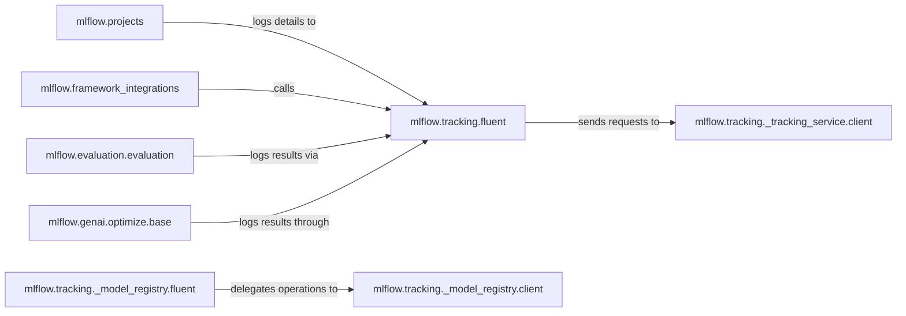

## Details

The MLflow Tracking subsystem provides a robust framework for managing the machine learning lifecycle, centered around experiment tracking and model management. At its core, `mlflow.tracking.fluent` offers a high-level, user-friendly interface for logging experiment data, acting as the primary entry point for various MLflow components. This fluent API then communicates with the lower-level `mlflow.tracking._tracking_service.client` to persist data to the MLflow Tracking Server. Similarly, `mlflow.tracking._model_registry.fluent` provides a high-level interface for model lifecycle management, delegating operations to `mlflow.tracking._model_registry.client` for interaction with the Model Registry. Diverse components like `mlflow.projects`, `mlflow.framework_integrations`, `mlflow.evaluation.evaluation`, and `mlflow.genai.optimize.base` leverage the `mlflow.tracking.fluent` API to log their specific details, ensuring comprehensive tracking across different ML workflows and domains.

### mlflow.tracking.fluent
Provides a high-level, user-friendly interface for logging experiment runs, parameters, metrics, and artifacts. It serves as the primary entry point for experiment tracking within the SDK.

**Related Classes/Methods**:

- <a href="https://github.com/mlflow/mlflow/blob/master/mlflow/tracking/fluent.py" target="_blank" rel="noopener noreferrer">`mlflow.tracking.fluent`</a>

### mlflow.tracking._model_registry.fluent
Offers a high-level interface for registering, managing, and transitioning models within the MLflow Model Registry, providing a user-friendly API for model lifecycle management.

**Related Classes/Methods**:

- <a href="https://github.com/mlflow/mlflow/blob/master/mlflow/tracking/_model_registry/fluent.py" target="_blank" rel="noopener noreferrer">`mlflow.tracking._model_registry.fluent`</a>

### mlflow.projects
Enables packaging and running ML code reproducibly, integrating with various execution backends (e.g., local, Docker, Kubernetes). It orchestrates the execution of ML projects.

**Related Classes/Methods**:

- <a href="https://github.com/mlflow/mlflow/blob/master/mlflow/projects" target="_blank" rel="noopener noreferrer">`mlflow.projects`</a>

### mlflow.framework_integrations
Represents a conceptual grouping of modules that provide specialized `save_model` and `load_model` functionalities for specific ML frameworks, along with autolog features to automatically log metrics, parameters, and models during training.

**Related Classes/Methods**:

- <a href="https://github.com/mlflow/mlflow/blob/master/" target="_blank" rel="noopener noreferrer">`mlflow.framework_integrations`</a>

### mlflow.evaluation.evaluation
Defines the structure for model evaluation results and facilitates logging these results, enabling standardized recording of model performance.

**Related Classes/Methods**:

- <a href="https://github.com/mlflow/mlflow/blob/master/mlflow/evaluation/evaluation.py" target="_blank" rel="noopener noreferrer">`mlflow.evaluation.evaluation`</a>

### mlflow.genai.optimize.base
Provides functionality for optimizing generative AI prompts and related operations, extending the platform's capabilities into the GenAI domain, including logging of GenAI-specific artifacts.

**Related Classes/Methods**:

- <a href="https://github.com/mlflow/mlflow/blob/master/mlflow/genai/optimize/base.py" target="_blank" rel="noopener noreferrer">`mlflow.genai.optimize.base`</a>

### mlflow.tracking._tracking_service.client
Handles low-level communication with the MLflow Tracking Server, abstracting away network details and API calls for experiment data persistence.

**Related Classes/Methods**:

- <a href="https://github.com/mlflow/mlflow/blob/master/mlflow/tracking/_tracking_service/client.py" target="_blank" rel="noopener noreferrer">`mlflow.tracking._tracking_service.client`</a>

### mlflow.tracking._model_registry.client
Handles low-level communication with the MLflow Model Registry, managing API calls for model registration, versioning, and stage transitions.

**Related Classes/Methods**:

- <a href="https://github.com/mlflow/mlflow/blob/master/mlflow/tracking/_model_registry/client.py" target="_blank" rel="noopener noreferrer">`mlflow.tracking._model_registry.client`</a>

### [FAQ](https://github.com/CodeBoarding/GeneratedOnBoardings/tree/main?tab=readme-ov-file#faq)