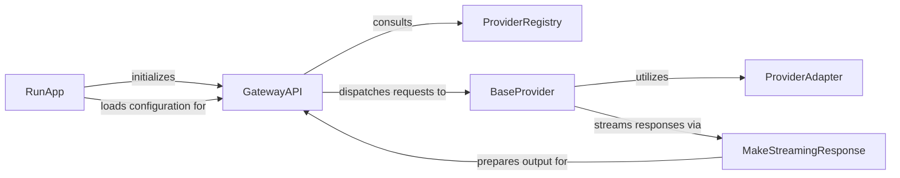

## Details

The `mlflow.gateway` subsystem serves as a unified API facade for various Large Language Model (LLM) providers, centralizing access and management of diverse AI models. The `RunApp` component initiates and manages the gateway's lifecycle, including loading configuration and starting the `GatewayAPI`. The `GatewayAPI` acts as the primary entry point, dynamically configuring routes and dispatching incoming LLM requests to the appropriate `BaseProvider` implementation, which is retrieved from the `ProviderRegistry`. Each `BaseProvider` handles the core LLM interaction, utilizing `ProviderAdapter` for seamless translation between the gateway's internal data formats and the specific external LLM API requirements. For streaming responses, `BaseProvider` implementations leverage the `MakeStreamingResponse` utility to format output into a Server-Sent Events (SSE) stream, which is then transmitted by the `GatewayAPI` back to the client. This architecture promotes extensibility and simplifies LLM integration by abstracting provider-specific complexities behind a unified interface.

### GatewayAPI
The central API Facade of the MLflow Gateway, built on FastAPI. It exposes unified LLM API endpoints, receives incoming requests, and dynamically dispatches them to appropriate handlers based on configured routes. It also manages rate limiting and dynamically sets up API routes.

**Related Classes/Methods**:

- <a href="https://github.com/mlflow/mlflow/blob/master/mlflow/gateway/app.py#L51-L79" target="_blank" rel="noopener noreferrer">`mlflow.gateway.app.GatewayAPI`:51-79</a>

### RunApp
Manages the operational lifecycle of the MLflow Gateway application, including starting, stopping, and reloading the service. It ensures continuous availability and responsiveness by orchestrating the application's initialization and dynamic configuration updates.

**Related Classes/Methods**:

- <a href="https://github.com/mlflow/mlflow/blob/master/mlflow/gateway/runner.py#L96-L106" target="_blank" rel="noopener noreferrer">`mlflow.gateway.runner.run_app`:96-106</a>

### ProviderRegistry
A central registry responsible for managing and providing access to various LLM provider implementations. It allows the gateway to dynamically discover, register, and retrieve different LLM backends, supporting extensibility.

**Related Classes/Methods**:

- <a href="https://github.com/mlflow/mlflow/blob/master/mlflow/gateway/provider_registry.py#L7-L24" target="_blank" rel="noopener noreferrer">`mlflow.gateway.provider_registry.ProviderRegistry`:7-24</a>

### BaseProvider
An abstract base class defining the common interface and core LLM interaction logic (e.g., chat, completions, embeddings) that all concrete LLM providers must implement. It acts as a contract for integrating diverse LLM services.

**Related Classes/Methods**:

- <a href="https://github.com/mlflow/mlflow/blob/master/mlflow/gateway/providers/base.py#L11-L77" target="_blank" rel="noopener noreferrer">`mlflow.gateway.providers.base.BaseProvider`:11-77</a>

### ProviderAdapter
An abstract base class defining methods for translating requests and responses between the MLflow Gateway's internal data models and the specific API formats of various LLM providers. It encapsulates the low-level communication details.

**Related Classes/Methods**:

- <a href="https://github.com/mlflow/mlflow/blob/master/mlflow/gateway/providers/base.py#L80-L127" target="_blank" rel="noopener noreferrer">`mlflow.gateway.providers.base.ProviderAdapter`:80-127</a>

### MakeStreamingResponse
A utility function responsible for formatting asynchronous LLM responses into a Server-Sent Events (SSE) stream. This enables real-time, token-by-token output for streaming endpoints, enhancing client interaction.

**Related Classes/Methods**:

- <a href="https://github.com/mlflow/mlflow/blob/master/mlflow/gateway/utils.py#L296-L305" target="_blank" rel="noopener noreferrer">`mlflow.gateway.utils.make_streaming_response`:296-305</a>

### [FAQ](https://github.com/CodeBoarding/GeneratedOnBoardings/tree/main?tab=readme-ov-file#faq)