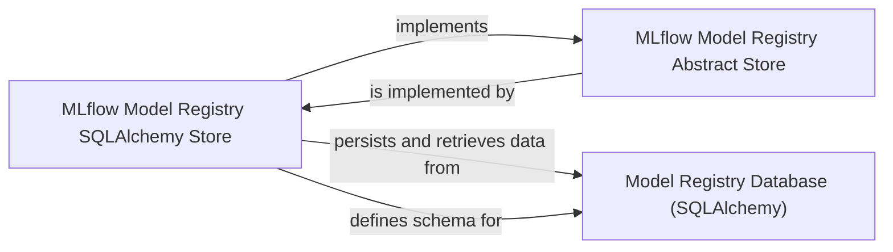

## Details

The MLflow Model Registry subsystem is built upon an abstract store interface (`MLflow Model Registry Abstract Store`) that defines the contract for model metadata management. This interface is concretely implemented by the `MLflow Model Registry SQLAlchemy Store`, which handles all persistent storage operations. The `MLflow Model Registry SQLAlchemy Store` directly interacts with the `Model Registry Database (SQLAlchemy)`, acting as the data access layer responsible for schema definition, CRUD operations, and transactional integrity of all registered model, version, tag, alias, and webhook metadata. This architecture ensures a clear separation of concerns between the abstract API and its concrete database-backed implementation, allowing for flexibility and extensibility in data storage mechanisms.

### Model Registry Database (SQLAlchemy)
The persistent data store whose structure and interactions are entirely defined and managed by the `MLflow Model Registry SQLAlchemy Store` through SQLAlchemy.

**Related Classes/Methods**: _None_

### MLflow Model Registry SQLAlchemy Store
Serves as the concrete data access layer for the MLflow Model Registry. It directly interacts with the underlying database using SQLAlchemy ORM. Responsible for schema management, CRUD operations, session management, and querying/filtering.

**Related Classes/Methods**:

- <a href="https://github.com/mlflow/mlflow/blob/master/mlflow/store/model_registry/sqlalchemy_store.py" target="_blank" rel="noopener noreferrer">`mlflow.store.model_registry.sqlalchemy_store`</a>

### MLflow Model Registry Abstract Store
An abstract store interface that defines the contract for model metadata management.

**Related Classes/Methods**: _None_

### [FAQ](https://github.com/CodeBoarding/GeneratedOnBoardings/tree/main?tab=readme-ov-file#faq)