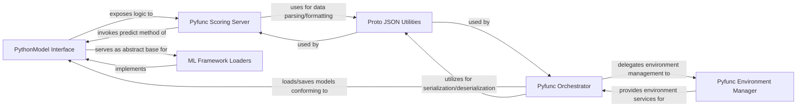

## Details

The `MLflow Model Serving` subsystem is a critical part of the MLflow platform, enabling the deployment of trained machine learning models as production-ready REST API endpoints for inference. Its boundaries are primarily defined by the `mlflow.pyfunc` package and its associated modules, which abstract away the complexities of model loading, environment management, and serving.

### PythonModel Interface
Defines the abstract interface (`load_context`, `predict`) that all MLflow Python models must implement. It acts as the contract for model behavior, ensuring consistency across different ML frameworks when served.

**Related Classes/Methods**:

- <a href="https://github.com/mlflow/mlflow/blob/master/mlflow/pyfunc/model.py" target="_blank" rel="noopener noreferrer">`mlflow.pyfunc.model`</a>

### Pyfunc Orchestrator
Serves as the primary orchestrator for `pyfunc` models. It handles the loading and saving of models, manages their environment, and facilitates integration with various deployment targets.

**Related Classes/Methods**:

- <a href="https://github.com/mlflow/mlflow/blob/master/mlflow/pyfunc/__init__.py" target="_blank" rel="noopener noreferrer">`mlflow.pyfunc`</a>

### Pyfunc Environment Manager
Manages the execution environment for `pyfunc` models, including setting up Conda or virtual environments and generating Dockerfiles for containerized deployment.

**Related Classes/Methods**:

- <a href="https://github.com/mlflow/mlflow/blob/master/mlflow/pyfunc/backend.py" target="_blank" rel="noopener noreferrer">`mlflow.pyfunc.backend`</a>

### Pyfunc Scoring Server
Provides the HTTP server endpoint for serving `pyfunc` models. It receives prediction requests, parses input, invokes the model's `predict` method, and formats the output for clients.

**Related Classes/Methods**:

- <a href="https://github.com/mlflow/mlflow/blob/master/mlflow/pyfunc/scoring_server" target="_blank" rel="noopener noreferrer">`mlflow.pyfunc.scoring_server`</a>

### ML Framework Loaders
These modules provide concrete implementations of the `PythonModel` interface for specific machine learning frameworks (e.g., scikit-learn, TensorFlow). They define how models from their respective frameworks are loaded and how their prediction logic is exposed through the `pyfunc` interface.

**Related Classes/Methods**:

- <a href="https://github.com/mlflow/mlflow/blob/master/mlflow/pyfunc/loaders/__init__.py" target="_blank" rel="noopener noreferrer">`mlflow.pyfunc.loaders`</a>
- <a href="https://github.com/mlflow/mlflow/blob/master/mlflow/sklearn" target="_blank" rel="noopener noreferrer">`mlflow.sklearn`</a>
- <a href="https://github.com/mlflow/mlflow/blob/master/mlflow/tensorflow" target="_blank" rel="noopener noreferrer">`mlflow.tensorflow`</a>

### Proto JSON Utilities
Provides serialization/deserialization utilities crucial for handling model metadata and prediction inputs/outputs, especially for communication over REST APIs.

**Related Classes/Methods**:

- <a href="https://github.com/mlflow/mlflow/blob/master/mlflow/utils/proto_json_utils.py" target="_blank" rel="noopener noreferrer">`mlflow.utils.proto_json_utils`</a>

### [FAQ](https://github.com/CodeBoarding/GeneratedOnBoardings/tree/main?tab=readme-ov-file#faq)