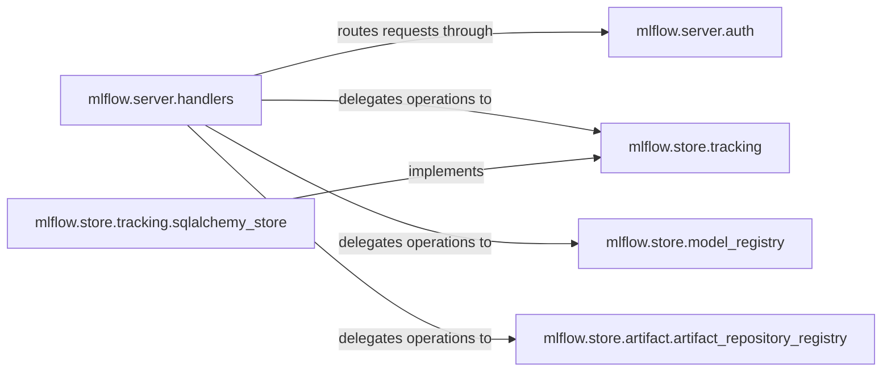

## Details

The MLflow Tracking Server subsystem is designed to manage the lifecycle of machine learning experiments, runs, and models. It acts as a central hub, receiving client requests, enforcing authentication, and delegating operations to specialized backend stores for tracking data, model registry entities, and artifacts. This modular design ensures scalability, flexibility, and clear separation of concerns, allowing for various storage implementations while maintaining a consistent API for clients.

### mlflow.server.handlers
Acts as the primary API gateway for the MLflow Tracking Server. It receives HTTP requests from MLflow clients (SDKs, UI), parses them, validates input, and dispatches operations to the appropriate backend store components (tracking, model registry, artifact). It also formats and sends responses back to clients.

**Related Classes/Methods**:

- <a href="https://github.com/mlflow/mlflow/blob/master/mlflow/server/handlers.py" target="_blank" rel="noopener noreferrer">`mlflow.server.handlers`</a>

### mlflow.server.auth
Enforces authentication and authorization policies for all incoming requests to the `mlflow.server.handlers`. It ensures that only authorized users or services can perform specific operations, securing the tracking server's data and functionality.

**Related Classes/Methods**:

- <a href="https://github.com/mlflow/mlflow/blob/master/mlflow/server/auth/__init__.py" target="_blank" rel="noopener noreferrer">`mlflow.server.auth.AuthMiddleware`</a>

### mlflow.store.tracking
Defines the abstract interface for storing and retrieving MLflow tracking data (experiments, runs, metrics, parameters, tags, traces). It provides a consistent API for various concrete storage implementations, decoupling the server logic from the specific persistence mechanism.

**Related Classes/Methods**:

- <a href="https://github.com/mlflow/mlflow/blob/master/mlflow/store/tracking/__init__.py" target="_blank" rel="noopener noreferrer">`mlflow.store.tracking.TrackingStore`</a>

### mlflow.store.tracking.sqlalchemy_store
Provides persistent storage for MLflow tracking data using a SQLAlchemy-compatible relational database. It handles database connections, ORM mapping, and SQL queries for CRUD operations on experiment and run entities.

**Related Classes/Methods**:

### mlflow.store.model_registry
Defines the abstract interface for managing MLflow Model Registry entities (registered models, model versions, aliases, webhooks). While the primary focus is tracking, the `mlflow.server.handlers` component interacts with this interface to support integrated MLflow workflows, allowing the tracking server to reference and manage models.

**Related Classes/Methods**:

- <a href="https://github.com/mlflow/mlflow/blob/master/mlflow/store/model_registry/__init__.py" target="_blank" rel="noopener noreferrer">`mlflow.store.model_registry.ModelRegistryStore`</a>

### mlflow.store.artifact.artifact_repository_registry
A central component that manages and provides access to various artifact storage backend implementations (e.g., S3, Azure Blob Storage, Google Cloud Storage, local filesystem). It acts as a factory, returning the correct artifact repository instance based on the configured artifact URI for MLflow runs.

**Related Classes/Methods**:

- <a href="https://github.com/mlflow/mlflow/blob/master/mlflow/store/artifact/artifact_repository_registry.py#L24-L90" target="_blank" rel="noopener noreferrer">`mlflow.store.artifact.artifact_repository_registry.ArtifactRepositoryRegistry`:24-90</a>

### [FAQ](https://github.com/CodeBoarding/GeneratedOnBoardings/tree/main?tab=readme-ov-file#faq)