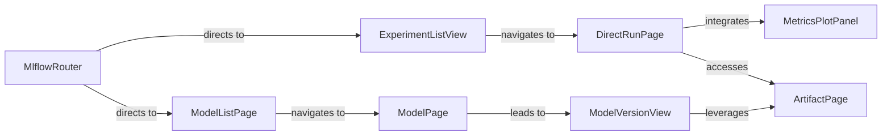

## Details

The MLflow UI architecture is centered around the MlflowRouter, which serves as the primary navigation hub, directing users to key sections such as experiment tracking and model registry. The ExperimentListView provides an overview and management interface for experiments, allowing users to delve into individual run details via the DirectRunPage. This DirectRunPage is a comprehensive view, integrating MetricsPlotPanel for performance visualization and ArtifactPage for exploring logged artifacts. Similarly, the ModelListPage manages registered models, leading to the ModelPage for specific model details. From there, users can access the ModelVersionView to examine individual model versions and their associated artifacts through the ArtifactPage. This structure ensures a clear and navigable flow for users interacting with MLflow's core functionalities.

### MlflowRouter
The foundational routing component that orchestrates navigation across the entire MLflow UI. It defines the application's structure and directs users to specific views for experiments, models, and other features.

**Related Classes/Methods**:

- <a href="https://github.com/mlflow/mlflow/blob/master/mlflow/server/js/src/MlflowRouter.tsx#L100-L123" target="_blank" rel="noopener noreferrer">`MlflowRouter`:100-123</a>

### ExperimentListView
The main interface for browsing and managing MLflow experiments. It provides functionalities for viewing, filtering, searching, and performing bulk actions on experiments, central to the experiment tracking aspect.

**Related Classes/Methods**:

- <a href="https://github.com/mlflow/mlflow/blob/master/mlflow/server/js/src/experiment-tracking/components/ExperimentListView.tsx#L31-L92" target="_blank" rel="noopener noreferrer">`ExperimentListView`:31-92</a>

### DirectRunPage
Provides a detailed, comprehensive view for a single MLflow run. This component displays all associated parameters, metrics, tags, artifacts, and linked models/datasets, crucial for in-depth run analysis.

**Related Classes/Methods**: _None_

### ModelListPage
The primary view for managing and listing registered models within the MLflow Model Registry. It offers capabilities for searching, sorting, and paginating through the catalog of models.

**Related Classes/Methods**: _None_

### ModelPage
Dedicated to displaying the detailed information for a specific registered model, including its metadata and a list of all its associated versions.

**Related Classes/Methods**: _None_

### ModelVersionView
Presents the granular details of a particular model version, including its tags, aliases, and provides controls for transitioning its lifecycle stage (e.g., from Staging to Production).

**Related Classes/Methods**:

- <a href="https://github.com/mlflow/mlflow/blob/master/mlflow/server/js/src/model-registry/components/ModelVersionView.tsx#L748-L751" target="_blank" rel="noopener noreferrer">`ModelVersionView`:748-751</a>

### MetricsPlotPanel
An interactive visualization component that enables users to plot and analyze metrics over time or steps for selected MLflow runs, essential for performance evaluation.

**Related Classes/Methods**: _None_

### ArtifactPage
Allows users to browse and view various types of artifacts (e.g., models, plots, data files) logged during an MLflow run, supporting different artifact viewers.

**Related Classes/Methods**: _None_

### [FAQ](https://github.com/CodeBoarding/GeneratedOnBoardings/tree/main?tab=readme-ov-file#faq)