```mermaid
graph LR
    MLflow_Client_SDK["MLflow Client SDK"]
    MLflow_Tracking_Server["MLflow Tracking Server"]
    MLflow_Model_Registry["MLflow Model Registry"]
    MLflow_Gateway["MLflow Gateway"]
    MLflow_UI["MLflow UI"]
    MLflow_Model_Serving["MLflow Model Serving"]
    External_LLM_Providers["External LLM Providers"]
    MLflow_Client_SDK -- "logs experiment data to" --> MLflow_Tracking_Server
    MLflow_Client_SDK -- "manages model versions in" --> MLflow_Model_Registry
    MLflow_Tracking_Server -- "provides experiment data to" --> MLflow_UI
    MLflow_Tracking_Server -- "stores run details referenced by" --> MLflow_Model_Registry
    MLflow_Model_Registry -- "provides model information to" --> MLflow_UI
    MLflow_Model_Registry -- "provides models for loading to" --> MLflow_Model_Serving
    MLflow_Gateway -- "routes LLM inference requests to" --> External_LLM_Providers
    MLflow_Gateway -- "routes LLM inference requests to" --> MLflow_Model_Serving
    MLflow_UI -- "queries" --> MLflow_Tracking_Server
    MLflow_UI -- "queries" --> MLflow_Model_Registry
    MLflow_Model_Serving -- "loads models from" --> MLflow_Model_Registry
    MLflow_Model_Serving -- "serves inference requests from" --> MLflow_Gateway
    External_LLM_Providers -- "receives LLM inference requests from" --> MLflow_Gateway
    External_LLM_Providers -- "sends LLM inference responses back to" --> MLflow_Gateway
    click MLflow_Client_SDK href "https://github.com/CodeBoarding/GeneratedOnBoardings/blob/main/mlflow/MLflow_Client_SDK.md" "Details"
    click MLflow_Tracking_Server href "https://github.com/CodeBoarding/GeneratedOnBoardings/blob/main/mlflow/MLflow_Tracking_Server.md" "Details"
    click MLflow_Model_Registry href "https://github.com/CodeBoarding/GeneratedOnBoardings/blob/main/mlflow/MLflow_Model_Registry.md" "Details"
    click MLflow_Gateway href "https://github.com/CodeBoarding/GeneratedOnBoardings/blob/main/mlflow/MLflow_Gateway.md" "Details"
    click MLflow_UI href "https://github.com/CodeBoarding/GeneratedOnBoardings/blob/main/mlflow/MLflow_UI.md" "Details"
    click MLflow_Model_Serving href "https://github.com/CodeBoarding/GeneratedOnBoardings/blob/main/mlflow/MLflow_Model_Serving.md" "Details"
    click External_LLM_Providers href "https://github.com/CodeBoarding/GeneratedOnBoardings/blob/main/mlflow/External_LLM_Providers.md" "Details"
```

## Details

The MLflow ecosystem is designed around a modular architecture, facilitating the entire machine learning lifecycle from experimentation to deployment. The MLflow Client SDK serves as the primary interface for users to interact with the system, enabling experiment logging, model management, and project execution. All experiment metadata and artifacts are centrally managed by the MLflow Tracking Server, which persists data and provides it to the MLflow UI for visualization and management. The MLflow Model Registry acts as a version-controlled repository for ML models, integrating with both the Tracking Server and the UI. For model deployment, the MLflow Model Serving component provides a generic REST API endpoint. A key addition for LLM-centric workflows is the MLflow Gateway, which unifies access to various External LLM Providers and can also route requests to internally served MLflow models. This interconnected system ensures a streamlined and observable ML development and deployment process.

### MLflow Client SDK [[Expand]](./MLflow_Client_SDK.md)
The primary programmatic interface for users, encompassing experiment logging, model registration, project execution, and initiating evaluation/tracing. It integrates with various ML frameworks for autologging.

**Related Classes/Methods**:

- <a href="https://github.com/mlflow/mlflow/blob/master/mlflow/tracking/fluent.py" target="_blank" rel="noopener noreferrer">`mlflow.tracking.fluent`</a>
- <a href="https://github.com/mlflow/mlflow/blob/master/mlflow/tracking/_model_registry/fluent.py" target="_blank" rel="noopener noreferrer">`mlflow.tracking._model_registry.fluent`</a>
- <a href="https://github.com/mlflow/mlflow/blob/master/mlflow/projects" target="_blank" rel="noopener noreferrer">`mlflow.projects`</a>
- <a href="https://github.com/mlflow/mlflow/blob/master/mlflow/evaluation/evaluation.py" target="_blank" rel="noopener noreferrer">`mlflow.evaluation.evaluation`</a>
- <a href="https://github.com/mlflow/mlflow/blob/master/mlflow/genai/optimize/base.py" target="_blank" rel="noopener noreferrer">`mlflow.genai.optimize.base`</a>
- <a href="https://github.com/mlflow/mlflow/blob/master/mlflow/sklearn" target="_blank" rel="noopener noreferrer">`mlflow.sklearn`</a>
- <a href="https://github.com/mlflow/mlflow/blob/master/mlflow/pytorch" target="_blank" rel="noopener noreferrer">`mlflow.pytorch`</a>
- <a href="https://github.com/mlflow/mlflow/blob/master/mlflow/tensorflow" target="_blank" rel="noopener noreferrer">`mlflow.tensorflow`</a>

### MLflow Tracking Server [[Expand]](./MLflow_Tracking_Server.md)
The central backend service for persisting, querying, and managing MLflow experiment metadata and artifacts.

**Related Classes/Methods**:

- <a href="https://github.com/mlflow/mlflow/blob/master/mlflow/server/handlers.py" target="_blank" rel="noopener noreferrer">`mlflow.server.handlers`</a>
- <a href="https://github.com/mlflow/mlflow/blob/master/mlflow/store/tracking/sqlalchemy_store.py" target="_blank" rel="noopener noreferrer">`mlflow.store.tracking.sqlalchemy_store`</a>

### MLflow Model Registry [[Expand]](./MLflow_Model_Registry.md)
A centralized backend repository for managing the lifecycle of ML models, enabling versioning and stage transitions.

**Related Classes/Methods**:

- <a href="https://github.com/mlflow/mlflow/blob/master/mlflow/store/model_registry/sqlalchemy_store.py" target="_blank" rel="noopener noreferrer">`mlflow.store.model_registry.sqlalchemy_store`</a>

### MLflow Gateway [[Expand]](./MLflow_Gateway.md)
A service providing a unified interface for interacting with various Large Language Model (LLM) providers and custom LLM deployments.

**Related Classes/Methods**:

- <a href="https://github.com/mlflow/mlflow/blob/master/mlflow/gateway/app.py" target="_blank" rel="noopener noreferrer">`mlflow.gateway.app`</a>

### MLflow UI [[Expand]](./MLflow_UI.md)
The web-based user interface for visualizing and managing MLflow experiments, runs, models, and traces.

**Related Classes/Methods**:

- <a href="https://github.com/mlflow/mlflow/blob/master/mlflow/server/js/src/MlflowRouter.tsx" target="_blank" rel="noopener noreferrer">`mlflow.server.js.src.MlflowRouter`</a>
- <a href="https://github.com/mlflow/mlflow/blob/master/mlflow/server/js/src/experiment-tracking/components/ExperimentListView.tsx" target="_blank" rel="noopener noreferrer">`mlflow.server.js.src.experiment_tracking.components.ExperimentListView`</a>
- <a href="https://github.com/mlflow/mlflow/blob/master/mlflow/server/js/src/model-registry/components/ModelListPage.tsx" target="_blank" rel="noopener noreferrer">`mlflow.server.js.src.model_registry.components.ModelListPage`</a>

### MLflow Model Serving [[Expand]](./MLflow_Model_Serving.md)
A generic mechanism for deploying MLflow models as REST API endpoints for inference.

**Related Classes/Methods**:

- <a href="https://github.com/mlflow/mlflow/blob/master/mlflow/pyfunc/model.py" target="_blank" rel="noopener noreferrer">`mlflow.pyfunc.model`</a>

### External LLM Providers [[Expand]](./External_LLM_Providers.md)
External Large Language Model APIs (e.g., OpenAI, Anthropic) that MLflow Gateway interacts with.

**Related Classes/Methods**:

- <a href="https://github.com/mlflow/mlflow/blob/master/mlflow/gateway/llm.py" target="_blank" rel="noopener noreferrer">`mlflow.gateway.llm`</a>

### [FAQ](https://github.com/CodeBoarding/GeneratedOnBoardings/tree/main?tab=readme-ov-file#faq)