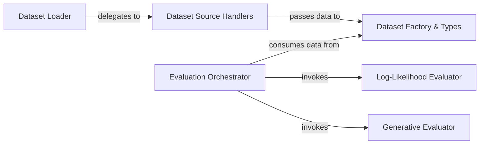

## Details

The `Data & Evaluation` subsystem is responsible for managing the lifecycle of datasets, from loading and preprocessing to their use in model training, fine-tuning, and performance assessment. It provides a structured approach to data handling and a comprehensive suite of tools for evaluating model performance using various metrics.

### Dataset Loader
Serves as the primary entry point for initiating the dataset loading process. It abstracts the underlying data sources and delegates to specialized handlers.

**Related Classes/Methods**:

- <a href="https://github.com/ml-explore/mlx-lm/blob/main/mlx_lm/tuner/datasets.py#L293-L316" target="_blank" rel="noopener noreferrer">`mlx_lm.tuner.datasets.load_dataset`:293-316</a>

### Dataset Source Handlers
Specializes in fetching raw data from specific sources, such as local file paths or the Hugging Face Hub, providing flexibility in data ingestion.

**Related Classes/Methods**:

- <a href="https://github.com/ml-explore/mlx-lm/blob/main/mlx_lm/tuner/datasets.py#L189-L203" target="_blank" rel="noopener noreferrer">`mlx_lm.tuner.datasets.load_local_dataset`:189-203</a>
- <a href="https://github.com/ml-explore/mlx-lm/blob/main/mlx_lm/tuner/datasets.py#L206-L230" target="_blank" rel="noopener noreferrer">`mlx_lm.tuner.datasets.load_hf_dataset`:206-230</a>

### Dataset Factory & Types
Transforms raw input data into standardized, structured dataset objects (e.g., CompletionsDataset, ChatDataset, TextDataset) that are optimized for ML tasks within the MLX framework.

**Related Classes/Methods**:

- <a href="https://github.com/ml-explore/mlx-lm/blob/main/mlx_lm/tuner/datasets.py#L159-L186" target="_blank" rel="noopener noreferrer">`mlx_lm.tuner.datasets.create_dataset`:159-186</a>
- <a href="https://github.com/ml-explore/mlx-lm/blob/main/mlx_lm/tuner/datasets.py#L75-L117" target="_blank" rel="noopener noreferrer">`mlx_lm.tuner.datasets.CompletionsDataset`:75-117</a>
- <a href="https://github.com/ml-explore/mlx-lm/blob/main/mlx_lm/tuner/datasets.py#L39-L72" target="_blank" rel="noopener noreferrer">`mlx_lm.tuner.datasets.ChatDataset`:39-72</a>
- <a href="https://github.com/ml-explore/mlx-lm/blob/main/mlx_lm/tuner/datasets.py#L11-L36" target="_blank" rel="noopener noreferrer">`mlx_lm.tuner.datasets.TextDataset`:11-36</a>

### Evaluation Orchestrator
The central component for managing and coordinating the model evaluation workflow. It determines which evaluation metrics to apply and invokes the relevant evaluators.

**Related Classes/Methods**:

- <a href="https://github.com/ml-explore/mlx-lm/blob/main/mlx_lm/evaluate.py#L339-L444" target="_blank" rel="noopener noreferrer">`mlx_lm.evaluate.main`:339-444</a>

### Log-Likelihood Evaluator
Focuses on quantitative model assessment by computing log-likelihood scores, including a rolling window variant for longer sequences, to measure how well a model predicts given text.

**Related Classes/Methods**:

- <a href="https://github.com/ml-explore/mlx-lm/blob/main/mlx_lm/evaluate.py#L140-L249" target="_blank" rel="noopener noreferrer">`mlx_lm.evaluate.loglikelihood`:140-249</a>
- <a href="https://github.com/ml-explore/mlx-lm/blob/main/mlx_lm/evaluate.py#L251-L294" target="_blank" rel="noopener noreferrer">`mlx_lm.evaluate.loglikelihood_rolling`:251-294</a>

### Generative Evaluator
Performs qualitative evaluation by generating text based on model predictions and assessing its quality and coherence, often based on specified stopping conditions.

**Related Classes/Methods**:

- <a href="https://github.com/ml-explore/mlx-lm/blob/main/mlx_lm/evaluate.py#L296-L336" target="_blank" rel="noopener noreferrer">`mlx_lm.evaluate.generate_until`:296-336</a>

### [FAQ](https://github.com/CodeBoarding/GeneratedOnBoardings/tree/main?tab=readme-ov-file#faq)