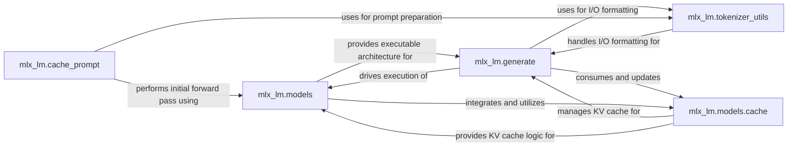

## Details

The `LLM Core (Inference & Architecture)` subsystem encapsulates the fundamental operations of Large Language Models, including the definition of model architectures, tokenization/detokenization of text, and the execution of the inference (text generation) process with KV cache management. Its boundaries are defined by the `mlx_lm.tokenizer_utils`, `mlx_lm.models`, `mlx_lm.generate`, `mlx_lm.cache_prompt`, and `mlx_lm.models.cache` modules.

### mlx_lm.models
Defines the computational graph and structure for various Large Language Model architectures (e.g., Llama, Gemma, Mixtral, Phi, Qwen). It encapsulates core neural network components like Attention, MLP, TransformerBlock, and integrates model-specific KV cache logic and Rotary Positional Embeddings (RoPE). This component is the blueprint for LLMs within mlx-lm.

**Related Classes/Methods**:

- <a href="https://github.com/ml-explore/mlx-lm/blob/main/mlx_lm/models" target="_blank" rel="noopener noreferrer">`mlx_lm.models`</a>

### mlx_lm.tokenizer_utils
Manages the conversion of raw text into numerical token IDs (tokenization) and vice-versa (detokenization). It handles special tokens, byte-level encoding/decoding, and provides the necessary utilities for text preprocessing and post-processing in the LLM pipeline.

**Related Classes/Methods**:

- <a href="https://github.com/ml-explore/mlx-lm/blob/main/mlx_lm/tokenizer_utils.py" target="_blank" rel="noopener noreferrer">`mlx_lm.tokenizer_utils`</a>

### mlx_lm.generate
Orchestrates the step-by-step text generation process. This includes executing the model's forward pass, managing the generation loop, implementing advanced techniques like speculative decoding, and providing streaming output capabilities. It is the primary execution engine for LLM inference.

**Related Classes/Methods**:

- <a href="https://github.com/ml-explore/mlx-lm/blob/main/mlx_lm/generate.py" target="_blank" rel="noopener noreferrer">`mlx_lm.generate`</a>

### mlx_lm.models.cache
Provides the core logic for creating, updating, and trimming the Key-Value (KV) cache. This is crucial for efficient sequential token generation by storing intermediate attention states, significantly optimizing performance for autoregressive models.

**Related Classes/Methods**:

- <a href="https://github.com/ml-explore/mlx-lm/blob/main/mlx_lm/models/cache.py" target="_blank" rel="noopener noreferrer">`mlx_lm.models.cache`</a>

### mlx_lm.cache_prompt
Optimizes repeated inferences for the same prompt by caching tokenized prompts and potentially their initial KV states. This reduces redundant computation for common prompts.

**Related Classes/Methods**:

- <a href="https://github.com/ml-explore/mlx-lm/blob/main/mlx_lm/cache_prompt.py" target="_blank" rel="noopener noreferrer">`mlx_lm.cache_prompt`</a>

### [FAQ](https://github.com/CodeBoarding/GeneratedOnBoardings/tree/main?tab=readme-ov-file#faq)