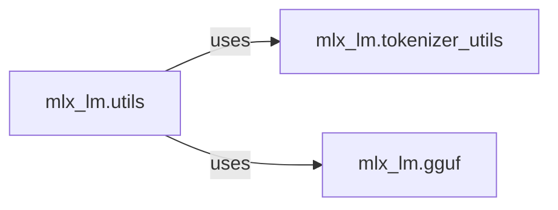

## Details

The Model Lifecycle Management subsystem is responsible for the end-to-end handling of machine learning models, from loading and configuration to saving and format conversion, specifically optimized for the MLX framework.

### mlx_lm.utils
This component acts as the central orchestrator for model lifecycle operations. It provides functionalities for loading pre-trained models from various sources (including Hugging Face Hub), saving fine-tuned or quantized models, and performing model quantization. It also includes utilities for generating model cards, ensuring proper metadata management.

**Related Classes/Methods**:

- <a href="https://github.com/ml-explore/mlx-lm/blob/main/mlx_lm/utils.py#L1-L100" target="_blank" rel="noopener noreferrer">`mlx_lm.utils:load_model`:1-100</a>
- <a href="https://github.com/ml-explore/mlx-lm/blob/main/mlx_lm/utils.py#L1-L100" target="_blank" rel="noopener noreferrer">`mlx_lm.utils:load`:1-100</a>
- <a href="https://github.com/ml-explore/mlx-lm/blob/main/mlx_lm/utils.py#L1-L100" target="_blank" rel="noopener noreferrer">`mlx_lm.utils:fetch_from_hub`:1-100</a>
- <a href="https://github.com/ml-explore/mlx-lm/blob/main/mlx_lm/utils.py#L1-L100" target="_blank" rel="noopener noreferrer">`mlx_lm.utils:save_model`:1-100</a>
- <a href="https://github.com/ml-explore/mlx-lm/blob/main/mlx_lm/utils.py#L1-L100" target="_blank" rel="noopener noreferrer">`mlx_lm.utils:save`:1-100</a>
- <a href="https://github.com/ml-explore/mlx-lm/blob/main/mlx_lm/utils.py#L1-L100" target="_blank" rel="noopener noreferrer">`mlx_lm.utils:quantize_model`:1-100</a>
- <a href="https://github.com/ml-explore/mlx-lm/blob/main/mlx_lm/utils.py#L1-L100" target="_blank" rel="noopener noreferrer">`mlx_lm.utils:create_model_card`:1-100</a>

### mlx_lm.gguf
This specialized component is dedicated to the conversion, serialization, and specific handling of models in the GGUF format. GGUF is critical for efficient inference on Apple Silicon, and this component manages the intricacies of GGUF vocabulary, token processing, and weight name translation to ensure compatibility and performance.

**Related Classes/Methods**:

- <a href="https://github.com/ml-explore/mlx-lm/blob/main/mlx_lm/gguf.py#L1-L100" target="_blank" rel="noopener noreferrer">`mlx_lm.gguf:convert_to_gguf`:1-100</a>
- <a href="https://github.com/ml-explore/mlx-lm/blob/main/mlx_lm/gguf.py#L1-L100" target="_blank" rel="noopener noreferrer">`mlx_lm.gguf:load`:1-100</a>
- <a href="https://github.com/ml-explore/mlx-lm/blob/main/mlx_lm/gguf.py#L1-L100" target="_blank" rel="noopener noreferrer">`mlx_lm.gguf:hf_tokens`:1-100</a>
- <a href="https://github.com/ml-explore/mlx-lm/blob/main/mlx_lm/gguf.py#L1-L100" target="_blank" rel="noopener noreferrer">`mlx_lm.gguf:added_tokens`:1-100</a>
- <a href="https://github.com/ml-explore/mlx-lm/blob/main/mlx_lm/gguf.py#L1-L100" target="_blank" rel="noopener noreferrer">`mlx_lm.gguf:all_tokens`:1-100</a>
- <a href="https://github.com/ml-explore/mlx-lm/blob/main/mlx_lm/gguf.py#L1-L100" target="_blank" rel="noopener noreferrer">`mlx_lm.gguf:translate_weight_names`:1-100</a>

### mlx_lm.tokenizer_utils
This auxiliary component is responsible for loading and managing tokenizers, which are an essential dependency for loading and processing models. It ensures that the correct tokenizer is associated with a loaded model, facilitating proper text encoding and decoding.

**Related Classes/Methods**:

- <a href="https://github.com/ml-explore/mlx-lm/blob/main/mlx_lm/tokenizer_utils.py#L1-L100" target="_blank" rel="noopener noreferrer">`mlx_lm.tokenizer_utils:load_tokenizer`:1-100</a>

### [FAQ](https://github.com/CodeBoarding/GeneratedOnBoardings/tree/main?tab=readme-ov-file#faq)