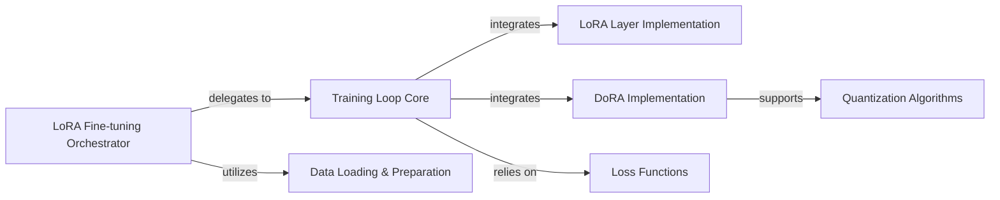

## Details

The `mlx-lm` project's fine-tuning subsystem is orchestrated by the `LoRA Fine-tuning Orchestrator`, which initiates and manages the entire process. It `utilizes` the `Data Loading & Preparation` component to prepare datasets and `delegates to` the `Training Loop Core` for the iterative optimization process. The `Training Loop Core` is central to the training, `relying on` `Loss Functions` for gradient computation and `integrating` both `LoRA Layer Implementation` and `DoRA Implementation` to apply low-rank adaptation techniques. Notably, `DoRA Implementation` is designed to `support` `Quantization Algorithms`, allowing it to operate on and potentially re-quantize models that have undergone quantization, thereby enabling efficient fine-tuning of compressed models. This modular design allows for flexible integration of various adaptation and optimization techniques.

### LoRA Fine-tuning Orchestrator
Acts as the high-level entry point and orchestrator for the LoRA fine-tuning workflow. It manages the end-to-end process, including initiating training and evaluation.

**Related Classes/Methods**:

- <a href="https://github.com/ml-explore/mlx-lm/blob/main/mlx_lm/lora.py" target="_blank" rel="noopener noreferrer">`mlx_lm.lora`</a>

### Training Loop Core
Implements the fundamental training loop, handling iterative optimization, forward/backward passes, and model updates.

**Related Classes/Methods**:

- <a href="https://github.com/ml-explore/mlx-lm/blob/main/mlx_lm/tuner/trainer.py" target="_blank" rel="noopener noreferrer">`mlx_lm.tuner.trainer`</a>

### Data Loading & Preparation
Provides utilities for loading, preprocessing, and preparing datasets from various sources (e.g., local files, Hugging Face Hub) for the fine-tuning process.

**Related Classes/Methods**:

- <a href="https://github.com/ml-explore/mlx-lm/blob/main/mlx_lm/tuner/datasets.py" target="_blank" rel="noopener noreferrer">`mlx_lm.tuner.datasets`</a>

### LoRA Layer Implementation
Contains the specific architectural implementations of LoRA layers, enabling low-rank adaptation within models.

**Related Classes/Methods**:

- <a href="https://github.com/ml-explore/mlx-lm/blob/main/mlx_lm/tuner/lora.py" target="_blank" rel="noopener noreferrer">`mlx_lm.tuner.lora`</a>

### DoRA Implementation
Provides the core logic for applying DoRA (Weight-Decomposed Low-Rank Adaptation) to models, including converting base layers and fusing weights. It is designed to be compatible with both unquantized and quantized linear layers.

**Related Classes/Methods**:

- <a href="https://github.com/ml-explore/mlx-lm/blob/main/mlx_lm/tuner/dora.py" target="_blank" rel="noopener noreferrer">`mlx_lm.tuner.dora`</a>

### Quantization Algorithms
This acts as a collective component encompassing various quantization algorithms (dwq, dynamic_quant, awq, gptq). Each sub-module within `mlx_lm.quant` is responsible for implementing its specific quantization technique to reduce model size and optimize for inference.

**Related Classes/Methods**:

- <a href="https://github.com/ml-explore/mlx-lm/blob/main/mlx_lm/quant/dwq.py" target="_blank" rel="noopener noreferrer">`mlx_lm.quant.dwq`</a>
- <a href="https://github.com/ml-explore/mlx-lm/blob/main/mlx_lm/quant/dynamic_quant.py" target="_blank" rel="noopener noreferrer">`mlx_lm.quant.dynamic_quant`</a>
- <a href="https://github.com/ml-explore/mlx-lm/blob/main/mlx_lm/quant/gptq.py" target="_blank" rel="noopener noreferrer">`mlx_lm.quant.gptq`</a>
- <a href="https://github.com/ml-explore/mlx-lm/blob/main/mlx_lm/quant/awq.py" target="_blank" rel="noopener noreferrer">`mlx_lm.quant.awq`</a>

### Loss Functions
Provides functions for computing gradients during optimization.

**Related Classes/Methods**:

- <a href="https://github.com/ml-explore/mlx-lm/blob/main/mlx_lm/tuner/losses.py" target="_blank" rel="noopener noreferrer">`mlx_lm.tuner.losses`</a>

### [FAQ](https://github.com/CodeBoarding/GeneratedOnBoardings/tree/main?tab=readme-ov-file#faq)