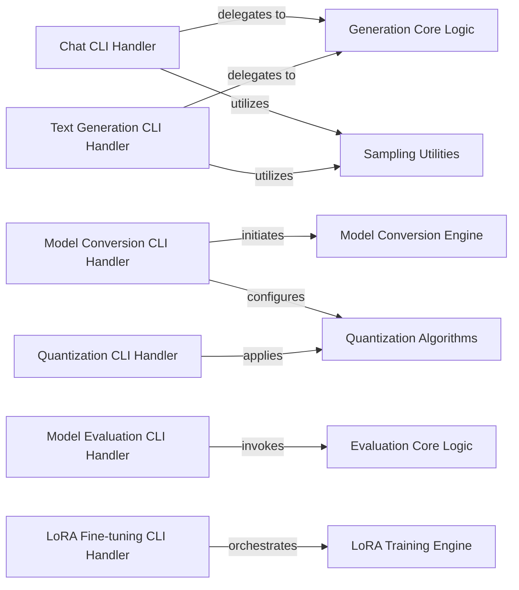

## Details

The mlx-lm project's command-line interface subsystem is structured around several CLI Handler components, each responsible for a specific user-facing task such as chat, model conversion, evaluation, LoRA fine-tuning, text generation, and quantization. These handlers act as the entry points, parsing user arguments and orchestrating the underlying core functionalities. The Chat CLI Handler and Text Generation CLI Handler both delegate to the Generation Core Logic for actual text generation and utilize Sampling Utilities to control output characteristics. The Model Conversion CLI Handler initiates the Model Conversion Engine for format transformations and configures Quantization Algorithms for model optimization. Similarly, the Model Evaluation CLI Handler invokes the Evaluation Core Logic to assess model performance, and the LoRA Fine-tuning CLI Handler orchestrates the LoRA Training Engine for adapting models. Finally, the Quantization CLI Handler directly applies various Quantization Algorithms to models. This modular design separates user interaction from core MLX model operations, promoting maintainability and clarity.

### Chat CLI Handler
Provides the command-line interface for interactive chat sessions with MLX models, enabling users to engage in conversational AI.

**Related Classes/Methods**:

- `mlx_lm.chat`

### Model Conversion CLI Handler
Offers a command-line interface for converting models between different formats, including integration with quantization processes. This component handles the initial user request for model format transformation.

**Related Classes/Methods**:

- `mlx_lm.convert`

### Model Evaluation CLI Handler
Provides a CLI for evaluating MLX models based on various metrics and tasks, allowing users to assess model performance.

**Related Classes/Methods**:

- `mlx_lm.evaluate`

### LoRA Fine-tuning CLI Handler
Manages the command-line interface for fine-tuning models using the LoRA (Low-Rank Adaptation) technique, enabling users to adapt pre-trained models to specific datasets.

**Related Classes/Methods**:

- `mlx_lm.lora`

### Text Generation CLI Handler
Offers a command-line interface for generating text using MLX models, providing options for various generation parameters.

**Related Classes/Methods**:

- `mlx_lm.generate`

### Quantization CLI Handler
Provides a unified command-line interface for applying various model quantization techniques (e.g., DWQ, Dynamic, AWQ, GPTQ), optimizing models for efficiency.

**Related Classes/Methods**:

- `mlx_lm.quant.dwq`
- `mlx_lm.quant.awq`
- `mlx_lm.quant.gptq`

### Generation Core Logic
Encapsulates the fundamental algorithms and processes for generating text, including streaming responses and managing the prompt cache. This component is central to all text generation tasks.

**Related Classes/Methods**:

- <a href="https://github.com/ml-explore/mlx-lm/blob/main/mlx_lm/generate.py#L634-L723" target="_blank" rel="noopener noreferrer">`mlx_lm.generate.stream_generate`:634-723</a>
- <a href="https://github.com/ml-explore/mlx-lm/blob/main/mlx_lm/models/cache.py#L10-L35" target="_blank" rel="noopener noreferrer">`mlx_lm.models.cache.make_prompt_cache`:10-35</a>

### Sampling Utilities
Provides various sampling strategies and utilities (e.g., temperature, top-p, XTC sampling) used during the text generation process to control the diversity and quality of generated output.

**Related Classes/Methods**:

- <a href="https://github.com/ml-explore/mlx-lm/blob/main/mlx_lm/sample_utils.py#L10-L70" target="_blank" rel="noopener noreferrer">`mlx_lm.sample_utils.make_sampler`:10-70</a>

### Model Conversion Engine
Handles the core logic for converting MLX models between different formats and managing the integration with quantization processes.

**Related Classes/Methods**:

- <a href="https://github.com/ml-explore/mlx-lm/blob/main/mlx_lm/convert.py#L84-L158" target="_blank" rel="noopener noreferrer">`mlx_lm.convert.convert`:84-158</a>

### Quantization Algorithms
Implements various quantization techniques (e.g., DWQ, AWQ, GPTQ, Dynamic Quantization) to optimize model size and inference speed. This component provides the specific algorithms applied during conversion or as a standalone process.

**Related Classes/Methods**:

- `mlx_lm.quant.dwq`
- `mlx_lm.quant.awq`
- `mlx_lm.quant.gptq`
- `mlx_lm.quant.dynamic_quant`

### Evaluation Core Logic
Contains the primary functionalities for evaluating MLX models, including loading datasets, running inference, and computing performance metrics.

**Related Classes/Methods**:

- `mlx_lm.evaluate.evaluate`

### LoRA Training Engine
Manages the core processes for fine-tuning models using the LoRA technique, including dataset handling, model loading, and the training loop.

**Related Classes/Methods**:

- <a href="https://github.com/ml-explore/mlx-lm/blob/main/mlx_lm/lora.py#L354-L373" target="_blank" rel="noopener noreferrer">`mlx_lm.lora.main`:354-373</a>

### [FAQ](https://github.com/CodeBoarding/GeneratedOnBoardings/tree/main?tab=readme-ov-file#faq)