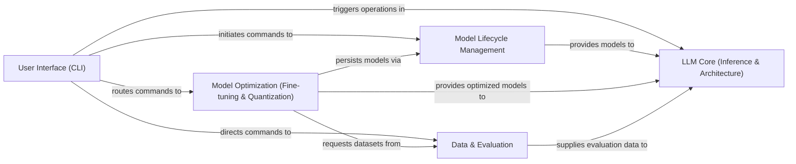

## Details

The `mlx-lm` project is structured around a clear separation of concerns, facilitating efficient development and deployment of Large Language Models. The User Interface (CLI) acts as the central orchestrator, providing command-line access to all core functionalities. It initiates commands to the Model Lifecycle Management for loading and saving models, triggers operations in the LLM Core (Inference & Architecture) for text generation, routes commands to Model Optimization (Fine-tuning & Quantization) for model adaptation, and directs commands to Data & Evaluation for dataset handling and performance assessment. The Model Lifecycle Management component is crucial for handling the persistence and configuration of models, serving as a repository that LLM Core retrieves models from for inference and where Model Optimization stores its refined outputs. Model Optimization is a key processing unit, taking raw models and datasets from Data & Evaluation to produce optimized models. These optimized models are then provided to the LLM Core for efficient inference. Finally, Data & Evaluation not only supplies datasets for optimization but also provides evaluation data to the LLM Core to assess its performance, closing the feedback loop for model improvement. This architecture ensures a modular and scalable approach to LLM development, from data preparation and model optimization to inference and evaluation.

### User Interface (CLI) [[Expand]](./User_Interface_CLI_.md)
The primary user interaction layer, providing command-line entry points for all major functionalities. It acts as the orchestrator, directing user requests to the appropriate backend modules.

**Related Classes/Methods**:

- <a href="https://github.com/ml-explore/mlx-lm/blob/main/mlx_lm/chat.py" target="_blank" rel="noopener noreferrer">`mlx_lm.chat`</a>
- <a href="https://github.com/ml-explore/mlx-lm/blob/main/mlx_lm/convert.py" target="_blank" rel="noopener noreferrer">`mlx_lm.convert`</a>
- <a href="https://github.com/ml-explore/mlx-lm/blob/main/mlx_lm/evaluate.py" target="_blank" rel="noopener noreferrer">`mlx_lm.evaluate`</a>
- <a href="https://github.com/ml-explore/mlx-lm/blob/main/mlx_lm/lora.py" target="_blank" rel="noopener noreferrer">`mlx_lm.lora`</a>
- <a href="https://github.com/ml-explore/mlx-lm/blob/main/mlx_lm/generate.py" target="_blank" rel="noopener noreferrer">`mlx_lm.generate`</a>
- <a href="https://github.com/ml-explore/mlx-lm/blob/main/mlx_lm/server.py" target="_blank" rel="noopener noreferrer">`mlx_lm.server`</a>
- <a href="https://github.com/ml-explore/mlx-lm/blob/main/mlx_lm/quant" target="_blank" rel="noopener noreferrer">`mlx_lm.quant`</a>

### Model Lifecycle Management [[Expand]](./Model_Lifecycle_Management.md)
Responsible for the lifecycle management of models, including loading pre-trained models, saving fine-tuned or quantized models, and handling model configuration. It also encompasses utilities for converting models to different formats like GGUF.

**Related Classes/Methods**:

- <a href="https://github.com/ml-explore/mlx-lm/blob/main/mlx_lm/utils.py" target="_blank" rel="noopener noreferrer">`mlx_lm.utils`</a>
- <a href="https://github.com/ml-explore/mlx-lm/blob/main/mlx_lm/gguf.py" target="_blank" rel="noopener noreferrer">`mlx_lm.gguf`</a>

### LLM Core (Inference & Architecture) [[Expand]](./LLM_Core_Inference_Architecture_.md)
Encapsulates the fundamental operations of Large Language Models, including the definition of model architectures, tokenization/detokenization of text, and the execution of the inference (text generation) process with KV cache management.

**Related Classes/Methods**:

- <a href="https://github.com/ml-explore/mlx-lm/blob/main/mlx_lm/tokenizer_utils.py" target="_blank" rel="noopener noreferrer">`mlx_lm.tokenizer_utils`</a>
- <a href="https://github.com/ml-explore/mlx-lm/blob/main/mlx_lm/models" target="_blank" rel="noopener noreferrer">`mlx_lm.models`</a>
- <a href="https://github.com/ml-explore/mlx-lm/blob/main/mlx_lm/generate.py" target="_blank" rel="noopener noreferrer">`mlx_lm.generate`</a>
- <a href="https://github.com/ml-explore/mlx-lm/blob/main/mlx_lm/cache_prompt.py" target="_blank" rel="noopener noreferrer">`mlx_lm.cache_prompt`</a>
- <a href="https://github.com/ml-explore/mlx-lm/blob/main/mlx_lm/models/cache.py" target="_blank" rel="noopener noreferrer">`mlx_lm.models.cache`</a>

### Model Optimization (Fine-tuning & Quantization) [[Expand]](./Model_Optimization_Fine_tuning_Quantization_.md)
Provides functionalities for adapting pre-trained models to specific tasks or datasets. This includes implementations of techniques like LoRA (Low-Rank Adaptation) and DoRA (DoRA: Weight-Decomposed Low-Rank Adaptation), as well as various quantization algorithms to reduce model size and improve inference speed.

**Related Classes/Methods**:

- <a href="https://github.com/ml-explore/mlx-lm/blob/main/mlx_lm/lora.py" target="_blank" rel="noopener noreferrer">`mlx_lm.lora`</a>
- <a href="https://github.com/ml-explore/mlx-lm/blob/main/mlx_lm/tuner" target="_blank" rel="noopener noreferrer">`mlx_lm.tuner`</a>
- <a href="https://github.com/ml-explore/mlx-lm/blob/main/mlx_lm/quant" target="_blank" rel="noopener noreferrer">`mlx_lm.quant`</a>

### Data & Evaluation [[Expand]](./Data_Evaluation.md)
Manages the loading, preprocessing, and preparation of datasets from various sources (e.g., local files, Hugging Face Hub) for use in training, fine-tuning, and evaluation processes. It also facilitates the assessment of model performance using various metrics.

**Related Classes/Methods**:

- <a href="https://github.com/ml-explore/mlx-lm/blob/main/mlx_lm/tuner/datasets.py" target="_blank" rel="noopener noreferrer">`mlx_lm.tuner.datasets`</a>
- <a href="https://github.com/ml-explore/mlx-lm/blob/main/mlx_lm/evaluate.py" target="_blank" rel="noopener noreferrer">`mlx_lm.evaluate`</a>

### [FAQ](https://github.com/CodeBoarding/GeneratedOnBoardings/tree/main?tab=readme-ov-file#faq)