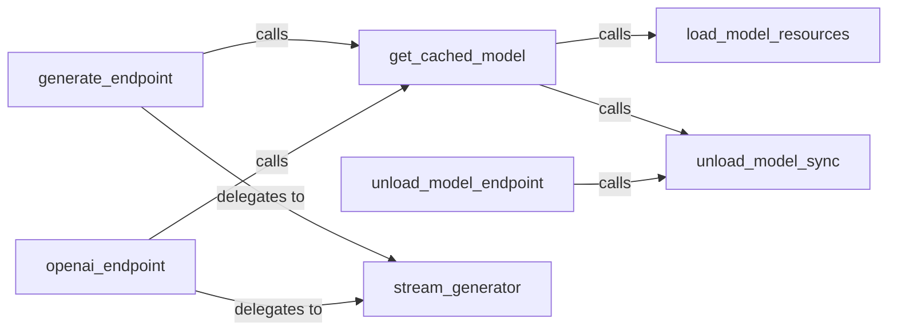

## Details

The API Gateway / Model Serving subsystem is primarily encapsulated within the mlx_vlm/server.py file, serving as the central hub for exposing VLM functionalities and managing model lifecycle. These components are selected due to their fundamental roles in establishing the API Gateway / Model Serving subsystem as a core part of a Web Application. The openai_endpoint, generate_endpoint, and unload_model_endpoint serve as the essential external interfaces, aligning with the "API Gateway" pattern by providing structured access points. get_cached_model, load_model_resources, and unload_model_sync are critical for the "Model Serving" aspect, managing the lifecycle, caching, and memory of the VLM models, which is central to performance and resource utilization. Finally, stream_generator is vital for modern web applications, enabling efficient, real-time delivery of potentially large AI model outputs, enhancing user experience. Together, they form a complete and cohesive unit for handling external requests and serving VLM functionalities.

### openai_endpoint
Serves as the OpenAI-compatible API entry point, handling requests formatted for OpenAI's API.

**Related Classes/Methods**:

- <a href="https://github.com/Blaizzy/mlx-vlm/blob/main/mlx_vlm/server.py#L348-L679" target="_blank" rel="noopener noreferrer">`openai_endpoint`:348-679</a>

### generate_endpoint
Provides a general-purpose API entry point for model generation requests, offering a flexible interface for VLM inference.

**Related Classes/Methods**:

- <a href="https://github.com/Blaizzy/mlx-vlm/blob/main/mlx_vlm/server.py#L926-L1077" target="_blank" rel="noopener noreferrer">`generate_endpoint`:926-1077</a>

### unload_model_endpoint
Exposes an API endpoint allowing explicit, external triggering of model unloading from memory.

**Related Classes/Methods**:

- <a href="https://github.com/Blaizzy/mlx-vlm/blob/main/mlx_vlm/server.py#L1092-L1109" target="_blank" rel="noopener noreferrer">`unload_model_endpoint`:1092-1109</a>

### get_cached_model
Manages model caching, orchestrating the loading of models into memory when needed and initiating their unloading when no longer required.

**Related Classes/Methods**:

- <a href="https://github.com/Blaizzy/mlx-vlm/blob/main/mlx_vlm/server.py#L64-L94" target="_blank" rel="noopener noreferrer">`get_cached_model`:64-94</a>

### load_model_resources
Responsible for the actual loading of VLM components and their associated resources into memory, preparing them for inference.

**Related Classes/Methods**:

- <a href="https://github.com/Blaizzy/mlx-vlm/blob/main/mlx_vlm/server.py#L44-L61" target="_blank" rel="noopener noreferrer">`load_model_resources`:44-61</a>

### unload_model_sync
Performs the synchronous unloading of models from memory, ensuring resources are released efficiently.

**Related Classes/Methods**:

- <a href="https://github.com/Blaizzy/mlx-vlm/blob/main/mlx_vlm/server.py#L98-L112" target="_blank" rel="noopener noreferrer">`unload_model_sync`:98-112</a>

### stream_generator
Handles the real-time streaming of model outputs, enabling incremental delivery of responses to clients.

**Related Classes/Methods**:

- <a href="https://github.com/Blaizzy/mlx-vlm/blob/main/mlx_vlm/server.py#L970-L1021" target="_blank" rel="noopener noreferrer">`stream_generator`:970-1021</a>

### [FAQ](https://github.com/CodeBoarding/GeneratedOnBoardings/tree/main?tab=readme-ov-file#faq)