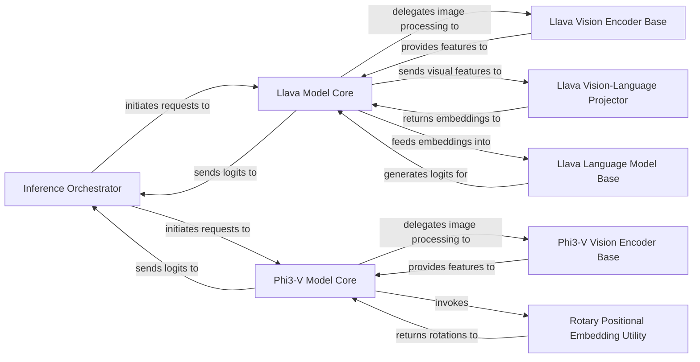

## Details

The Core VLM Engine subsystem is defined as the central processing unit for all Vision-Language Model operations, encapsulating VLM architectures and performing inference. Its boundaries are primarily established by the mlx_vlm/generate.py module, which orchestrates the inference process, and the mlx_vlm/models/llava.py and mlx_vlm/models/phi3_v.py packages, which contain the specific implementations of the Llava and Phi3-V VLM architectures, respectively. These components are chosen because they represent the fundamental building blocks and operational units of a Vision-Language Model engine. The Inference Orchestrator serves as the control plane, managing the overall execution flow. The Llava Model Core and Phi3-V Model Core are the concrete implementations of the VLM architectures, each encapsulating their specific multimodal processing logic. Their respective sub-components (Vision Encoder Base, Language Model Base, Vision-Language Projector, Rotary Positional Embedding Utility) are critical for handling the distinct vision, language, and architectural specifics of each model, making them indispensable for the VLM engine's functionality.

### Inference Orchestrator
Manages the overall VLM inference flow, including iterative token generation, sampling, and streaming. It acts as the primary interface for initiating VLM tasks.

**Related Classes/Methods**:

- <a href="https://github.com/Blaizzy/mlx-vlm/blob/main/mlx_vlm/generate.py" target="_blank" rel="noopener noreferrer">`mlx_vlm.generate`</a>

### Llava Model Core
Integrates the vision and language components of the Llava model to perform multimodal inference, coordinating the forward pass.

**Related Classes/Methods**:

- <a href="https://github.com/Blaizzy/mlx-vlm/blob/main/mlx_vlm/models/llava/llava.py" target="_blank" rel="noopener noreferrer">`mlx_vlm.models.llava.llava`</a>

### Phi3-V Model Core
Encapsulates the complete Phi3-V VLM architecture, coordinating its specific vision and language processing for multimodal inference.

**Related Classes/Methods**:

- <a href="https://github.com/Blaizzy/mlx-vlm/blob/main/mlx_vlm/models/phi3_v/phi3_v.py" target="_blank" rel="noopener noreferrer">`mlx_vlm.models.phi3_v.phi3_v`</a>

### Llava Vision-Language Projector
Transforms visual features extracted by the vision encoder into an embedding space compatible with the language model, specifically for the Llava architecture.

**Related Classes/Methods**:

- <a href="https://github.com/Blaizzy/mlx-vlm/blob/main/mlx_vlm/models/llava/llava.py" target="_blank" rel="noopener noreferrer">`mlx_vlm.models.llava.llava`</a>

### Llava Language Model Base
Implements the core language model architecture for Llava, processing combined multimodal inputs to generate textual outputs.

**Related Classes/Methods**:

- <a href="https://github.com/Blaizzy/mlx-vlm/blob/main/mlx_vlm/models/llava/language.py" target="_blank" rel="noopener noreferrer">`mlx_vlm.models.llava.language`</a>

### Llava Vision Encoder Base
Extracts and encodes visual features from input images specifically for the Llava model.

**Related Classes/Methods**:

- <a href="https://github.com/Blaizzy/mlx-vlm/blob/main/mlx_vlm/models/llava/vision.py" target="_blank" rel="noopener noreferrer">`mlx_vlm.models.llava.vision`</a>

### Phi3-V Vision Encoder Base
Extracts and encodes visual features from input images specifically for the Phi3-V model.

**Related Classes/Methods**:

- <a href="https://github.com/Blaizzy/mlx-vlm/blob/main/mlx_vlm/models/phi3_v/vision.py" target="_blank" rel="noopener noreferrer">`mlx_vlm.models.phi3_v.vision`</a>

### Rotary Positional Embedding Utility
Provides the implementation for rotary positional embeddings, crucial for attention mechanisms within the Phi3-V model.

**Related Classes/Methods**:

- <a href="https://github.com/Blaizzy/mlx-vlm/blob/main/mlx_vlm/models/phi3_v/su_rope.py" target="_blank" rel="noopener noreferrer">`mlx_vlm.models.phi3_v.su_rope`</a>

### [FAQ](https://github.com/CodeBoarding/GeneratedOnBoardings/tree/main?tab=readme-ov-file#faq)