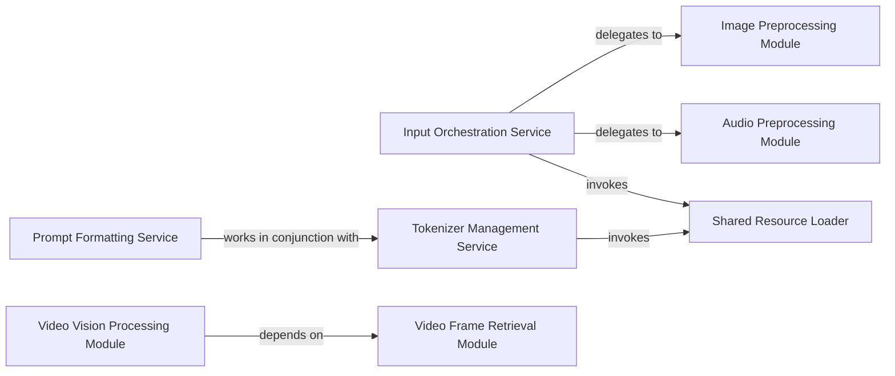

## Details

The `Data Preprocessing & Utilities` subsystem is a critical shared service within the `mlx-vlm` project, responsible for transforming diverse raw input modalities (images, audio, text, video) into a standardized, VLM-consumable format. This includes specialized operations like prompt formatting and tokenizer interactions.

### Input Orchestration Service
Acts as the primary entry point for input preparation, coordinating and delegating specific preprocessing tasks based on the input modality. It ensures that all diverse inputs are channeled through the appropriate processing pipelines.

**Related Classes/Methods**:

- <a href="https://github.com/Blaizzy/mlx-vlm/blob/main/mlx_vlm/utils.py#L722-L829" target="_blank" rel="noopener noreferrer">`mlx_vlm.utils.prepare_inputs`:722-829</a>

### Image Preprocessing Module
Specializes in handling image inputs, performing necessary transformations such as loading, resizing, and normalization to prepare images for the VLM.

**Related Classes/Methods**:

- <a href="https://github.com/Blaizzy/mlx-vlm/blob/main/mlx_vlm/utils.py#L615-L620" target="_blank" rel="noopener noreferrer">`mlx_vlm.utils.process_image`:615-620</a>

### Audio Preprocessing Module
Manages the preprocessing of audio inputs, including loading audio files and resampling them to meet the VLM's required format and specifications.

**Related Classes/Methods**:

- <a href="https://github.com/Blaizzy/mlx-vlm/blob/main/mlx_vlm/utils.py#L631-L653" target="_blank" rel="noopener noreferrer">`mlx_vlm.utils.load_audio`:631-653</a>

### Prompt Formatting Service
Responsible for structuring and formatting chat messages and other textual inputs into coherent prompts, integrating various modalities as needed, making them ready for tokenization.

**Related Classes/Methods**:

- <a href="https://github.com/Blaizzy/mlx-vlm/blob/main/mlx_vlm/prompt_utils.py#L378-L474" target="_blank" rel="noopener noreferrer">`mlx_vlm.prompt_utils.apply_chat_template`:378-474</a>

### Tokenizer Management Service
Handles the loading, initialization, and application of the VLM's tokenizer, which is essential for converting formatted text into numerical tokens that the VLM can process.

**Related Classes/Methods**:

- <a href="https://github.com/Blaizzy/mlx-vlm/blob/main/mlx_vlm/tokenizer_utils.py#L314-L344" target="_blank" rel="noopener noreferrer">`mlx_vlm.tokenizer_utils.load_tokenizer`:314-344</a>

### Video Vision Processing Module
Coordinates the processing of visual information specifically derived from video inputs, preparing individual video frames for subsequent VLM analysis.

**Related Classes/Methods**:

- <a href="https://github.com/Blaizzy/mlx-vlm/blob/main/mlx_vlm/video_generate.py#L319-L347" target="_blank" rel="noopener noreferrer">`mlx_vlm.video_generate.process_vision_info`:319-347</a>

### Video Frame Retrieval Module
Focuses on the retrieval and initial extraction of individual frames from a given video source, serving as a foundational step for video processing.

**Related Classes/Methods**:

- <a href="https://github.com/Blaizzy/mlx-vlm/blob/main/mlx_vlm/video_generate.py#L233-L298" target="_blank" rel="noopener noreferrer">`mlx_vlm.video_generate.fetch_video`:233-298</a>

### Shared Resource Loader
Provides a general utility for loading common resources such as models, processors, and configuration files that are required by various preprocessing steps across different modalities.

**Related Classes/Methods**:

- <a href="https://github.com/Blaizzy/mlx-vlm/blob/main/mlx_vlm/utils.py#L259-L306" target="_blank" rel="noopener noreferrer">`mlx_vlm.utils.load`:259-306</a>

### [FAQ](https://github.com/CodeBoarding/GeneratedOnBoardings/tree/main?tab=readme-ov-file#faq)