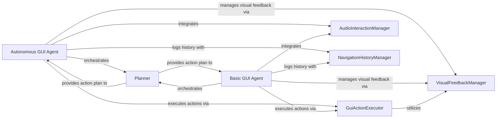

## Details

The `mlx-vlm` project's GUI automation subsystem is designed around two primary agent types: the `Autonomous GUI Agent` and the `Basic GUI Agent`. Both agents orchestrate the interaction with the GUI by leveraging a `Planner` to interpret visual information and formulate actions, and a `GuiActionExecutor` to perform these actions. The `VisualFeedbackManager` provides real-time visual cues during GUI operations, enhancing user understanding. Audio input and output are managed by the `AudioInteractionManager`, enabling voice-controlled interactions. All significant interactions and navigation steps are recorded by the `NavigationHistoryManager` for logging and analysis. This modular design ensures clear separation of concerns, allowing for flexible extension and maintenance of the GUI automation capabilities.

### Autonomous GUI Agent
The primary orchestrator for autonomous GUI interaction. It captures screenshots, sends them to a VLM for analysis and action planning, executes planned actions, and manages the overall interaction loop. It integrates voice command processing and audio responses, and handles task completion, waiting, and user assistance requests.

**Related Classes/Methods**:

- <a href="https://github.com/Blaizzy/mlx-vlm/blob/main/computer_use/autonomous_gui_agent.py#L560-L591" target="_blank" rel="noopener noreferrer">`computer_use.autonomous_gui_agent.main`:560-591</a>
- <a href="https://github.com/Blaizzy/mlx-vlm/blob/main/computer_use/autonomous_gui_agent.py#L496-L551" target="_blank" rel="noopener noreferrer">`computer_use.autonomous_gui_agent.process_command`:496-551</a>
- <a href="https://github.com/Blaizzy/mlx-vlm/blob/main/computer_use/autonomous_gui_agent.py#L233-L234" target="_blank" rel="noopener noreferrer">`computer_use.autonomous_gui_agent.finished`:233-234</a>
- <a href="https://github.com/Blaizzy/mlx-vlm/blob/main/computer_use/autonomous_gui_agent.py#L229-L230" target="_blank" rel="noopener noreferrer">`computer_use.autonomous_gui_agent.wait`:229-230</a>
- <a href="https://github.com/Blaizzy/mlx-vlm/blob/main/computer_use/autonomous_gui_agent.py#L237-L238" target="_blank" rel="noopener noreferrer">`computer_use.autonomous_gui_agent.call_user`:237-238</a>

### Basic GUI Agent
Provides fundamental GUI interaction capabilities, primarily processing direct commands from a VLM. It handles core logic for screenshot capture, VLM interaction, and action execution, and can also integrate voice commands.

**Related Classes/Methods**:

- <a href="https://github.com/Blaizzy/mlx-vlm/blob/main/computer_use/gui_agent.py#L217-L234" target="_blank" rel="noopener noreferrer">`computer_use.gui_agent.main`:217-234</a>
- <a href="https://github.com/Blaizzy/mlx-vlm/blob/main/computer_use/gui_agent.py#L137-L214" target="_blank" rel="noopener noreferrer">`computer_use.gui_agent.process_command`:137-214</a>

### Planner
Responsible for generating a plan or sequence of actions. It prepares input (screenshots, task queries, past actions) for a Vision-Language Model (VLM) and interprets the VLM's response to determine the next GUI action.

**Related Classes/Methods**:

- <a href="https://github.com/Blaizzy/mlx-vlm/blob/main/computer_use/autonomous_gui_agent.py#L258-L288" target="_blank" rel="noopener noreferrer">`computer_use.autonomous_gui_agent.build_messages`:258-288</a>
- <a href="https://github.com/Blaizzy/mlx-vlm/blob/main/computer_use/autonomous_gui_agent.py#L294-L298" target="_blank" rel="noopener noreferrer">`computer_use.autonomous_gui_agent.extract_thought_action`:294-298</a>
- <a href="https://github.com/Blaizzy/mlx-vlm/blob/main/computer_use/gui_agent.py" target="_blank" rel="noopener noreferrer">`computer_use.gui_agent.system_prompt`</a>

### GuiActionExecutor
Executes specific, low-level GUI interactions such as clicking, typing, hovering, scrolling, and text selection. It directly interfaces with the operating system's GUI automation libraries (e.g., `pyautogui`).

**Related Classes/Methods**:

- <a href="https://github.com/Blaizzy/mlx-vlm/blob/main/computer_use/autonomous_gui_agent.py" target="_blank" rel="noopener noreferrer">`computer_use.autonomous_gui_agent.action_functions`</a>
- <a href="https://github.com/Blaizzy/mlx-vlm/blob/main/computer_use/autonomous_gui_agent.py#L92-L105" target="_blank" rel="noopener noreferrer">`computer_use.autonomous_gui_agent.click`:92-105</a>
- <a href="https://github.com/Blaizzy/mlx-vlm/blob/main/computer_use/autonomous_gui_agent.py#L123-L137" target="_blank" rel="noopener noreferrer">`computer_use.autonomous_gui_agent.input_text`:123-137</a>
- <a href="https://github.com/Blaizzy/mlx-vlm/blob/main/computer_use/autonomous_gui_agent.py#L182-L192" target="_blank" rel="noopener noreferrer">`computer_use.autonomous_gui_agent.scroll`:182-192</a>
- <a href="https://github.com/Blaizzy/mlx-vlm/blob/main/computer_use/autonomous_gui_agent.py#L156-L169" target="_blank" rel="noopener noreferrer">`computer_use.autonomous_gui_agent.hover`:156-169</a>
- <a href="https://github.com/Blaizzy/mlx-vlm/blob/main/computer_use/autonomous_gui_agent.py#L140-L153" target="_blank" rel="noopener noreferrer">`computer_use.autonomous_gui_agent.select`:140-153</a>
- <a href="https://github.com/Blaizzy/mlx-vlm/blob/main/computer_use/autonomous_gui_agent.py#L195-L214" target="_blank" rel="noopener noreferrer">`computer_use.autonomous_gui_agent.select_text`:195-214</a>
- <a href="https://github.com/Blaizzy/mlx-vlm/blob/main/computer_use/autonomous_gui_agent.py#L217-L221" target="_blank" rel="noopener noreferrer">`computer_use.autonomous_gui_agent.copy`:217-221</a>
- <a href="https://github.com/Blaizzy/mlx-vlm/blob/main/computer_use/autonomous_gui_agent.py#L177-L179" target="_blank" rel="noopener noreferrer">`computer_use.autonomous_gui_agent.enter`:177-179</a>
- <a href="https://github.com/Blaizzy/mlx-vlm/blob/main/computer_use/autonomous_gui_agent.py#L172-L174" target="_blank" rel="noopener noreferrer">`computer_use.autonomous_gui_agent.answer`:172-174</a>
- <a href="https://github.com/Blaizzy/mlx-vlm/blob/main/computer_use/autonomous_gui_agent.py#L108-L120" target="_blank" rel="noopener noreferrer">`computer_use.autonomous_gui_agent.left_double`:108-120</a>

### VisualFeedbackManager
Manages the visual cues and animations displayed on the GUI to indicate the agent's actions or points of interest, including animating cursor movements, highlighting clicks, and creating temporary action overlays.

**Related Classes/Methods**:

- <a href="https://github.com/Blaizzy/mlx-vlm/blob/main/computer_use/autonomous_gui_agent.py#L31-L39" target="_blank" rel="noopener noreferrer">`computer_use.autonomous_gui_agent.animate_cursor_movement`:31-39</a>
- <a href="https://github.com/Blaizzy/mlx-vlm/blob/main/computer_use/autonomous_gui_agent.py#L42-L55" target="_blank" rel="noopener noreferrer">`computer_use.autonomous_gui_agent.highlight_click`:42-55</a>
- <a href="https://github.com/Blaizzy/mlx-vlm/blob/main/computer_use/autonomous_gui_agent.py#L58-L89" target="_blank" rel="noopener noreferrer">`computer_use.autonomous_gui_agent.create_action_overlay`:58-89</a>
- <a href="https://github.com/Blaizzy/mlx-vlm/blob/main/computer_use/utils.py#L10-L39" target="_blank" rel="noopener noreferrer">`computer_use.utils.draw_point`:10-39</a>

### AudioInteractionManager
Handles audio input (listening for voice commands via speech recognition) and audio output (playing audio feedback or responses).

**Related Classes/Methods**:

### NavigationHistoryManager
Records and manages the history of GUI navigation and interactions, including saving screenshots, queries, and executed actions for logging and potential future analysis.

**Related Classes/Methods**:

- <a href="https://github.com/Blaizzy/mlx-vlm/blob/main/computer_use/utils.py#L43-L65" target="_blank" rel="noopener noreferrer">`computer_use.utils.update_navigation_history`:43-65</a>

### [FAQ](https://github.com/CodeBoarding/GeneratedOnBoardings/tree/main?tab=readme-ov-file#faq)