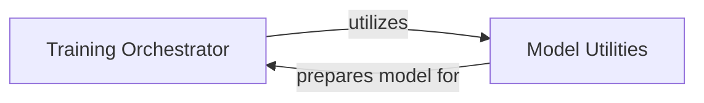

## Details

The `Model Training & Fine-tuning` subsystem is dedicated to providing the core infrastructure and logic required for training and fine-tuning VLM (Vision-Language Model) models. This includes specialized functionalities such as the integration of LoRA (Low-Rank Adaptation) adapters for efficient fine-tuning. The primary boundaries of this subsystem are defined by the `mlx_vlm/trainer/trainer.py` and `mlx_vlm/trainer/utils.py` modules, which encapsulate its core functionalities.

### Training Orchestrator
This component serves as the primary control unit for the entire model training process. In a web application context, it can be conceptualized as a specialized backend service or a worker responsible for executing complex, long-running computational jobs. It manages the iteration through training epochs, executes individual training steps, computes and manages the training loss, and handles the preparation and loading of data for the training loop.

**Related Classes/Methods**:

- <a href="https://github.com/Blaizzy/mlx-vlm/blob/main/mlx_vlm/trainer/trainer.py" target="_blank" rel="noopener noreferrer">`mlx_vlm.trainer.trainer:train_step`</a>
- <a href="https://github.com/Blaizzy/mlx-vlm/blob/main/mlx_vlm/trainer/trainer.py" target="_blank" rel="noopener noreferrer">`mlx_vlm.trainer.trainer:loss_fn`</a>
- <a href="https://github.com/Blaizzy/mlx-vlm/blob/main/mlx_vlm/trainer/trainer.py" target="_blank" rel="noopener noreferrer">`mlx_vlm.trainer.trainer:__getitem__`</a>

### Model Utilities
This component provides a collection of essential utility functions specifically designed for preparing and configuring VLM models, particularly for Parameter-Efficient Fine-Tuning (PEFT) using LoRA. Within a web application, this would be analogous to a "Shared Library" or "Helper Service" that offers reusable functionalities. It handles the application of LoRA layers, configures the model for PEFT, and manages/reports on trainable parameters.

**Related Classes/Methods**:

- <a href="https://github.com/Blaizzy/mlx-vlm/blob/main/mlx_vlm/trainer/utils.py" target="_blank" rel="noopener noreferrer">`mlx_vlm.trainer.utils:apply_lora_layers`</a>
- <a href="https://github.com/Blaizzy/mlx-vlm/blob/main/mlx_vlm/trainer/utils.py" target="_blank" rel="noopener noreferrer">`mlx_vlm.trainer.utils:get_peft_model`</a>
- <a href="https://github.com/Blaizzy/mlx-vlm/blob/main/mlx_vlm/trainer/utils.py" target="_blank" rel="noopener noreferrer">`mlx_vlm.trainer.utils:print_trainable_parameters`</a>
- <a href="https://github.com/Blaizzy/mlx-vlm/blob/main/mlx_vlm/trainer/utils.py" target="_blank" rel="noopener noreferrer">`mlx_vlm.trainer.utils:count_parameters`</a>

### [FAQ](https://github.com/CodeBoarding/GeneratedOnBoardings/tree/main?tab=readme-ov-file#faq)