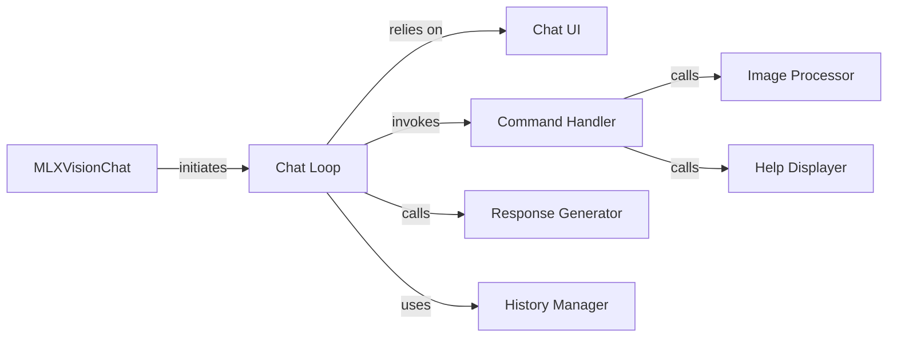

## Details

The mlx-vlm chat application is structured around a central MLXVisionChat component that manages the entire chat session. This component integrates with a Chat UI for user interaction, providing a continuous Chat Loop that processes user input. Within this loop, a Command Handler dispatches specific commands, including those for an Image Processor to handle visual inputs and a Help Displayer for user guidance. Textual and multimodal responses are generated by a Response Generator which interfaces with the VLM, and all interactions are recorded by a History Manager to maintain conversation context. This design ensures a clear separation of concerns, with the MLXVisionChat class acting as the primary coordinator for the application's core functionalities.

### MLXVisionChat
Serves as the central orchestrator, encapsulating the entire chat application's state and high-level logic. It manages the VLM instance and overall chat session, acting as the main controller for the UI.

**Related Classes/Methods**:

- <a href="https://github.com/Blaizzy/mlx-vlm/blob/main/mlx_vlm/chat.py#L20-L197" target="_blank" rel="noopener noreferrer">`mlx_vlm.chat.MLXVisionChat`:20-197</a>

### Chat UI
Handles the presentation layer for the chat application, specifically managing the visual rendering of the chat interface and capturing user input from the command line. This is the direct interface with the user.

**Related Classes/Methods**:

- <a href="https://github.com/Blaizzy/mlx-vlm/blob/main/mlx_vlm/chat_ui.py#L1-L1000" target="_blank" rel="noopener noreferrer">`mlx_vlm.chat_ui`:1-1000</a>

### Chat Loop
Manages the continuous flow of the chat interaction. It handles user input, processes commands, generates responses, and updates the chat history in a continuous cycle, driving the interactive experience.

**Related Classes/Methods**:

- <a href="https://github.com/Blaizzy/mlx-vlm/blob/main/mlx_vlm/chat.py#L158-L197" target="_blank" rel="noopener noreferrer">`mlx_vlm.chat.MLXVisionChat.chat_loop`:158-197</a>

### Command Handler
Parses user input to identify and execute specific commands (e.g., /image, /help), acting as a dispatcher for special actions within the chat.

**Related Classes/Methods**:

- <a href="https://github.com/Blaizzy/mlx-vlm/blob/main/mlx_vlm/chat.py#L139-L156" target="_blank" rel="noopener noreferrer">`mlx_vlm.chat.MLXVisionChat.handle_command`:139-156</a>

### Response Generator
Interfaces with the underlying VLM to produce textual or multimodal responses based on the current chat context, preparing data for display in the UI.

**Related Classes/Methods**:

- <a href="https://github.com/Blaizzy/mlx-vlm/blob/main/mlx_vlm/chat.py#L74-L137" target="_blank" rel="noopener noreferrer">`mlx_vlm.chat.MLXVisionChat.generate_response`:74-137</a>

### History Manager
Appends new messages and responses to the chat's conversation history, maintaining the chronological flow of the dialogue for display purposes.

**Related Classes/Methods**:

- <a href="https://github.com/Blaizzy/mlx-vlm/blob/main/mlx_vlm/chat.py#L69-L72" target="_blank" rel="noopener noreferrer">`mlx_vlm.chat.MLXVisionChat.add_to_history`:69-72</a>

### Image Processor
Manages the loading, preprocessing, and integration of image data into the chat context, enabling multimodal interactions with the VLM.

**Related Classes/Methods**:

- <a href="https://github.com/Blaizzy/mlx-vlm/blob/main/mlx_vlm/chat.py#L53-L67" target="_blank" rel="noopener noreferrer">`mlx_vlm.chat.MLXVisionChat.process_image`:53-67</a>

### Help Displayer
Displays predefined help messages and usage instructions to the user, providing guidance on available commands and features directly within the UI.

**Related Classes/Methods**:

- <a href="https://github.com/Blaizzy/mlx-vlm/blob/main/mlx_vlm/chat.py#L41-L51" target="_blank" rel="noopener noreferrer">`mlx_vlm.chat.MLXVisionChat.print_help`:41-51</a>

### [FAQ](https://github.com/CodeBoarding/GeneratedOnBoardings/tree/main?tab=readme-ov-file#faq)