```mermaid
graph LR
    User_Interface_UI_Chat_Application["User Interface (UI) / Chat Application"]
    API_Gateway_Model_Serving["API Gateway / Model Serving"]
    Core_VLM_Engine["Core VLM Engine"]
    Data_Preprocessing_Utilities["Data Preprocessing & Utilities"]
    Model_Training_Fine_tuning["Model Training & Fine-tuning"]
    GUI_Automation_Agent["GUI Automation Agent"]
    External_Integrations_Examples["External Integrations / Examples"]
    User_Interface_UI_Chat_Application -- "sends User Requests" --> API_Gateway_Model_Serving
    API_Gateway_Model_Serving -- "sends Model Responses" --> User_Interface_UI_Chat_Application
    API_Gateway_Model_Serving -- "sends Inference Requests" --> Core_VLM_Engine
    Core_VLM_Engine -- "sends Generated Output" --> API_Gateway_Model_Serving
    Core_VLM_Engine -- "sends Input Preparation Requests" --> Data_Preprocessing_Utilities
    Data_Preprocessing_Utilities -- "sends Prepared Inputs" --> Core_VLM_Engine
    Model_Training_Fine_tuning -- "sends Model Updates" --> Core_VLM_Engine
    GUI_Automation_Agent -- "sends Visual/Audio Input" --> Data_Preprocessing_Utilities
    Data_Preprocessing_Utilities -- "sends Processed Features" --> GUI_Automation_Agent
    GUI_Automation_Agent -- "sends VLM-specific Requests" --> API_Gateway_Model_Serving
    External_Integrations_Examples -- "sends Stream Data" --> Data_Preprocessing_Utilities
    External_Integrations_Examples -- "interacts directly with" --> API_Gateway_Model_Serving
    click User_Interface_UI_Chat_Application href "https://github.com/CodeBoarding/GeneratedOnBoardings/blob/main/mlx-vlm/User_Interface_UI_Chat_Application.md" "Details"
    click API_Gateway_Model_Serving href "https://github.com/CodeBoarding/GeneratedOnBoardings/blob/main/mlx-vlm/API_Gateway_Model_Serving.md" "Details"
    click Core_VLM_Engine href "https://github.com/CodeBoarding/GeneratedOnBoardings/blob/main/mlx-vlm/Core_VLM_Engine.md" "Details"
    click Data_Preprocessing_Utilities href "https://github.com/CodeBoarding/GeneratedOnBoardings/blob/main/mlx-vlm/Data_Preprocessing_Utilities.md" "Details"
    click Model_Training_Fine_tuning href "https://github.com/CodeBoarding/GeneratedOnBoardings/blob/main/mlx-vlm/Model_Training_Fine_tuning.md" "Details"
    click GUI_Automation_Agent href "https://github.com/CodeBoarding/GeneratedOnBoardings/blob/main/mlx-vlm/GUI_Automation_Agent.md" "Details"
```

## Details

The MLX-VLM project is structured around a client-server architecture, enabling multimodal interactions with Vision-Language Models. The `User Interface (UI) / Chat Application` serves as the primary client, facilitating user input and displaying model responses. This UI communicates with the `API Gateway / Model Serving` component, which acts as the central entry point for all VLM functionalities, handling request routing, model management, and caching. The core intelligence resides within the `Core VLM Engine`, responsible for executing VLM inference. Data preparation for the VLM is managed by the `Data Preprocessing & Utilities` component, which handles various input modalities. For model improvement, the `Model Training & Fine-tuning` component provides the necessary infrastructure. Additionally, a `GUI Automation Agent` leverages VLM capabilities for autonomous GUI interaction, and `External Integrations / Examples` showcase real-time multimodal processing. This modular design ensures clear separation of concerns, promoting maintainability and scalability, and is well-suited for visual representation as a data flow diagram.

### User Interface (UI) / Chat Application [[Expand]](./User_Interface_UI_Chat_Application.md)
The client-side component for user interaction, displaying chat history, and sending user inputs (text, images) to the backend.

**Related Classes/Methods**:

- <a href="https://github.com/Blaizzy/mlx-vlm/blob/main/mlx_vlm/chat.py" target="_blank" rel="noopener noreferrer">`mlx_vlm/chat.py`</a>
- <a href="https://github.com/Blaizzy/mlx-vlm/blob/main/mlx_vlm/chat_ui.py" target="_blank" rel="noopener noreferrer">`mlx_vlm/chat_ui.py`</a>

### API Gateway / Model Serving [[Expand]](./API_Gateway_Model_Serving.md)
The entry point for external clients, exposing VLM functionalities through RESTful APIs, managing model lifecycle, caching, and request routing.

**Related Classes/Methods**:

- <a href="https://github.com/Blaizzy/mlx-vlm/blob/main/mlx_vlm/server.py" target="_blank" rel="noopener noreferrer">`mlx_vlm/server.py`</a>

### Core VLM Engine [[Expand]](./Core_VLM_Engine.md)
The central processing unit for all Vision-Language Model operations, encapsulating VLM architectures and performing inference.

**Related Classes/Methods**:

- <a href="https://github.com/Blaizzy/mlx-vlm/blob/main/mlx_vlm/generate.py" target="_blank" rel="noopener noreferrer">`mlx_vlm/generate.py`</a>
- <a href="https://github.com/Blaizzy/mlx-vlm/blob/main/mlx_vlm/models/llava/llava.py" target="_blank" rel="noopener noreferrer">`mlx_vlm/models/llava.py`</a>
- <a href="https://github.com/Blaizzy/mlx-vlm/blob/main/mlx_vlm/models/phi3_v/phi3_v.py" target="_blank" rel="noopener noreferrer">`mlx_vlm/models/phi3_v.py`</a>

### Data Preprocessing & Utilities [[Expand]](./Data_Preprocessing_Utilities.md)
A shared service responsible for preparing diverse input modalities (images, audio, text) into a VLM-consumable format, including prompt formatting and tokenizer operations.

**Related Classes/Methods**:

- <a href="https://github.com/Blaizzy/mlx-vlm/blob/main/mlx_vlm/utils.py" target="_blank" rel="noopener noreferrer">`mlx_vlm/utils.py`</a>
- <a href="https://github.com/Blaizzy/mlx-vlm/blob/main/mlx_vlm/prompt_utils.py" target="_blank" rel="noopener noreferrer">`mlx_vlm/prompt_utils.py`</a>
- <a href="https://github.com/Blaizzy/mlx-vlm/blob/main/mlx_vlm/tokenizer_utils.py" target="_blank" rel="noopener noreferrer">`mlx_vlm/tokenizer_utils.py`</a>
- <a href="https://github.com/Blaizzy/mlx-vlm/blob/main/mlx_vlm/video_generate.py" target="_blank" rel="noopener noreferrer">`mlx_vlm/video_generate.py`</a>

### Model Training & Fine-tuning [[Expand]](./Model_Training_Fine_tuning.md)
Provides infrastructure and logic for training and fine-tuning VLM models, including LoRA adapter integration.

**Related Classes/Methods**:

- <a href="https://github.com/Blaizzy/mlx-vlm/blob/main/mlx_vlm/trainer/trainer.py" target="_blank" rel="noopener noreferrer">`mlx_vlm/trainer/trainer.py`</a>
- <a href="https://github.com/Blaizzy/mlx-vlm/blob/main/mlx_vlm/trainer/utils.py" target="_blank" rel="noopener noreferrer">`mlx_vlm/trainer/utils.py`</a>

### GUI Automation Agent [[Expand]](./GUI_Automation_Agent.md)
A specialized application for autonomous interaction with graphical user interfaces, potentially leveraging VLM capabilities for visual understanding and action planning.

**Related Classes/Methods**:

- <a href="https://github.com/Blaizzy/mlx-vlm/blob/main/computer_use/autonomous_gui_agent.py" target="_blank" rel="noopener noreferrer">`computer_use/autonomous_gui_agent.py`</a>
- <a href="https://github.com/Blaizzy/mlx-vlm/blob/main/computer_use/autonomous_gui_agent_voice.py" target="_blank" rel="noopener noreferrer">`computer_use/autonomous_gui_agent_voice.py`</a>
- <a href="https://github.com/Blaizzy/mlx-vlm/blob/main/computer_use/gui_agent.py" target="_blank" rel="noopener noreferrer">`computer_use/gui_agent.py`</a>
- <a href="https://github.com/Blaizzy/mlx-vlm/blob/main/computer_use/gui_agent_voice.py" target="_blank" rel="noopener noreferrer">`computer_use/gui_agent_voice.py`</a>

### External Integrations / Examples
Contains demonstration code and integration points for external data sources (e.g., camera feeds, microphones), showcasing real-time multimodal processing.

**Related Classes/Methods**:

- <a href="https://github.com/Blaizzy/mlx-vlm/blob/main/examples/omni.py" target="_blank" rel="noopener noreferrer">`examples/omni.py`</a>

### [FAQ](https://github.com/CodeBoarding/GeneratedOnBoardings/tree/main?tab=readme-ov-file#faq)